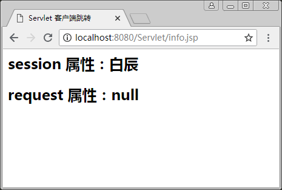

# Servlet 客户端跳转

Servlet 跳转有客户端跳转和服务器跳转两种。其中，客户端跳转运用 sendRedirect() 方法实现，服务器跳转运用 RequestDispatcher 接口实现，本文将介绍客户端跳转方法的实现以及使用。

在 Servlet 中要想进行客户端跳转，需要使用 HttpServletResponse 接口的 sendRedirect() 方法，但需要注意的是，这种跳转只能传递 session 和 application 范围的属性，无法传送 request 范围的属性。

【例 1】使用客户端跳转 ClientRedirect.java。

首先创建一个 Servlet 文件 ClientRedirect.java，代码如下：

```
package ch05;
import java.io.IOException;
import java.io.PrintWriter;
import javax.servlet.ServletException;
import javax.servlet.http.HttpServlet;
import javax.servlet.http.HttpServletRequest;
import javax.servlet.http.HttpServletResponse;
public class ClientRedirect extends HttpServlet
{
    /**
    *客户端跳转
    */
    public void goGet(HttpServletRequest request,HttpServletResponse response) throws ServletException,IOException
    {
        request.getSession().setAttribute("name","白辰");
        request.setAttribute("info","JavaServlet");
        response.sendRedirect("info.jsp");
    }
    public void doPost(HttpServletRequest request,HttpServletResponse response) throws ServletException,IOException
    {
        this.doGet(request,response);    //调用 doGet 的方法
    }
}
```

然后配置 web.xml 文件如下：

```
<servlet>
    <servlet-name>client<servlet-name>
    <servlet-class>ch05.ClientRedirect</servlet-class>
</servlet>
<servlet-mapping>
<servlet-name>client</servlet-name>
<url-pattern>/servlet/ClientRedirect</url-pattern>
</servlet-mapping>
```

info.jsp 代码如下：

```
<%@ page contentType="text/html;charset=utf-8" pageEncoding="utf-8"%>
<html>
<head>
<title>
    Serlet 客户端跳转
</title></head>
<body>
    <% request.setCharacterEncoding("utf-8");%>
    <h2>session 属性:<%=session.getAttribute("name")%></h2>
    <h2>request 属性:<%=request.getAttribute("info")%></h2>
</body>
</html>
```

启动服务器后，在浏览器的地址栏输入 http://localhost:8080/servlet/ClientRedirect，运行结果如图 1 所示。


图 1 客户端跳转运行结果

#### 提示：

由于是客户端跳转，跳转后，浏览器地址栏中变为 http://localhost:8080/ch05/info.jsp。从程序结果可以看到，request 属性的范围无法接收，只能接收 session 属性的范围。