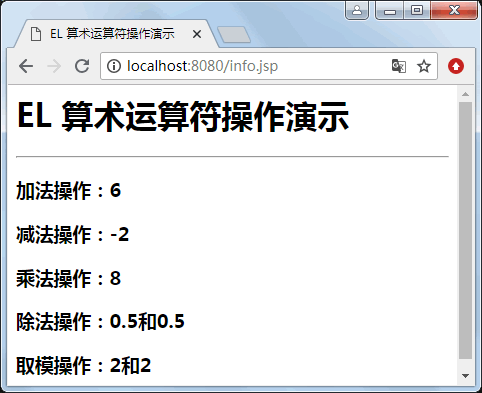

# JSP EL 算数运算符

EL 表达式提供了可以进行加、减、乘、除和求余的 5 种算术运算符，各种算术运算符以及用法如表 1 所示。

表 1 EL 提供的算术运算符

| EL 算术运算符 | 说明 | 范例 | 结果 |
| + | 加 | ${15+2} | 17 |
| - | 减 | ${15-2} | 13 |
| * | 乘 | ${15*2} | 30 |
| / 或 div | 除 | ${15/2} 或 ${15 div 2} | 7 |
| % 或 mod | 求余 | ${15%2} 或 ${15 mod 2} | 1 |

EL 的“+”运算符与 java 的“+”运算符不一样，它无法实现两个字符串的连接运算，如果该运算符连接的两个值不能转换为数值型的字符串，则会拋出异常。如果使用该运算符连接两个可以转换为数值型的字符串，EL 会自动地将这两个字符转换为数值型数据，再进行加法运算。

【例 1】算术运算符演示（math_demo.jsp）：

```
<%@ page contentType="text/html" pageEncoding="utf-8"%>
<html>
<head> <title>EL 算术运算符操作演示</title> </head>
<body>
<%
//存放的是数字
pageContext.setAttribute("num1",2);
pageContext.setAttribute("num2",4);
%>
<h1>EL 算术运算符操作演示 </h1>
<hr/>
<h3>加法操作：${num1+num2}</h3>
<h3>减法操作：${num1-num2}</h3>
<h3>乘法操作：${num1*num2}</h3>
<h3>除法操作：${num1/num2}和${num1 div num2}</h3>
<h3>取模操作：${num1%num2}和${num1 mod num2}</h3>
```

程序运行结果如图 1 所示。


图 1 EL 算术运算符的操作演示