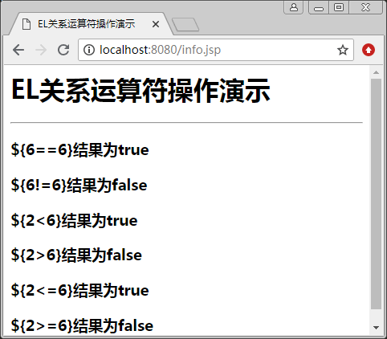

# JSP EL 关系运算符

用 EL 表达式可以实现关系运算。关系运算符用于实现两个表达式的比较。进行比较的表达式可以是数值型的或字符串。EL 中提供的各种关系运算符如表 1 所示。

表 1 EL 中的关系运算符

| EL 关系运算符 | 说明 | 范例 | 结果 |
| ==  或 eq | 等于 | ${6==6} 或 ${6 eq 6} ${"A"="a"} 或 ${"A" eq "a"} | true false |
| != 或 ne | 不等于 | ${6!=6} 或 ${6 ne 6} ${“A"!=“a”} 或 ${“A” ne “a”} |
| false true |
| < 或 lt | 小于 | ${3<8} 或 ${3 lt 8} ${"A"<"a"} 或 ${"A" lt "a"} | true true |
| > 或 gt | 大于 | ${3>8} 或 ${3 gt 8} ${"A">"a"} 或 ${"A" gt "a"} | false false |
| <= 或 le | 小于等于 | ${3<=8} 或 ${3 le 8} ${"A"<="a"} 或 ${"A" le "a"} | true true |
| >= 或 ge | 大于等于 | ${3>=8} 或 ${3 ge 8} ${"A">="a"} 或 ${"A" ge "a"} | false false |

【例 1】关系运算符演示（rel_demo.jsp）:

```
<%@ page contentType="text/html;charset=utf-8"%>
<html>
<head>
<title>EL 关系运算符操作演示</title>
</head>
<body>
<h1> EL 关系运算符操作演示 </h1>
<hr>
<h3>\${6==6}结果为${6==6}</h3>
<h3>\${6!=6}结果为${6!=6}</h3>
<h3>\${2<6}结果为${2<6}</h3>
<h3>\${2>6}结果为${2>6}</h3>
<h3>\${2<=6}结果为${2<=6}</h3>
<h3>\${2>=6}结果为${2>=6}</h3>
</body>
</html>
```

程序运行结果如图 1 所示。


图 1 EL 关系运算符的操作演示