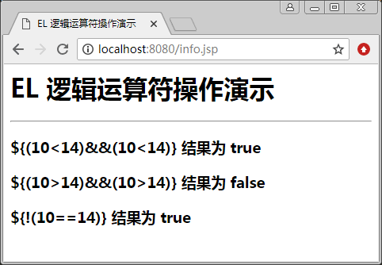

# JSP EL 逻辑运算符

在进行比较运算时，如果涉及两个或两个以上判断，就需要使用逻辑运算符。逻辑运 算符两边的表达式必须是布尔型（Boolean）变量，其结果也是布尔型（Boolean）。EL 中的逻辑运算符如表 1 所示。

表 1 EL 中的逻辑运算符

| EL 逻辑运算符 | 范例(A、B 为逻辑型表达式） | 结果 |
| && 或 and | ${A && B} 或 ${A and B} | true/false |
| &#124;&#124; 或 or | ${A &#124;&#124; B} 或 ${A or B} | true/false |
| ! 或 not | ${!A} 或 ${not A} | true/false |

关系运算表达式从左向右进行运算，一旦表达式的值可以确定，将停止执行。例如， 表达式 A and B and C 中，如果 A 为 true，B 为 false，则只计算 A and B；又如，表达式 A or B or C 中，如果 A 为 true，B 为 true，则只计算 A or B。

【例 1】EL 逻辑运算符演示（logical.jsp）:

```
<%@ page language="java" contentType="text/html;charset=utf-8" %>
<html>
<head>
<title>EL 逻辑运算符操作演示</title>
</head>
<body>
<h1> EL 逻辑运算符操作演示</h1>
<hr>
<h3>\${(10<14)&&(10<14)} 结果为 ${(10<14)&&(10<14)}</h3>
<h3>\${(10>14)&&(10>14)} 结果为 ${(10>14)&&(10>14)}</h3>
<h3>\${!(10==14)} 结果为 ${!(10==14)}</h3> 
</body>
</html>
```

程序运行结果如图 1 所示。


图 1 EL 逻辑运算符的操作演示