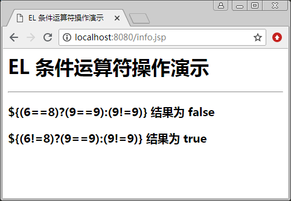

# JSP EL 条件运算符

在 EL 表达式中，条件运算符的用法与 Java 语言的语法完全一致。格式如下：

${条件表达式?表达式 1:表达式 2}

其中，条件表达式用于指定一个判定条件，该表达式的结果为 Boolean 型值。可以由关系运算、逻辑运算、判空运算等运算得到。如果该表达式的运算结果为真，则返回表达式 1 的值；如果运算结果为假，则返回表达式 2 的值。

【例 1】EL 条件运算符演示（condition_demo.jsp）：

```
<%@ page contentType="text/html;charset=utf-8"%>
<html>
<head>
<title>EL 条件运算符操作演示</title>
</head>
<body>
<h1>EL 条件运算符操作演示</h1>
<hr>
<h3>\${(6==8)?(9==9):(9!=9)} 结果为 ${(6==8)?(9==9):(9!=9)}</h3>
<h3>\${(6!=8)?(9==9):(9!=9)} 结果为 ${(6!=8)?(9==9):(9!=9)}</h3>
</body>
</html>
```

程序运行结果如图 1 所示。


图 1 EL 条件运算符的操作演示