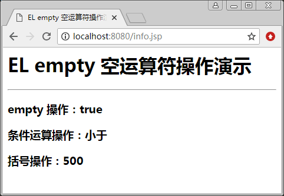

# JSP EL empty 空运算符

通过 empty 运算符，可以实现在 EL 表达式中判断对象是否为空。该运算符用于确定一个对象或者变量是否为 null 或空。若为空或者 null，返回空字符串、空数组，否则返回 false。

例如，应用条件运算符来实现，当 cart 变量为空时，输出购物车为空，否则输出购物车的代码如下：

```
${empty cart?"购物车为空":cart}
```

【例 1】empty 运算符演示（empty_demo.jsp）：

```
<%@ page contentType="text/html"  pageEncoding="utf-8" %>
<html>
<head>
<title>EL empty 空运算符操作演示</title>
</head>
<body>
<%
//存放的是数字
pageContext.setAttribute("num1",10);
pageContext.setAttribute("num2",20);
pageContext.setAttribute("num3",30);
%>
<h1> EL empty 空运算符操作演示 </h1>
<hr/>
<h3>empty 操作：${empty info}</h3>
<h3>条件运算操作：${num1>num2?"大于":"小于"}</h3>
<h3>括号操作：${num1*(num2+num3)}</h3>
</body>
</html>
```

程序运行结果如图 1 所示。


图 1 EL empty 空运算符操作演示