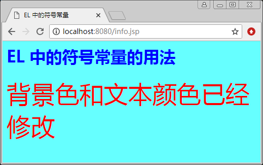

# EL 表达式中的常量与变量

下面介绍 EL 表达式中常量与变量的定义和用法。

## 常量

EL 表达式中的常量也称为字面常量，它是不可改变的数据。EL 表达式中有以下几种常量。

1.  Null 常量：Null 常量用于表示常量引用的对象为空，它只有一个 null 值。
2.  整型常量：整型常量与 Java 中的十进制整型常量相似，它的取值范围与 Java 语言中 long 范围的整型常量相同，即在 -263~263-1 之间。
3.  浮点数常量：浮点数常量用整数部分加小数部分来表示，也可以用指数的形式来表示。例如，1.3e4 和 1.3 都是合法的浮点数常量，它的取值范围是 Java 语言中定义的范围，即其绝对值介于 4.9E-324~1.8E-308 之间。
4.  布尔常量：布尔常量用于区分一个事物的正反两方面，它的值只有两个，分别是 true 和 false。
5.  字符串常量：字符串常量是使用单引号或者双引号括起来的一连串字符。如果字符串常量本身又含有单引号或双引号，则需要在前面加上“\”进行转义，即用“V”表示单引号，用表示双引号。如果字符本身包含“\”，则需要用“\\”表示字面意义上的反斜杠。
6.  符号常量：在 EL 表达式语言中，可以使用符号常量，它类似于 Java 中 final 说明的常量。使用符号常量的目的是为了减少代码的维护量。

【例 1】常量的使用（symbol_const_demo.jsp）:

```
<%@ page contentType="text/html"  pageEncoding="utf-8" %>
<html>
<head>
<title>EL 中的符号常量</title>
</head>
<%
String color="#66FFFF";
String size="12";
String textclr="Blue";
String foregr="Red";
pageContext.setAttribute("color",color);
pageContext.setAttribute("size",size);
pageContext.setAttribute("textclr",textclr);
pageContext.setAttribute("foregr",foregr);
%>
<body bgcolor="${ pageScope.color }"
    text="${ pageScope.textclr }">
<h1>EL 中的符号常量的用法</h1>
<Font color="${ pageScope.foregr }"
    size="${ pageScope.size }">
    背景色和文本颜色已经修改
</Font>
<br/>
</body>
</html>
```

程序运行结果如图 1 所示。


图 1 用符号常量定义颜色

## 变量

EL 存取变量数据的方法很简单，如 ${username}。它的意思是取出某一范围中的名为 username 的变量值。因为没有指定哪一个范围的 usemame，所以，它的默认值是在 page 范围内查找，如果找不到，则按照 request、session、application 范围依次查找，如果此期间找到 usemame，则直接回传，不再继续找下去，如果没有找到，则返回 null。表 1 为 EL 变量的使用范围。

表 1 EL 变量的使用范围

| 属性范围 | 在 EL 中的名称 |
| page | pageScope |
| request | requestScope |
| session | sessionScope |
| application | applicationScope |

如果出现重名的情况，我们也可以根据实际需要指定要取出哪一个范围的变量，如表 2 所示。其中，pageScope、requestScope、sessionScope 和 applicationScope 都是 EL 的内部对象，由它们的名称，可以很容易猜出它们所代表的意思。例如：

```
${sessionScope.username}
```

即取出 session 范围的 usemame 变量。这种写法比先前 JSP 的写法容易许多：

```
String username=(String)session.getAttribute("username");
```

另外，EL 支持预定义的变量，即 EL 对象。

表 2 取出不同范围的变量

| 属性范围 | 在 EL 中的名称 |
| ${pageScope.usemame} | 取出 page 范围的 usemame 变量 |
| ${requestScope.usemame} | 取出 request 范围的 usemame 变量 |
| ${sessionScope.usemame} | 取出 session 范围的 usemame 变量 |
| ${applicationScope.usemame} | 取出 application 范围的 usemame 变量 |

EL 拥有自动转变类型的功能，下面通过实例说明一下。

```
${param.Coun+10}
```

假若窗体传来的结果为 10，那么上面的结果为 20。先前没接触过 JSP 的读者可能会认为上面的例子是理所当然的。但是，在 EL 之前的 JSP 1.2 中不能这样做，原因是窗体传来的值类型一律是 String。所以，当我们接收后，必须再将它转为其他类型，如 int、float 等，然后才能执行一些数学运算。下面是先前的做法：

```
String str_count=request.getParameter("count");
int count=Integer.parseInt(str_count);
count=count+10;
```

EL 类型变量在使用过程中也经常需要转换。接下来，我们介绍 EL 类型转换的基本规则，先假设 X 是某一类型的一个变量。

(1) 将 X 转为 String 类型。

*   当 X 为 String 时：回传 X。
*   当 X 为 null 时：回传“ ”。
*   当 X.toString() 产生异常时，返回错误。
*   其他情况则传回 A.toString()。

(2) 将 X 转为 Number 类型的 N。

*   当 X 为 null 或“ ”时，回传 0。
*   当 X 为 Character 时，将 X 转为 new Short((short)x.charValue(})。
*   当 X 为 Boolean 时，返回错误。
*   当 X 为 Number 类型，与 N 一样时，则回传 X。
*   当 X 为 String 时，回传 N.valueOf(X)。

(3) 将 X 转为 Boolean 类型。

*   当 X 为 null 或“ ”时，回传 false。
*   当 X 为 Boolean 时，回传 X。
*   当 X 为 String 且 Boolean.valueOf(X) 没有产生异常时，回传 Boolean.valueOf(X)。

(4) 将 X 转为 Character 类型。

*   当 X 为 null 或“ ”时，回传 (char)0。
*   当 X 为 Character 时，回传 X。
*   当 X 为 Boolean 时，返回错误。
*   当 X 为 Number 时，转换为 Short 后，回传 Character。
*   当 X 为 String 时，回传 X.charAt(0)。