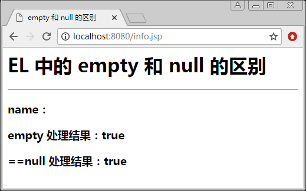

# EL 表达式的保留字

保留字是系统预留的名称。在为变量命名时，应该避开这些预留的名称，以免程序编译时发生错误。EL 表达式的保留字如表 1 所示。

表 1 EL 表达式的保留字

| and | eq | gt | div |
| or | ne | le | mod |
| no | lt | ge | true |
| instanceof | empty | null | false |

这里 empty 和 null 都表示空，下面通过一个例子来说明 empty 和 null 之间的区别。

【例 1】empty 和 null 的区别（reservedword_demo.jsp）:

```
<%@ page contentType="text/html"  pageEncoding="utf-8" %>
<html>
<head>
<title>empty 和 null 的区别</title>
</head>
<body>
    <h1>EL 中的 empty 和 null 的区别</h1>
    <hr/>
    <h3>name：${param.name}</h3>
    <h3>empty 处理结果：${empty param.name}</h3>
<h3>==null 处理结果：${param.name==null}</h3>
</body>
</html>
```

在浏览器的地址栏中输入 http://localhost:8080/ch7/reservedword_demo.jsp，显示结果如图 1 所示。


图 1 对“ ”的显示结果
在浏览器的地址栏中输入 http://localhost:8080/ch7/reservedword.demo.jsp?name=，显示结果如图 2 所示。


图 2 对 null 的显示结果
由此可知，在 EL 中，empty 对“ ”和 null 的处理结果都返回 true，而 ==null 对“ ”的处理结果返回 false，对 null 的处理结果返回 true。