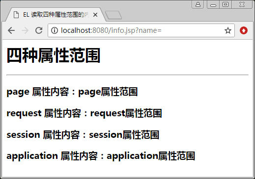
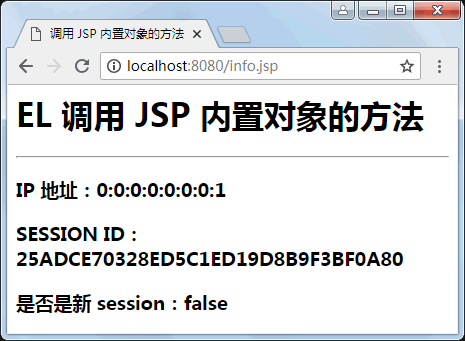

# EL 表达式的内置对象及其作用域

EL 表达式的主要功能是进行内容显示。为了显示方便，在表达式语言中，提供了许多内置对象，通过不同的内置对象的设置，表达式语言可以输出不同的内容，这些内置对象如表 1 所示。

表 1 EL 表达式的内置对象

| 内置对象 | 类型 | 说明 |
| pageContext | javax.servlet.ServletContext | 表示 JSP 的 pageContext |
| pageScope | java.util.Map | 取得 page 范围的属性名称所对应的值 |
| requestScope | java.util.Map | 取得 request 范围的属性名称所对应的值 |
| sessionScope | java.util.Map | 取得 session 范围的属性名称所对应的值 |
| applicationScope | java.util.Map | 取得 application 范围的属性名称所对应的值 |
| param | java.util.Map | 如同 ServletRequest.getParameter(String name)，返回 Slring[] 类型的值 |
| param Values | java.util.Map | 如同 ServletRequest.getParameter Values(String name)， 返回 string[] 类型的值 |
| header | java.util.Map | 如同 ServletRequest.getHeader(String name)，返回 string[] 类型的值 |
| header Values | java.util.Map | 如同 ServletRequest.getHeaders(String name)， 返回 string[] 类型的值 |
| cookie | java.util.Map | 如同 HttpServletRequest.getCookies() |
| initParam | java.util.Map | 如同 ServletContext.getInitParameter(String name)，返回 string[] 类型的值 |

使用 EL 表达式语言可以输出 4 种属性范围的内容，属性的范围在 EL 中的名称如表 2 所示。

表 2 EL 表达式的属性范围

| 属性范围 | EL 中的名称 |
| page | pageScope |
| request | requestScope |
| session | sessionScope |
| application | applicationScope |

如果在不同的属性范围中设置了同一个属性名称，则按照 page、request、session、application 的范围进行查找。我们也可以指定要取出哪一个范围的变量，如表 3 所示。

表 3 通过 EL 取出相应属性范围内的变量

| 范例 | 说明 |
| ${pagesScope.usemame} | 取出 page 范围的 username 变量 |
| ${requestScope.usemame} | 取出 request 范围的 username 变量 |
| ${sessionScope.usemame} | 取出 session 范围的 username 变量 |
| ${applicationScope.usemame} | 取出 application 范围的 username 变量 |

其中，pageScope、requestScope、sessionScope 和 applicationScope 都是 EL 内置对象，由它们的名称可知所代表的意思。例如，${sessionScope.usemame} 是取出 session 范围的 usemame 变量，显然这种写法比先前 JSP 的写法 String usemame=(String)session.getAttribute("usemame") 要简洁许多。

下面通过例子来演示 EL 如何读取 4 种属性范围的内容。

【例 1】EL 读取 4 种属性范围的内容（attribute_demo.jsp）：

```
<%@ page contentType="text/html"  pageEncoding="utf-8" %>
<html>
<head>
<title>EL 读取四种属性范围的内容 </title>
<body>
<%
pageContext.setAttribute("info","page 属性范围");
request.setAttribute("info","request 属性范围");
session.setAttribute("info","session 属性范围");
application.setAttribute("info","application 属性范围");
%>
<h1>四种属性范围</h1>
<hr/>
<h3>page 属性内容：${pageScope.info}</h3>
<h3>request 属性内容：${requestScope.info}</h3>
<h3>session 属性内容：${sessionScope.info}</h3>
<h3>application 属性内容：${applicationScope.info}</h3>
</body>
</html>
```

程序运行结果如图 1 所示。


图 1 EL 读取四种属性范围的内容
我们也可以通过表达式的 pageContext 内置对象获取 JSP 内置对象 request、session、application 的实例，可以通过 pageContext 内置对象调用 JSP 内置对象中提供的方法。

【例 2】调用 JSP 内置对象的方法（methodjsp）：

```
<%@ page contentType="text/html" pageEncoding="utf-8" %>
<html>
<head>
<title>调用 JSP 内置对象的方法 </title>
</head>
<body>
    <h1>EL 调用 JSP 内置对象的方法 </h1>
    <hr/>
    <h3>IP 地址：${pageContext.request.remoteAddr}</h3>
    <h3>SESSION ID：${pageContext.session.id}</h3>
    <h3>是否是新 session：${pageContext.session['new']}</h3>
</body>
</html>
```

程序运行结果如图 2 所示。


图 2 EL 调用 JSP 内置对象的方法