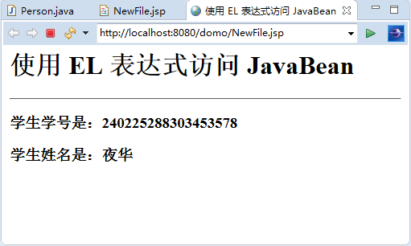

# 使用 EL 表达式访问 JavaBean

在实际开发过程中，Servlet 通常用于处理业务逻辑，由 Servlet 来实例化 JavaBean，最后在指定的 JSP 程序中显示 JavaBean 中的内容。使用 EL 表达式可以访问 JavaBean，基本语法格式如下：

${bean.property}

这里，bean 表示 JavaBean 实例对象的名称，property 代表该 JavaBean 的某一个属性。使用 EL 表达式，可以清晰简洁地显示 JavaBeane 的内容。下面通过一个例子，来看一下在 JSP 中如何用 EL 表达式展示 JavaBean 中的内容。

【例 1】通过 EL 表达式展示 JavaBean 中的内容。

先定义 JavaBean，在 vo 包中定义 Person.java 类，程序代码如下：

```
package vo;
public class Person
{
    private String name;
    private String ID;
    public String getName()
    {
        return name;
    }
    public void setName(String name)
    {
        this.name=name;
    }
    public String getID()
    {
        return ID;
    }
    public void setID(String id)
    {
        ID=id;
    }
}
```

在 JavaBean 中定义了两个属性，即 name 和 ID，表示人的姓名和身份证号。然后在 showPerson.jsp 文件中设置 JavaBean 的属性。

在下面的程序中，创建了一个 Person 的实例 pi，接着对 pi 的属性设置值，然后将该对象放入 session 作用域中，最后取出 pi 对象，将其属性显示出来，代码如下：

```
<%@ page language="java" contentType="text/html;charset=utf-8" %>
<%@ page import="vo.Person" %>
<html>
<head>
<title>
    使用 EL 表达式访问 JavaBean
</title>
</head>
<body>
<h1>使用 EL 表达式访问 JavaBean </h1>
<hr>
<%
Person p1=new Person();
p1.setID("240225288303453578");
p1.setName("夜华");
session.setAttribute("p1",p1);
%>
<h3>学生学号是：${p1.ID}</h3>
<h3>学生姓名是：${p1.name}</h3>
</body>
</html>
```

程序运行结果如图 1 所示。


图 1 使用 EL 表达式访问 JavaBean