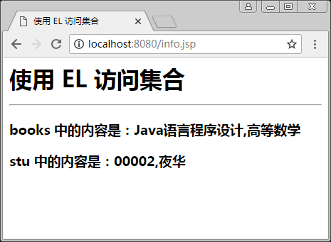

# 使用 EL 表达式访问集合

在 EL 表达式中，同样可以获取集合的数据，这些集合可能是 Vector、List、Map、数组等。可以在 JSP 中获取这些对象，继而显示其中的内容，其语法格式如下：

${collection [序号]}

其中，collection 代表集合对象的名称。例如：

```
${books [0]}
```

表示集合 books 中下标为 0 的元素。

上面表示的是一维集合，如数组、List 等，若操作的集合为二维集合，如 HashMap，其值是 key 和 value 值对的形式，则值 (value) 可以这样显示：

${collection.key}

例如：

```
${p1.ID}
```

表示显示名为 pi 的 HashMap 中的 key 为 ID 的元素的值。下面是通过 EL 表达式访问集合的一个案例。

【例 1】通过 EL 表达式访问集合（collection_demo.jsp）：

```
<%@ page language="java"  contentType="text/html;charset=utf-8" %>
<%@ page import="java.util.*" %>
<html>
<head>
<title>使用 EL 访问集合</title>
</head>
<body>
<h1>使用 EL 访问集合</ h1>
<hr/>
<%
List books=new ArrayList();
books.add("Java 语言程序设计");
books.add("高等数学");
session.setAttribute("books",books);
HashMap stu=new HashMap();
stu.put("stuno","00002");
stu.put("stuname","夜华");
session.setAttribute("stu",stu);
%>
<h3>books 中的内容是：${books[0]},${books[1]}</h3>
<h3>stu 中的内容是：${stu.stuno},${stu.stuname}</h3>
</body>
</html>
```

程序运行结果如图 1 所示。


图 1 使用 EL 访问集合