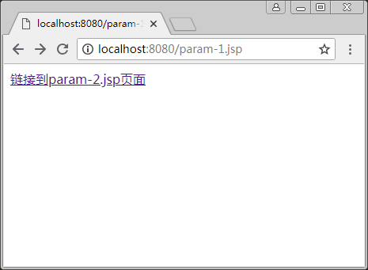
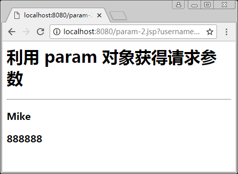
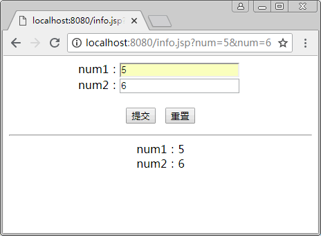

# EL 表达式内置对象 param 和 paramValues

除了 page、request、session 和 application 4 种内置对象作用域外，EL 表达式还定义了一些其他的内置对象，可以使用它们完成程序中数据的快速调用。其他的常用内置对象如表 1 所示，其中，比较常见的是 param、cookie、initParam 三种内置对象。

表 1 其他常用内置对象

| 内置对象 | 说明 |
| param | 获取单个表单参数 |
| parmValues | 获取捆绑数组参数 |
| cookie | 获取 cookie 中的值 |
| initParam | 获取 web.xml 文件中的参数值 |

本文首先介绍 param 和 paramValues 对象，在后面的教程中我们再逐一介绍 cookie 对象和 initParam 对象。

param 对象用于获取某个请求参数的值，它是 Map 类型，与 request.getParameter() 方法相同，在 EL 获取参数时，如果参数不存在，则返回空字符串。param 对象的使用方法如下：

${param.username}

【例 1】EL 表达式中 param 对象的使用。

在 param-1.jsp 页面定义一个带 username 和 userpassword 两个参数的超级链接，链接到 param-2.jsp 上，在 param-2.jsp 上通过 EL 表达式接收这两个参数。代码如下:

```
<!--param-1.jsp-->
<%@ page contentType="text/html;charset=utf-8" %>
<html>
<body>
<a href="param-2.jsp?username=Mike&userpassword=888888" />
    链接到 param-2.jsp 页面
</a>
</body>
</html>
```

```
<!--param-2.jsp-->
<%@ page contentType="text/html;charset=utf-8" %>
<html>
<body>
<h1>利用 param 对象获得请求参数</h1>
<hr/>
<h3>${param.username}</h3>
<h3>${param.userpassword}</h3>
</body>
</html>
```

程序运行结果如图 1 和图 2 所示。


图 1 带参数链接的页面

图 2 参数通过 param 对象获取
与 param 对象类似，paramValues 对象返回请求参数的所有值，该对象用于返回请求参数所有值组成的数组，如果想获取某个请求参数的第一个值，可以使用如下代码：

```
${paramValues.nums[0]}
```

【例 1】通过 paramValues 对象获取请求参数的值（paramValues.jsp）：

```
<%@ page language="java"  contentType="text/html;charset=utf-8 " pageEncoding="utf-8" %>
<html>
<head></head>
<body style="text-align:center;">
<form action="${pageContext.request.contextPath}/info.jsp">
    num1：<input  type="text"  name="num"> <br>
    num2：<input  type="text"  name="num"> <br>
<br>
<input type="submit" value="提交" />&nbsp;&nbsp;
<input type="reset" value="重置" /> <p> <hr>
    num1：${paramValues.num[0]}<br>
    num2：${paramValues.num[1]}<br>
</form>
</body>
</html>
```

程序运行结果如图 3 所示。


图 3 paramValues 对象获取请求参数的值

#### 提示：

表单的 action 属性也是一个 EL 表达式。${pageContext.request.contextPath} 等价于 <%=request.getContextPath()%>，或者可以说是 <%=request.getContextPath()%> 的 EL 版，意思就是取出部署的应用程序名，或者是当前的项目名称。项目名称是 pro01，在浏览器中输入“http://localhost:8080/pro01/login.jsp”。${pageContext.request.contextPath} 或 <%=Tequest.getContextPath()%> 取出来的就是 /pro01，而代表的含义就是 http://localhost:8080。因此，项目中应该这样写：${pageContext.request.contextPath}/login.jsp。