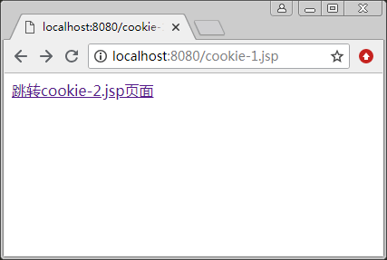
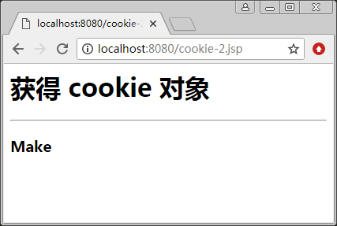

# EL 表达式内置对象 cookie

EL 表达式的 cookie 内置对象可以获取 cookie 的值。使用方法如下：

${cookie.Cookie 名称.value}

例如：

```
${cookie.username.value}
```

显示名称为 username 的 cookie 的值。

【例 1】获取 cookie 的值：

```
<!--cookie-1.jsp-->
<%@page contentType="text/html;charset=utf-8" %>
<html>
<body>
<%
    response.addCookie(new Cookie("username","Make"));
%>
<a href="cookie-2.jsp"/>跳转 cookie-2.jsp 页面
</body>
</html>
```

```
<!--cookie-2.jsp-->
<%@ page contentType="text/html;charset=utf-8" %>
<html>
<body>
<h1>获得 cookie 对象</h1>
<hr>
<h3>${cookie.username.value}</h3>
</body>
</html>
```

程序运行结果如图 1 和图 2 所示。


图 1 链接跳转到 cookie_2.jsp 页面

图 2 获取 cookie 的值