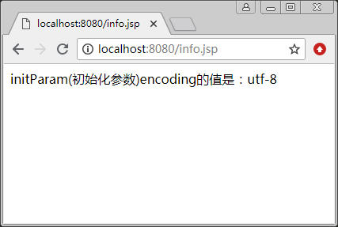

# EL 表达式内置对象 initParam

EL 表达式中的 initParam 内置对象可以获取 web.xml 文件中初始化参数的值 9 使用方法如下：

${initParam.参数名称}

例如：

```
${initParam.encoding}
```

表示获取 web.xml 中定义的参数 encoding 的值。

【例 1】获取 web.xml 文件中初始化参数的值。

先在 web.xml 文件中配置一个 encoding 参数，值是 utf-8，然后通过 ${initParam.encoding} 获得值。web.xml 文件中的内容如下：

```
<!DOCTYPE html PUBLIC "-//W3C//DTD XHTML 1.0 Transitional//EN" "http://www.w3.org/TR/xhtml1/DTD/xhtml1-transitional.dtd">
<html >
<head>
<meta http-equiv="Content-Type" content="text/html;charset=utf-8" />
<title>无标题文档</title>
</head>
<?xml version="1.0" encoding="UTF-8"?>
<web-app version="2.5" xmlns=http://java.sun.com/xml/ns/javaee
xmlns:xsi=http://www.w3.org/2001/XMLSchema-instance
xsi:schemaLocation=http://java.sun.com/xml/ns/javaee
http://java.sun.com/xml/ns/javaee/web-app_2_5.xsd />
<context-param>
<param-name>encoding</param-name >
<param-value>utf-8</param-value >
</context-param>
</web-app>
</html>
```

创建 initParam.jsp 文件：

```
<%@ page contentType="texthtml;charset=utf-8" pageEncoding="utf-8" %>
<%
response.setHeader("Content-Type", "text/html;charset=utf-8");
response.setCharacterEncoding("utf-8");
%>
<html>
<body>
    initParam(初始化参数)encoding 的值是：${initParam.encoding}
</body>
</html>
```

程序运行结果如图 1 所示。


图 1 获取 web.xml 文件中初始化参数的值