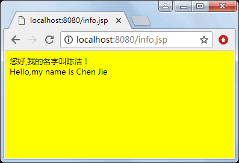

# 使用字节流读/写文件

Java 的 I/O 流提供了一条通道，这条通道可以把数据送给目的地。输入流的指向称作源，程序从指向源的输入流中读取源中的数据。输出流的指向是数据要去的目的地，程序通过向输出流中写入数据把信息传递到目的地。

Java.io 包提供了大量的流类，抽象类有四种：InputStream、OutputStream、Reader 和 Writer。称 InputStream 类及其子类对象为字节输入流类，称 OutputStream 类及其子类对象为字节输出流类，称 Reader 类及其子类对象为字符输入流类，称 Writer 类及及其子类对象为字符输出流类。

InputStream 类的常用方法：

*   int read()：输入流调用该方法从源中读取单个字节的数据，该方法返回字节值（0~255 之间的一个整数）。如果未读出字节就返回 -1。
*   int read(byte b[])：输入流调用该方法从源中试图读取 b.length 个字节到字节数组 b 中，返回实际读取的字节数目。如果到达文件的末尾，则返回 -1。
*   int read(byte b[],int off,int len)：输入流调用该方法从源中试图读取 len 个字节。如果到达文件的末尾，则返回 -1。
*   void close()：输入流调用该方法关闭输入流。
*   long skip(long numBytes)：输入流调用该方法跳过 numBytes 个字节，并返回实际跳过的字节。

OutputStream 类的常用方法：

*   voidwrite(int n)：输出流调用该方法向输出流写入单个字节。
*   void write(byte b[])：输出流调用该方法向输出流写入一个字节数组。
*   void write(byte b[],int off,int len)：从给定字节数组中起始于偏移量 off 处取 len 个字节写入到输出流。
*   void close()：关闭输出流。

FileInputStream 类和 FileOutputStream 类

FileInputStream 类是从 InputStream 类中派生出来的简单的输入流类。该类的所有方法都是从 InputStream 类继承的。为了创建 FileInputStream 类的对象，用户可以调用它的构造方法，如下：

1.  FileInputStream(String name)
2.  FileInputStream(File file)

第一个构造方法使用给定的文件名 name 创建一个 FileInputStream 对象。第二个构造方法使用 File 对象创建 FileInputStream 对象。参数 name 和 file 指定的文件称作输入流源，输入流通过调用 read 方法读出源中的数据。

FileInputStream 文件输入流，打开一个到达文件的输入流（源就是这个文件，输入流指向这个文件）。例如，为了读取一个名为 myfile.dat 的文件，建立一个文件输入流对象，如下所示：

```
try
{
    FilelnputStream istream=new FilelnputStream("myfile.dat");
}
catch(IOException e)
{
    System.out.println("File read error:"+e);
}
```

文件输入流构造方法的另一种格式是允许使用文件对象来指定要打开哪个文件，下面使用文件输入流构造方法建立一个文件输入流：

```
try
{
    File f=new File("myfile.dat");
    FileInputStream istream=new FileInputStream(f);
}
catch(IOException e)
{
    System.out.println("File read error:"+e);
}
```

#### 提示：

当使用文件输入流构造方法建立通往文件的输入流时，可能会出现异常。例如要打开的文件可能不存在。当出现 I/O 错误时，Java 会生成一个出错信号，它使用一个 IOException 对象来表示这个出错信号。

与 FilelnputStream 类相对应的类是 FileOutputStream 类。FileOutputStream 类提供基本的文件写入功能。除了从 OutputStream 类继承来的方法以外，FileOutputStream 类还有两个常用的构造方法，如下：

1.  FileOutputStream(String name)
2.  FileOutputStream(File file)

第一个构造方法使用给定的文件名 name 创建 FileOutputStream 对象。第二个构造方法使用 File 对象创建 FileOutputStream 对象。参数 name 和 file 指定的文件称作输出流的目的地，通过向输出流中写入数据把信息传递到目的地。创建输出流对象也能发生 IOException 异常，必须在 try、catch 块语句中创建输出流对象。

使用 FilelnputStream 的构造方法 FileInputStream(String name) 创建输入流时，以及使用 FileOutputStream 的构造方法 FileOutputStream(String name) 创建输出流时，如果参数仅仅是文件的名字（不带路径），就要保证参数表示的文件和当前应用程序在同一目录下，由于 JSP 引擎是在 bin 下启动执行的，所以文件必须在 bin 目录中。

## BufferedInputStream 类和 BufferedOutputStream 类

FileInputStream 流经常和 BufferedInputStream 流配合使用，FileOutputStream 流经常和 BufferedOutputStream 流配合使用。BufferedInputStream 类的一个常用的构造方法是 BufferedInputStream(InputStream in)，该构造方法创建缓存输入流。

当要读取一个文件，例如 A.txt 时，可以先建立一个指向该文件的文件输入流：

```
FileInputStream in=new FileInputStream("A.txt");
```

然后再创建一个指向文件输入流 in 的输入缓存流：

```
BufferedInputStream bufferRead=new BufferedInputStream(in);
```

这时，就可以让 bufferRead 调用 read 方法读取文件的内容。bufferRead 在读取文件过程中会进行缓存处理，提高读取的效率。

同样，当要向一个文件，例如 B.txt 写入时，可以先建立一个指向该文件的文件输出流：

```
FileOutputStream out=new FileOutputStream("B.txt");
```

然后再创建一个指向输出流 out 的输出缓存流：

```
BufferedOutputStream bufferWriter=new BufferedOutputStream(out);
```

这时，bufferWriter 调用 write 方法向文件写入内容时会进行缓存处理，提高写入的效率。注意写入完毕后须调用 flush 方法将缓存中的数据存入文件。

【例 1】将若干内容写入一个文件，然后读取这个文件，并将文件的内容显示给用户：

```
<%@page contentType="text/html;charset=utf-8" %>
<%@page import="java.io.*"%>
<html>
<body bgcolor=yellow>
<font size=2>
<%
    File dir=new File("D:/","Students");
    dir.mkdir();
    File f=new File(dir,"hello.txt");
    try
    {
        FileOutputStream outfile=new FileOutputStream("hello.txt");
        BufferedOutputStream bufferout=new BufferedOutputStream(outfile);
        byte b[]="您好,我的名字叫陈洁！<br>Hello,my name is Chen Jie".getBytes();
        bufferout.write(b);
        bufferout.flush();
        bufferout.close();
        outfile.close();
        FileInputStream in=new FileInputStream("hello.txt");
        BufferedInputStream bufferin=new BufferedInputStream(in);
        byte c[]=new byte[90];
        int n=0;
        while((n=bufferin.read(c))!=-1)
        {
            String temp=new String(c,0,n);
            out.print(temp);
        }
        bufferin.close();
        in.close();
    }
    catch(IOException e){}
%>
</font>
</body>
</html>
```

程序运行结果如图 1 所示。


图 1 使用字节流读/写文件