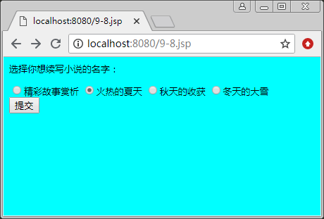
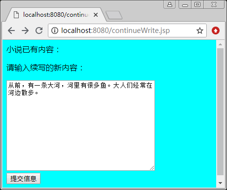
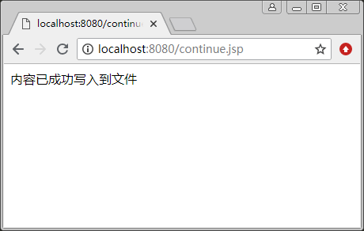

# RandomAccessFile 类

RandomAccessFile 类创建的流与前面的输入、输出流不同。RandomAccessFile 类既不是输入流类 InputStream 的子类，也不是输出流类 OutputStream 的子类。

RandomAccessFile 类创建的对象为一个流。RandomAccessFile 流的指向既可以作源，也可以作为目的地。当想对一个文件进行读/写操作时，可以创建一个指向该文件的 RandomAccessFile 流，这样既可以通过这个流读取文件的数据，也可以通过这个流在文件中写入数据。

RandomAccessFile 类的两个构造方法如下。

1.  RandomAccessFile(String name?String mode)：参数 name 用来确定一个文件名，给出创建的流源（也是流的目的地）。参数 mode 取“r”（只读）或“rw”（可读/写），决定创建的流对文件的访问权利。
2.  RandomAccessFile(File file?String mode)：参数 file 是一个 File 对象，给出创建的流的源（也是流的目的地）。参数 mode 取“r”（只读）或“rw”（可读/写），决定创建的流对文件的访问权利。创建对象时应捕获 IOException 异常。

RandomAccessFile 流对文件的读/写方式比前面学过的釆用顺序读/写方式的文件输入、输出流更为灵活。例如，RandomAccessFile 类中有一个方法 seek(long a)，该方法可以用来移动 RandomAccessFile 流在文件中的读/写位置，其中参数 a 确定读/写位置，即距离文件开 头的字节数目。另外，RandomAccessFile 流还可以调用 getFilePointer() 方法获取当前流在文件中的读/写位置。

RandomAccessFile 类的常用方法如下。

*   getFilePointer()：获取当前流在文件中的读/写位置。
*   length()：获取文件的长度。
*   readByte()：从文件中读取一个字节。
*   readDouble()：从文件中读取一个双精度浮点值（8 个字节）。
*   readlnt()：从文件中读取一个 int 值（4 个字节）。
*   readLine()：从文件中读取一个文本行。
*   readUTF()：从文件中读取一个 UTF 字符串。
*   seek(long a)：定位当前流在文件中的读/写位置。
*   write(byte b[])：写 b。length 个字节文件。
*   writeDouble(double v)：向文件写入一个双精度浮点值。
*   writelnt(int v)：向文件写入一个 int 值。
*   writeUTF(String s)：写入一个 UTF 字符串。

【例 1】网络创作小说已成为当下流行的趋势，有许多作者共同创建一部小说。当 A 写完一篇文章之后，B 在 A 创作的基础上继续写作。在服务器的某个目录下有 4 部小说，在小说的内容页面 9-8.jsp 选择一部小说的名字，然后链接到 continueWrite.jsp 页面。

continueWrite.jsp 页面显示了小说已有的内容，用户可以在该页写作并提交给 continue.jsp 页面。continue.jsp 页面负责将续写的内容存入文件。将 continue.jsp 页面的 isThreadSafe 属性值设置为 false，使得该页面同一时刻只能响应一个用户的请求，其他用户须排队等待。

9-8.jsp 的代码如下：

```
<%@page contentType="text/html;charset=utf-8"%>
<%@page import="java.io.*"%>
<html>
<body bgcolor=cyan>
<font size=2>
<%
    String str=response.encodeURL("continueWrite.jsp");
%>
<P>选择你想续写小说的名字：
<form action="<%=str%>" method=post name=form>
<input type="radio" name="R" value="spring.doc">精彩故事赏析
<input type="radio" name="R" value="summer.doc">火热的夏天
<input type="radio" name="R" value="autumn.doc">秋天的收获
<input type="radio" name="R" value="winter.doc">冬天的大雪
<br>
<input type=submit name="g" value="提交">
</form>
</font>
</body>
</html>
```

continueWrite.jsp 的代码如下：

```
<%@page contentType="text/html;charset=utf-8"%>
<%@page import="java.io.*"%>
<%@page info="story"%>
<html>
<body bgcolor=cyan>
<P>小说已有内容：
<Font size=2 Color=Navy>
<%
    String str=response.encodeURL("continue.jsp");
%>
<%--获取用户提交的小说的名字--%>
<%
    String name=(String)request.getParameter("R");
    if(name==null)
        name=" ";
    byte c[]=name.getBytes("utf-8");
    name=new String(c);
    session.setAttribute("name",name);
    String dir=getServletInfo();
    File storyFileDir=new File(dir);
    storyFileDir.mkdir();
    File f=new File(storyFileDir,name);
    //列出小说的内容
    try
    {
        RandomAccessFile file=new RandomAccessFile(f,"r");
        String temp=null;
        while((temp=file.readUTF())!=null)
        {
            byte d[]=temp.getBytes("utf-8");
            temp=new String(d);
            out.print("<br>"+temp);
        }
        file.close();
    }
    catch(IOException e){}
%>
</font>
<P>请输入续写的新内容：
<form action="<%=str%>" method=post name=form>
<textArea name="messages" rows="12" cols=40 wrap="physical"></textArea>
<br>
<input type="submit" value ="提交信息" name ="Submit">
</form>
</body>
</html>
```

continue.jsp 的代码如下：

```
<%@page contentType="text/html;charset=utf-8"%>
<%@page isThreadSafe="false"%>
<%@page import="java.io.*"%>
<%@page info="story"%>
<html>
<body>
<%!
    String writeContent(File f,String s)
    {
        try
        {
            RandomAccessFile out=new RandomAccessFile(f,"rw");
            out.seek(out.length());    //定位到文件的末尾
            out.writeUTF(s);
            out.close();
            return "内容已成功写入到文件";
        }
        catch(IOException e)
        {
            return "不能写入到文件";
        }
    }
%>
<%--获取用户提交的小说的名字--%>
<%
    String name=(String)session.getAttribute("name");
    byte c[]=name.getBytes("utf-8");
    name=new String(c);
    //获取用户续写的内容
    String content=(String)request.getParameter("messages");
    if(content==null)
    content=" ";
    String dir=getServletInfo();
    File storyFileDir=new File(dir);
    storyFileDir.mkdir();
    File f=new File(storyFileDir,name);
    String message=writeContent(f,content);
    out.print(message);
%>
</body>
</html>
```

9-8.jsp、continueWrite.jsp、continue.jsp 页面的运行效果如图 1 所示。


a) 9-8.jsp 的运行效果

b) continueWrite.jsp 的运行效果

c) continue.jsp 的运行效果
图 1 运行效果