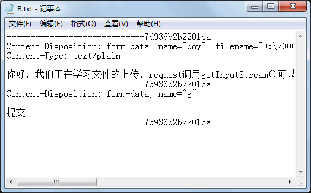
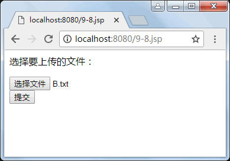
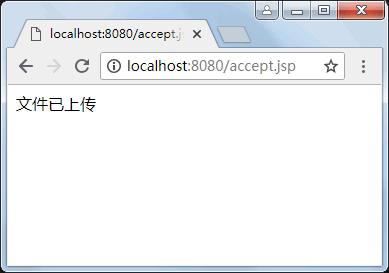

# JSP 文件上传

JSP 提供了上传和下载的功能，用户釆用此功能，可以轻松实现文件的传输。下面介绍文件上传与下载的操作。

用户通过一个 JSP 页面上传文件给服务器时，该 JSP 页面必须含有 File 类型的表单， 并且表单必须将 enctype 的属性值设置为 multipart/form-data。File 类型表单如下：

<form action="接受上传文件的页面" method="post" enctype="multipart/form-data">
<input type="File" name="picture">
</form>

JSP 引擎可以让内置对象 request 调用方法 getInputStream() 获得一个输入流，通过这输入流读入用户上传的全部信息，包括文件的内容以及表单域的信息。

【例 1】用户通过 9-9.jsp 页面上传文本文件 a.txt。request 获得一个输入流读取用户上传的全部信息，包括表单的头信息以及上传文件的内容；如何去掉表单的信息以及获取文件的内容。

在 accept.jsp 页面，内置对象 request 调用方法 getInputStream() 获得一个输入流 in，用 FileOutputStream 类再创建一个输出流 o。输入流 in 读取用户上传的信息，输出流 o 将读取的信息写入文件 B.txt。用户上传的全部信息，包括文件 a.txt 的内容以及表单域的信息存放于服务器的 C:/1000 目录下的 B.txt 文件中。文件 B.txt 的前 4 行（包括一个空行）以及倒数 5 行（包括一个空行）是表单域的内容，中间部分是上传文件 a.txt 的内容。

9-9.jsp 的代码如下：

```
<%@page contentType="text/html;charset=utf-8"%>
<html>
<body>
<P>选择要上传的文件：<br>
<form action="accept.jsp" method="post" engtype="multipart/form-data">
<input type=File name="boy" size="38">
<br>
<input type="submit" name="g" value="提交">
</form>
</body>
</html>
```

accept.jsp 的代码如下：

```
<%@page contentType="text/html;charset=utf-8" %>
<%@page import="java.io.*" %>
<html>
<body>
<%
    try
    {
        InputStream in=request.getInputStream();
        File dir=new File("D:/l000");
        dir.mkdir();
        File f=new File(dir,"B.txt");
        FileOutputStream o=new FileOutputStream(f);
        byte b[]=new byte[1000];
        int n;
        while((n=in.read(b))!=-1)
            o.write(b,0,n);
        in.close();
        out.print ("文件已上传");
    } 
    catch(IOException e)
    {
        out.print("上传失败"+e);
    }   
%>
</body>
</html>
```

B.txt、9-9.jsp 和 accept.jsp 的运行效果如图 1 所示。


a) B.txt 的内容

b) 9-9.jsp 的运行结果

c) accept.jsp 的运行结果
图 1 运行结果