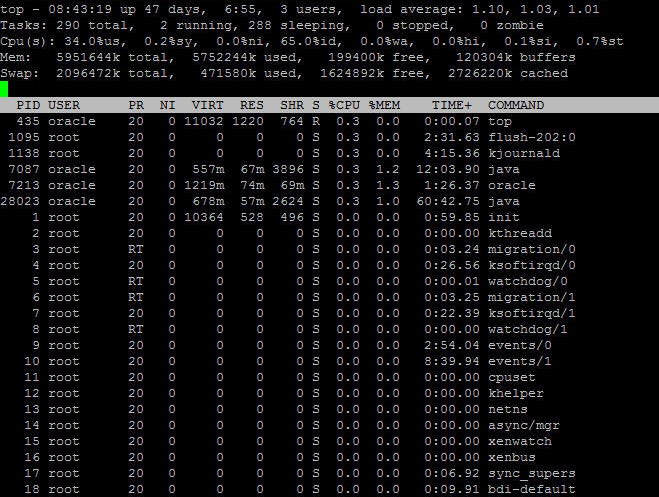

# Linux 进程管理

当我们运行程序时，Linux 会为程序创建一个特殊的环境，该环境包含程序运行需要的所有资源，以保证程序能够独立运行，不受其他程序的干扰。这个特殊的环境就称为进程。

每个 Linux 命令都与系统中的程序对应，输入命令，Linux 就会创建一个新的进程。例如使用 ls 命令遍历目录中的文件时，就创建了一个进程。

简而言之，进程就是程序的实例。

系统通过一个五位数字跟踪程序的运行状态，这个数字称为 pid 或进程 ID。每个进程都拥有唯一的 pid。

理论上，五位数字是有限的，当数字被用完时，下一个 pid 就会重新开始，所以 pid 最终会重复。但是，两个 pid 一样的进程不能同时存在，因为 Linux 会使用 pid 来跟踪程序的运行状态。

## 创建进程

有两种方式来创建进程：前台进程和后台进程。

#### 前台进程

默认情况下，用户创建的进程都是前台进程；前台进程从键盘读取数据，并把处理结果输出到显示器。

我们可以看到前台进程的运行过程。例如，使用 ls 命令来遍历当前目录下的文件：

```
$ls ch*.doc
ch01-1.doc   ch010.doc  ch02.doc    ch03-2.doc
ch04-1.doc   ch040.doc  ch05.doc    ch06-2.doc
ch01-2.doc   ch02-1.doc
```

这个程序就运行在前台，它会直接把结果输出到显示器。如果 ls 命令需要数据（实际上不需要），那么它会等待用户从键盘输入。

当程序运行在前台时，由于命令提示符($)还未出现，用户不能输入其他命令；即使程序需要运行很长时间，也必须等待程序运行结束才能输入其他命令。

#### 后台进程

后台进程与键盘没有必然的关系。当然，后台进程也可能会等待键盘输入。

后台进程的优点是不必等待程序运行结束就可以输入其他命令。

创建后台进程最简单的方式就是在命令的末尾加 &，例如：

```
$ls ch*.doc &
ch01-1.doc   ch010.doc  ch02.doc    ch03-2.doc
ch04-1.doc   ch040.doc  ch05.doc    ch06-2.doc
ch01-2.doc   ch02-1.doc
```

如果 ls 命令需要输入（实际上不需要），那么它会暂停，直到用户把它调到前台并从键盘输入数据才会继续运行。

## 查看正在运行的进程

可以使用 **ps** 命令查看进程的运行状态，包括后台进程，例如：

```
$ps
PID       TTY      TIME        CMD
18358     ttyp3    00:00:00    sh
18361     ttyp3    00:01:31    abiword
18789     ttyp3    00:00:00    ps
```

还可以结合 **-f** 选项查看更多信息，f 是 full 的缩写，例如：

```
$ps -f
UID      PID  PPID C STIME    TTY   TIME CMD
amrood   6738 3662 0 10:23:03 pts/6 0:00 first_one
amrood   6739 3662 0 10:22:54 pts/6 0:00 second_one
amrood   3662 3657 0 08:10:53 pts/6 0:00 -ksh
amrood   6892 3662 4 10:51:50 pts/6 0:00 ps -f
```

每列的含义如下：

| 列 | 描述 |
| UID | 进程所属用户的 ID，即哪个用户创建了该进程。 |
| PID | 进程 ID。 |
| PPID | 父进程 ID，创建该进程的进程称为父进程。 |
| C | CPU 使用率。 |
| STIME | 进程被创建的时间。 |
| TTY | 与进程有关的终端类型。 |
| TIME | 进程所使用的 CPU 时间。 |
| CMD | 创建该进程的命令。 |

ps 命令还有其他一些选项：

| 选项 | 说明 |
| -a | 显示所有用户的所有进程。 |
| -x | 显示无终端的进程。 |
| -u | 显示更多信息，类似于 -f 选项。 |
| -e | 显示所有进程。 |

## 终止进程

当进程运行在前台时，可以通过 **kill** 命令或 Ctrl+C 组合键来结束进程。

如果进程运行在后台，那么首先要通过 **ps** 命令来获取进程 ID，然后使用 **kill** 命令“杀死”进程，例如：

```
$ps -f
UID      PID  PPID C STIME    TTY   TIME CMD
amrood   6738 3662 0 10:23:03 pts/6 0:00 first_one
amrood   6739 3662 0 10:22:54 pts/6 0:00 second_one
amrood   3662 3657 0 08:10:53 pts/6 0:00 -ksh
amrood   6892 3662 4 10:51:50 pts/6 0:00 ps -f
$kill 6738
Terminated
```

如上所示，kill 命令终结了 first_one 进程。

如果进程忽略 kill 命令，那么可以通过 kill -9 来结束：

```
$kill -9 6738
Terminated
```

## 父进程和子进程

每个 Linux 进程会包含两个进程 ID：当前进程 ID(pid)和父进程 ID(ppid)。可以暂时认为所有的进程都有父进程。

由用户运行的大部分命令都将 Shell 作为父进程，使用 **ps -f** 命令可以查看当前进程 ID 和父进程 ID。

## 僵尸进程和孤儿进程

正常情况下，子进程被终止时会通过 SIGCHLD 信号通知父进程，父进程可以做一些清理工作或者重新启动一个新的进程。但在某些情况下，父进程会在子进程之前被终止，那么这些子进程就没有了“父亲”，被称为**孤儿进程**。

init 进程会成为所有孤儿进程的父进程。init 的 pid 为 1，是 Linux 系统的第一个进程，也是所有进程的父进程。

如果一个进程被终止了，但是使用 ps 命令仍然可以查看该进程，并且状态为 Z，那么这就是一个**僵尸进程**。僵尸进程虽然被终止了，但是仍然存在于进程列表中。一般僵尸进程很难杀掉，你可以先杀死他们的父进程，让他们变成孤儿进程，init 进程会自动清理僵尸进程。

## 常驻进程

常驻进程一般是系统级进程，以 root 权限运行在后台，可以处理其他进程的请求。

常驻进程没有终端，不能访问 /dev/tty 文件，如果使用 ps -ef 查看该进程，tty 这一列会显示问号(?)。

更确切地说，常驻进程通常运行在后台，等待指定事件发生，例如打印进程是一个常驻进程，它会等待用户输入打印相关的命令并进行处理。

## top 命令

top 命令是一个很有用的工具，它可以动态显示正在运行的进程，还可以按照指定条件对进程进行排序，与 Windows 的任务管理器类似。

top 命令可以显示进程的很多信息，包括物理内存、虚拟内存、CPU 使用率、平均负载以及繁忙的进程等。例如：

```
$top
```

这里仅给出一个示意图，读者最好亲自运行一下：



## 任务和进程

任务(task)是最抽象的，是一个一般性的术语，指由软件完成的一个活动。一个任务既可以是一个进程，也可以是多个进程。简而言之，它指的是一系列共同达到某一目的的操作。例如，读取数据并将数据放入内存中。这个任务可以由一个进程来实现，也可以由多个进程来实现。  每个任务都有一个数字表示的任务号。

进程(process)常常被定义为程序的执行。可以把一个进程看成是一个独立的程序，在内存中有其完备的数据空间和代码空间。一个进程所拥有的数据和变量只属于它自己。

**jobs** 命令可以用来查看系统中正在运行的任务，包括后台运行的任务。该命令可以显示任务号及其对应的进程 ID。一个任务可以对应于一个或者多个进程号。

jobs 命令的 -l 选项可以查看当前任务包含的进程 ID：

```
$jobs -l
[1] + 1903 running                 ls ch*.doc &
$
```

其中，第一列表示任务号，第二列表示任务对应的进程 ID，第三列表示任务的运行状态，第四列表示启动任务的命令。

## 前台任务和后台任务的切换

**fg** 命令可以将后台任务调到前台，语法为：

```
$fg %jobnumber
```

jobnumber 是通过 jobs 命令获取的后台任务的的序号，注意不是 pid。如果后台只有一个任务，可以不指定 jobnumber。

**bg** 命令可以将后台暂停的任务，调到前台继续运行，语法为：

```
$bg %jobnumber
```

jobnumber 同样是通过 jobs 命令获取的后台任务的的序号，注意不是 pid。如果前台只有一个任务，可以不指定 jobnumber。

如果希望将当前任务转移到后台，可以先 Ctrl+z 暂停任务，再使用 bg 命令。任务转移到后台可以空出终端，继续输入其他命令。