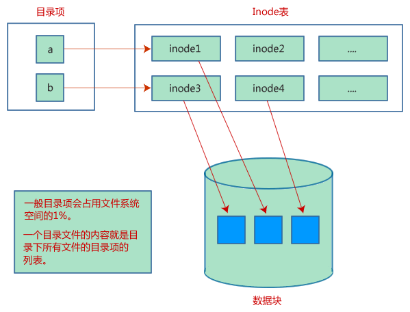

# Linux 文件存储结构，包括目录项、inode、数据块

大部分的 Linux 文件系统（如 ext2、ext3）规定，一个文件由目录项、inode 和数据块组成：

*   目录项：包括文件名和 inode 节点号。
*   Inode：又称文件索引节点，包含文件的基础信息以及数据块的指针。
*   数据块：包含文件的具体内容。

## 先说 inode

理解 inode，要从文件储存说起。文件储存在硬盘上，硬盘的最小存储单位叫做"扇区"（Sector），每个扇区储存 512 字节（相当于 0.5KB）。

操作系统读取硬盘的时候，不会一个扇区一个扇区地读取，这样效率太低，而是一次性连续读取多个扇区，即一次性读取一个"块"（block）。这种由多个扇区组成的"块"，是文件存取的最小单位。"块"的大小，最常见的是 4KB，即连续八个 sector 组成一个 block。

文件数据都储存在"块"中，那么很显然，我们还必须找到一个地方储存文件的元信息，比如文件的创建者、文件的创建日期、文件的大小等等。这种储存文件元信息的区域就叫做 inode，中文译名为"索引节点"。

inode 包含文件的元信息，具体来说有以下内容：

*   文件的字节数。
*   文件拥有者的 User ID。
*   文件的 Group ID。
*   文件的读、写、执行权限。
*   文件的时间戳，共有三个：ctime 指 inode 上一次变动的时间，mtime 指文件内容上一次变动的时间，atime 指文件上一次打开的时间。
*   链接数，即有多少文件名指向这个 inode。
*   文件数据 block 的位置。

可以用 stat 命令，查看某个文件的 inode 信息：

```
stat demo.txt
```

总之，除了文件名以外的所有文件信息，都存在 inode 之中。至于为什么没有文件名，下文会有详细解释。

当查看某个文件时，会先从 inode 表中查出文件属性及数据存放点，再从数据块中读取数据。

请看文件存储结构示意图：



#### inode 的大小

inode 也会消耗硬盘空间，所以硬盘格式化的时候，操作系统自动将硬盘分成两个区域。一个是数据区，存放文件数据；另一个是 inode 区（inode table），存放 inode 所包含的信息。

每个 inode 节点的大小，一般是 128 字节或 256 字节。inode 节点的总数，在格式化时就给定，一般是每 1KB 或每 2KB 就设置一个 inode。假定在一块 1GB 的硬盘中，每个 inode 节点的大小为 128 字节，每 1KB 就设置一个 inode，那么 inode table 的大小就会达到 128MB，占整块硬盘的 12.8%。

查看每个硬盘分区的 inode 总数和已经使用的数量，可以使用 df -i 命令。

查看每个 inode 节点的大小，可以用如下命令：

```
sudo dumpe2fs -h /dev/hda | grep "Inode size"
```

由于每个文件都必须有一个 inode，因此有可能发生 inode 已经用光，但是硬盘还未存满的情况。这时，就无法在硬盘上创建新文件。

#### inode 号码

每个 inode 都有一个号码，操作系统用 inode 号码来识别不同的文件。

这里值得重复一遍，Linux 系统内部不使用文件名，而使用 inode 号码来识别文件。对于系统来说，文件名只是 inode 号码便于识别的别称或者绰号。表面上，用户通过文件名，打开文件。实际上，系统内部这个过程分成三步：首先，系统找到这个文件名对应的 inode 号码；其次，通过 inode 号码，获取 inode 信息；最后，根据 inode 信息，找到文件数据所在的 block，读出数据。

使用 ls -i 命令，可以看到文件名对应的 inode 号码，例如：

```
ls -i demo.txt
```

## 目录项

Linux 系统中，目录（directory）也是一种文件。打开目录，实际上就是打开目录文件。

目录文件的结构非常简单，就是一系列目录项（dirent）的列表。每个目录项，由两部分组成：所包含文件的文件名，以及该文件名对应的 inode 号码。

ls 命令只列出目录文件中的所有文件名：

```
ls /etc
```

ls -i 命令列出整个目录文件，即文件名和 inode 号码：

```
ls -i /etc
```

如果要查看文件的详细信息，就必须根据 inode 号码，访问 inode 节点，读取信息。ls -l 命令列出文件的详细信息。

```
ls -l /etc
```

## 硬链接和软链接

#### 硬链接

一般情况下，文件名和 inode 号码是"一一对应"关系，每个 inode 号码对应一个文件名。但是，Linux 系统允许，多个文件名指向同一个 inode 号码。这意味着，可以用不同的文件名访问同样的内容；对文件内容进行修改，会影响到所有文件名；但是，删除一个文件名，不影响另一个文件名的访问。这种情况就被称为"硬链接"（hard link）。

ln 命令可以创建硬链接，语法为：

```
ln source_file target_file
```

运行上面这条命令以后，源文件与目标文件的 inode 号码相同，都指向同一个 inode。inode 信息中有一项叫做"链接数"，记录指向该 inode 的文件名总数，这时就会增加 1。反过来，删除一个文件名，就会使得 inode 节点中的"链接数"减 1。当这个值减到 0，表明没有文件名指向这个 inode，系统就会回收这个 inode 号码，以及其所对应 block 区域。

这里顺便说一下目录文件的"链接数"。创建目录时，默认会生成两个目录项："."和".."。前者的 inode 号码就是当前目录的 inode 号码，等同于当前目录的"硬链接"；后者的 inode 号码就是当前目录的父目录的 inode 号码，等同于父目录的"硬链接"。所以，任何一个目录的"硬链接"总数，总是等于 2 加上它的子目录总数（含隐藏目录）,这里的 2 是父目录对其的“硬链接”和当前目录下的".硬链接“。

#### 软链接

除了硬链接以外，还有一种特殊情况。文件 A 和文件 B 的 inode 号码虽然不一样，但是文件 A 的内容是文件 B 的路径。读取文件 A 时，系统会自动将访问者导向文件 B。因此，无论打开哪一个文件，最终读取的都是文件 B。这时，文件 A 就称为文件 B 的"软链接"（soft link）或者"符号链接（symbolic link）。

这意味着，文件 A 依赖于文件 B 而存在，如果删除了文件 B，打开文件 A 就会报错："No such file or directory"。这是软链接与硬链接最大的不同：文件 A 指向文件 B 的文件名，而不是文件 B 的 inode 号码，文件 B 的 inode"链接数"不会因此发生变化。

ln -s 命令可以创建软链接，语法为：

```
ln source_file target_file
```