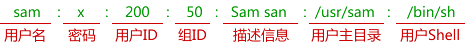

# Linux 用户管理

在 Linux 中，有三种用户：

*   Root 用户：也称为超级用户，对系统拥有完全的控制权限。超级用户可以不受限制的运行任何命令。Root 用户可以看做是系统管理员。
*   系统用户：系统用户是 Linux 运行某些程序所必须的用户，例如 mail 用户、sshd 用户等。系统用户通常为系统功能所必须的，不建议修改这些用户。
*   普通用户：一般用户都是普通用户，这些用户对系统文件的访问受限，不能执行全部 Linux 命令。

Linux 支持用户组，用户组就是具有相同特征的用户的集合。一个组可以包含多个用户，每个用户也可以属于不同的组。用户组在 Linux 中扮演着重要的角色，方便管理员对用户进行集中管理。

## 与用户和组有关的系统文件

与用户和组有关的系统文件：

| 系统文件 | 说明 |
| /etc/passwd | 保存用户名和密码等信息，Linux 系统中的每个用户都在/etc/passwd 文件中有一个对应的记录行。这个文件对所有用户都是可读的。 |
| /etc/shadow | /etc/shadow 中的记录行和/etc/passwd 中的相对应，他由 pwconv 命令根据/etc/passwd 中的数据自动产生，它的格式和/etc/passwd 类似，只是对密码进行了加密。并不是所有的系统都支持这个文件。 |
| /etc/group | 以记录行的形式保存了用户组的所有信息。 |

来看一下/etc/passwd 文件的结构：

```
$cat /etc/passwd
root:x:0:0:Superuser:/:
daemon:x:1:1:System daemons:/etc:
bin:x:2:2:Owner of system commands:/bin:
sys:x:3:3:Owner of system files:/usr/sys:
adm:x:4:4:System accounting:/usr/adm:
uucp:x:5:5:UUCP administrator:/usr/lib/uucp:
auth:x:7:21:Authentication administrator:/tcb/files/auth:
cron:x:9:16:Cron daemon:/usr/spool/cron:
listen:x:37:4:Network daemon:/usr/net/nls:
lp:x:71:18:printer administrator:/usr/spool/lp:
sam:x:200:50:Sam san:/usr/sam:/bin/sh
```

可以看到，/etc/passwd 文件中一行记录对应着一个用户，每行记录又被冒号分隔为 7 个字段，其格式和具体含义如下图所示：



对每个字段的说明：

| 字段 | 说明 |
| 用户名 | 用户名是惟一的，长度根据不同的 linux 系统而定，一般是 8 位。 |
| 密码 | 由于系统中还有一个/etc/shadow 文件用于存放加密后的口令，所以在这里这一项是“x”来表示，如果用户没有设置口令，则该项为空。如果 passwd 字段中的第一个字符是“*”的话，那么，就表示该账号被查封了，系统不允许持有该账号的用户登录。 |
| 用户 ID | 系统内部根据用户 ID 而不是用户名来识别不同的用户，用户 ID 有以下几种： 
*   0 代表系统管理员，如果你想建立一个系统管理员的话，可以建立一个普通帐户，然后将该账户的用户 ID 改为 0 即可。
*   1~500 系统预留的 ID。
*   500 以上是普通用户使用。

 |
| 组 ID | 其实这个和用户 ID 差不多，用来管理群组，与/etc/group 文件相关。 |
| 描述信息 | 这个字段几乎没有什么用，只是用来解释这个账号的意义。在不同的 Linux 系统中，这个字段的 格式并没有统一。在许多 Linux 系统中，这个字段存放的是一段任意的注释性描述文字，用做 finger 命令的输出。 |
| 用户主目录 | 用户登录系统的起始目录。用户登录系统后将首先进入该目录。root 用户默认是/，普通用户是/home/username。 |
| 用户 Shell | 用户登录系统时使用的 Shell。 |

## 管理用户和组

下面是一些常用的管理用户和组的命令：

| 命令 | 说明 |
| useradd | 添加用户。 |
| usermod | 修改用户信息。 |
| userdel | 删除用户。 |
| groupadd | 添加用户组。 |
| groupmod | 修改用户组信息。 |
| groupdel | 删除用户组。 |

#### 创建用户组

添加用户时，可以将用户添加到现有的用户组，或者创建一个新的用户组。可以在 /etc/groups 文件中看到所有的用户组信息。

默认的用户组通常用来管理系统用户，不建议将普通用户添加到这些用户组。使用 groupadd 命令创建用户组的语法为：

```
groupadd [-g gid [-o]] [-r] [-f] groupname
```

每个选项的含义如下：

| 选项 | 说明 |
| -g GID | 以数字表示的用户组 ID。 |
| -o | 可以使用重复的组 ID。 |
| -r | 建立系统组，用来管理系统用户。 |
| -f | 强制创建。 |
| groupname | 用户组的名称。 |

如果不指定选项，系统将使用默认值。例如创建一个 developers 用户组：

```
$ groupadd developers
```

#### 修改用户组

groupmod 命令可以用来修改用户组，语法为：

```
$ groupmod -n new_modified_group_name old_group_name
```

例如，将用户组 developers_2 重命名为 developer：

```
$ groupmod -n developer developer_2
```

将 developer 用户组的 ID 改为 545：

```
$ groupmod -g 545 developer
```

#### 删除用户组

通过 groupdel 命令可以删除用户组。例如，删除 developer 组：

```
$ groupdel developer
```

groupdel 仅仅删除用户组，并不删除与之相关的文件，这些文件仍然可以被所有者访问。

#### 添加用户

添加用户可以使用 useradd 命令，语法为：

```
useradd -d homedir -g groupname -m -s shell -u userid accountname
```

每个选项的含义如下：

| 选项 | 描述 |
| -d homedir | 指定用户主目录。 |
| -g groupname | 指定用户组。 |
| -m | 如果主目录不存在，就创建。 |
| -s shell | 为用户指定默认 Shell。 |
| -u userid | 指定用户 ID。 |
| accountname | 用户名。 |

如果不指定任何选项，系统将使用默认值。useradd 命令将会修改 /etc/passwd、/etc/shadow、and /etc/group 三个文件，并创建用户主目录。

下面的例子将会添加用户 mcmohd，并设置主目录为 /home/mcmohd，用户组为 developers，默认 Shell 为  Korn Shell：

```
$ useradd -d /home/mcmohd -g developers -s /bin/ksh mcmohd
```

注意：添加用户前请确认 developers 用户组存在。

用户被创建后，可以使用 passwd 命令来设置密码，例如：

```
$ passwd mcmohd20
Changing password for user mcmohd20.
New Linux password:******
Retype new UNIX password:******
passwd: all authentication tokens updated successfully.
```

注意：如果你是管理员，输入 $ passwd username 可以修改你所管理的用户的密码；否则只能修改你自己的密码（不需要提供 username）。

#### 修改用户

usermod 命令可以修改现有用户的信息。usermod 命令的选项和 useradd 相同，不过可以增加 -l 选项来更改用户名。

下面的例子将用户 mcmohd 的用户名修改为 mcmohd20，主目录修改为 /home/mcmohd20：

```
$ usermod -d /home/mcmohd20 -m -l mcmohd mcmohd20
```

#### 删除用户

userdel 命令可以用来删除现有用户。userdel 是一个危险的命令，请谨慎使用。

userdel 命令仅有一个选项 -r，用来删除用户主目录和本地邮件。例如，删除用户  mcmohd20：

```
$ userdel -r mcmohd20
```

为了便于恢复被误删的用户，可以忽略 -r 选项，保留用户主目录，之后确认无误可以随时删除主目录。