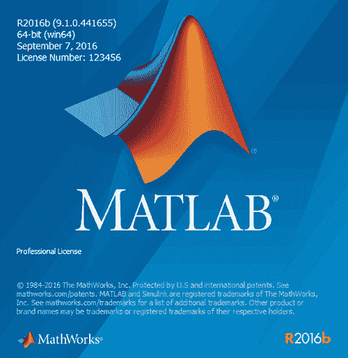

# MATLAB 是什么？

> 原文：[`c.biancheng.net/view/6595.html`](http://c.biancheng.net/view/6595.html)

MATLAB 是一种商业数学软件，用于算法开发、数据可视化、数据分析以及数值计算的科学计算语言和编程环境，主要包括 MATLAB 和 Simulink 两大部分。

MATLAB 的名字取自矩阵实验室（Matrix Laboratory），是由美国 MathWorks 公司发布的主要面对科学计算、可视化以及交互式程序设计的高科技计算系统。

MATLAB 将数值分析、矩阵计算、科学数据可视化以及非线性动态系统的建模和仿真等诸多强大功能集成在一个易于使用的视窗环境中，为科学研究、工程设计以及必须进行有效数值计算的众多科学领域提供了一种全面的解决方案，并在很大程度上摆脱了传统非交互式程序设计语言的编辑模式，代表了当今国际科学计算软件的先进水平。

MATLAB 包括命令控制、可编程，有上百个预先定义好的命令和函数，这些函数能通过用户自定义函数进一步扩展。

MATLAB 有许多强有力的命令。例如，MATLAB 能够用一个单一的命令求解线性系统，能完成大量的高级矩阵处理。

MATLAB 有强有力的二维、三维图形工具。

MATLAB 能与其他程序一起使用。例如，MATLAB 的图形功能，可以在一个 C 语言程序中完成可视化计算。

此外，有众多不同的 MATLAB 工具箱可应用于特殊的应用领域。

在下面的领域里，MATLAB 是解决各种问题十分有效的一个工具。

*   工业研究与开发。
*   数学教学，特别是线性代数，几乎所有基本概念都能涉及。
*   数值分析和科学计算方面的教学与研究。
*   电子学、控制理论和物理学等工程和科学学科方面的教学与研究。
*   经济学、化学和生物学等有计算问题的其他领域中的教学与研究。

下图为 MATLAB 的启动界面。

## MATLAB 语言的特点

MATLAB 的突出特点就是简洁。MATLAB 用更直观的、符合人们思维习惯的代码，代替了 C 和 FORTRAN 语言的冗长代码，给用户带来的是最直观、最简洁的程序开发环境。

以下简单介绍 MATLAB 的主要特点：

1) 运算符丰富。由于 MATLAB 是用 C 语言编写的，因此 MATLAB 提供了与 C 语言几乎一样多的运算符。灵活使用 MATLAB  运算符，将使程序变得极为简短。

2) 语言简单易学，容易使用，库函数及其丰富。MATLAB 程序书写形式自由，利用其丰富的库函数避开繁杂的子程序编程任务，可以压缩一切不必要的编程工作。库函数都由本领域的专家编写，用户不必担心函数的可靠性。

3) 既具有结构化的控制语句，又具有面向对象编程的特性。

4) 程序限制不严格，程序设计自由度大。例如，在 MATLAB 里，用户无须对矩阵预定义即可食用。

5) 程序的可移植性很好。基本上不做修改就可以在各种型号的计算机和操作系统上运行。

6) 图形功能强大。在 MATLAB 里，数据的可视化非常简单。MATLAB 还具有较强的编辑图形界面的能力。

7) 功能强大的工具箱。

8) 源程序的开放性。开放性也许是 MATLAB 最受人们欢迎的特点。除了内部函数以外，所有 MATLAB 的核心文件和工具箱文件都是可读可改的源文件，用户可通过对源文件的修改以及加入自己的文件构成新的工具箱。

9) 程序运行速度较慢。与其他高级程序相比，MATLAB 程序的执行速度较慢。由于 MATLAB 程序不用编译等预处理，也不生成可执行文件，程序为解释执行，所以速度较慢。
MATLAB