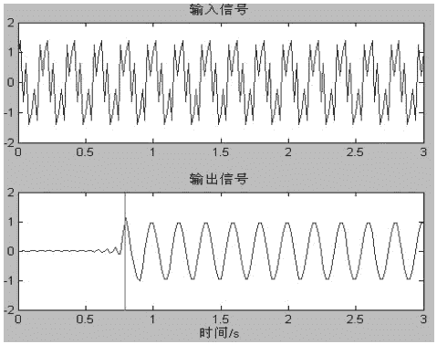
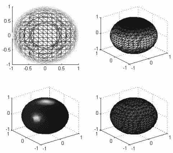
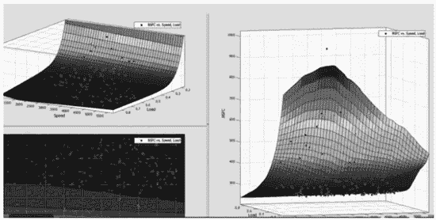

# MATLAB 的应用领域

> 原文：[`c.biancheng.net/view/6618.html`](http://c.biancheng.net/view/6618.html)

MATLAB 的应用领域十分广阔，从 MATLAB 拥有几十个工具箱也可以看出这一点。

MATLAB 的典型应用有：

*   数据分析
*   数值与符号计算
*   工程与科学绘图
*   控制系统设计
*   航天工业
*   汽车工业
*   生物医学工程
*   语音处理
*   图像与数字信号处理
*   财务、金融分析
*   建模、仿真及样机开发
*   新算法研究开发
*   图形用户界面设计

下图是 MATLAB 在数字信号处理中的应用举例。

下图是 MATLAB 用于绘制三维图形举例。

下图是 MATLAB 在科学计算中的应用举例。
上面这 3 个图展现了 MATLAB 不同的应用领域和强大的绘图功能。