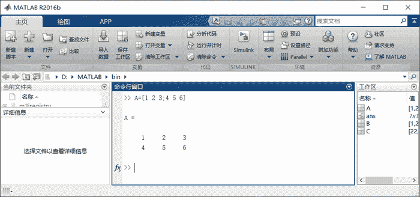
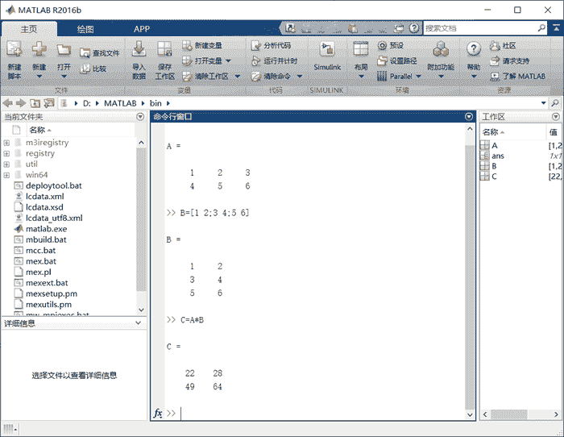

# 直接使用 MATLAB 命令（交互式编程）

> 原文：[`c.biancheng.net/view/6607.html`](http://c.biancheng.net/view/6607.html)

上图是 MATLAB 的工作界面，我们可以在“命令行窗口”中直接输入 MATLAB 命令，然后可以立即观察执行结果。

用户每输入一个命令，MATLAB 都会立即给一个执行结果，好像我们在和 MATLAB 交流，这种编程方式称为“交互式编程”。

本节我们使用 MATLAB 命令来完成以下两个矩阵的相乘操作。
在 MATLAB“命令行窗口”的命令提示符`>>`后，可直接输入 MATLAB 命令。

首先输入`A=[1 2 3;4 5 6]`，表示一个 2 行 3 列的矩阵（行内元素之间用空格隔开，相邻行元素之间用分号隔开，符号均用半角）。

接着输入`B=[1 2; 3 4; 5 6]`，它表示一个 3 行 2 列的矩阵；然后输入`C=A*B`，回车即可得到两个矩阵相乘的结果。

完整的过程如下图所示。

你看，通过 MATLAB 学习过线性代数，是不是觉得很方便呢？它简直是一个超级强大的科学计算器。