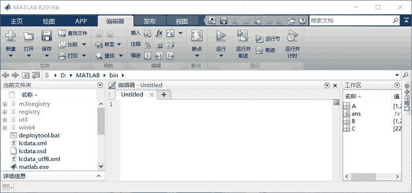
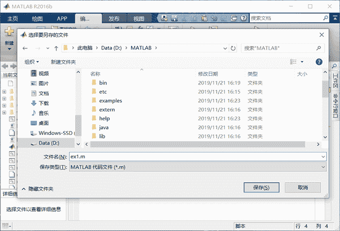
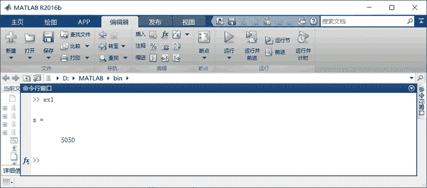
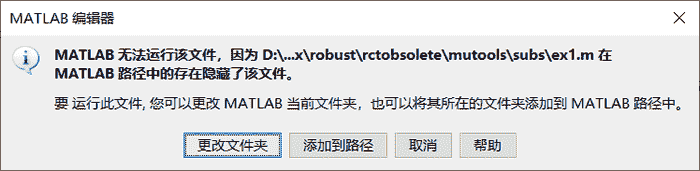
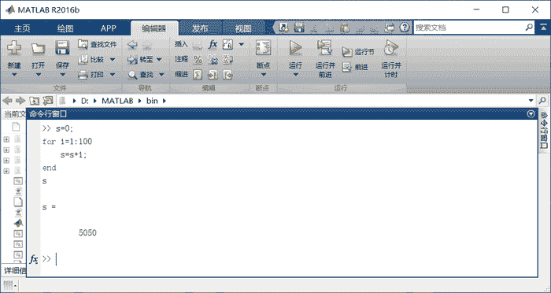

# 一个简单的 MATLAB 程序（1 到 100 求和）

> 原文：[`c.biancheng.net/view/6608.html`](http://c.biancheng.net/view/6608.html)

MATLAB 的程序文件是扩展名为`.m`的 M 文件，M 文件有脚本 M 文件和函数 M 文件两种。脚本 M 文件是比较简单的程序文件，仅是一串按用户意图排列而成的 MATLAB 命令集合。

在 MATLAB 的工作界面，单击左上角的“新建脚本”图标，新建一个脚本文件，会弹出下图所示的脚本文件编辑器窗口。在这个编辑器窗口中可以输入脚本文件代码。


在编辑器窗口中输入以下程序：

```

s=0;
for i=1:100
    s=s+i;
end
s
```

程序的功能是计算 1+2+...+100 的和，程序用到了一个 for 循环结构，基本语句比较简单，稍有编程基础的同学很容易明白。

语句后面加`;`的作用是：程序运行时不在命令行窗口显示改行的运算结果。

单击“保存”按钮，会弹出下图所示的对话框。

将文件取名为 ex1.m。可以选择保存文件的文件夹位置（本节中文件保存的位置为“D:\MATLAB\bin”），然后单击“保存”按钮，则文件保存成功。

之后可以单击“运行”按钮，程序运行结果在命令行窗口中显示，如下图所示。


如果运行后出现如下图所示的对话框，说明所设置的存储位置不包含在 MATLAB 的搜索路径中，此时单击“添加到路径”选项，就可以顺利运行程序了。


实际上，对于不长的程序，可以直接在 MATLAB 的命令行窗口中运行。例如，将 ex1.m 程序的内容复制到命令行窗口，然后敲回车，运行结果如下图所示。

