# MATLAB R2016b 下载、安装及破解教程

> 原文：[`c.biancheng.net/view/6611.html`](http://c.biancheng.net/view/6611.html)

本节以 MATLAB  R2016b 版本为例，实现软件的下载、安装以及破解。

安装过程中的注意事项如下（非常重要）：

*   杀毒软件：安装前一定要把各种杀毒软件，尤其是 360，电脑管家，毒霸之类的，为了保险起见，最好把其他不相干的软件也全都关闭。
*   权限问题：解压文件、复制粘贴时一定要注意权限问题，有的人用的是 administrator 管理员账户，有的人用的是普通管理员账户，必要时要选择以管理员权限去进行操作。
*   路径问题：matlab 的安装路径建议使用默认值，另外不管安装什么软件，都建议路径中尽量不要出现中文、空格、点号等各种特殊符号。
*   网络问题：整个安装过程需要在无网的环境下进行，所以请拔掉网线，断开无线，否则安装可能会失败。

## MATLAB 下载

MATLAB 百度网盘下载地址：

*   链接：[`pan.baidu.com/s/1ZQQMnS7FLk6FCMT-2ibXkQ`](https://pan.baidu.com/s/1ZQQMnS7FLk6FCMT-2ibXkQ)
*   提取码：xk9n 

1) 通过上面网盘下载下来的安装包是一个压缩文件，里面共有 3 个文件，将它们全部解压出来：

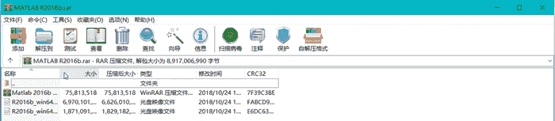
2) 把那两个光盘映像文件（.iso 文件）全部解压出来，切记，这两个映像文件要解压到同一个文件夹中，否则后面安装的时候会出问题。

例如我将其解压到 R2016b_win64 这个文件夹中，解压合并之后应该是这个样子的：

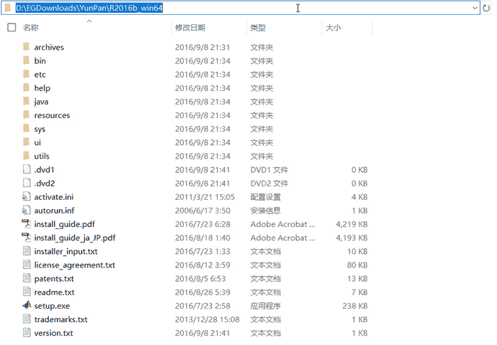
另外一个压缩文件也要解压出来，里面的东西接下来我们会用到。

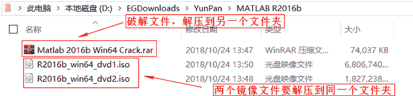

## MATLAB 安装

1) 双击 setup.exe 文件开始安装了。

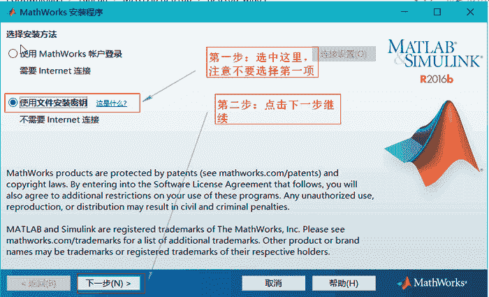
 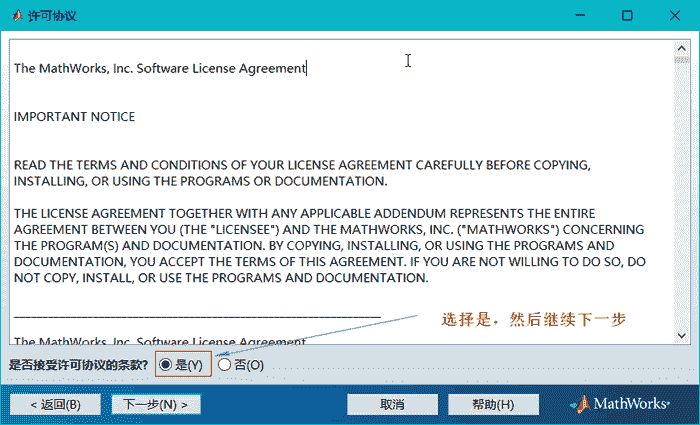
 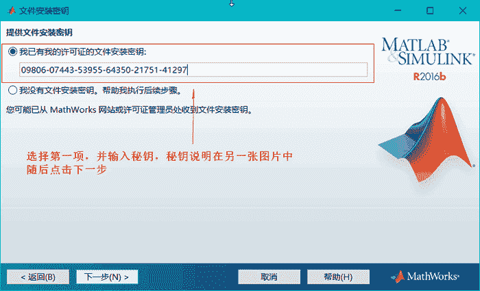
2) 这里输入的秘钥：`09806-07443-53955-64350-21751-41297` 在破解文件里有。

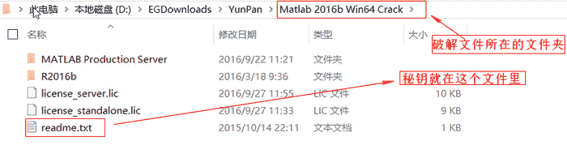
 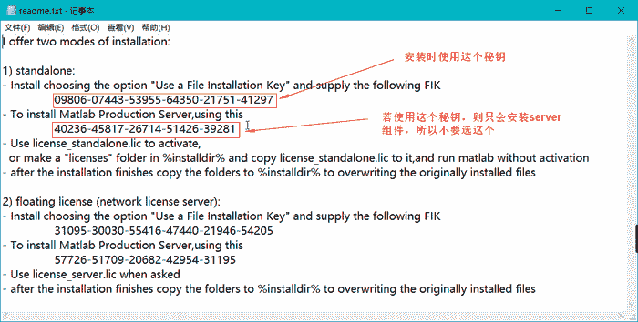
 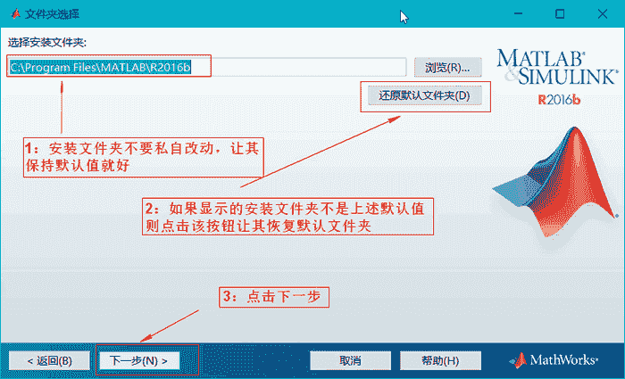
这里要强调一下，安装文件夹最好选择默认目录，如果你不是特别懂电脑最好不要私自改动这个目录，否则安装时会出现一些莫名其妙的问题，如果非要改这个路径，最好保证路径中没有中文字符，不包含空格，不包含各种奇奇怪怪的符号等。

3) 搞定路径后就可以继续下一步了，这里记住你的安装路径，后面找文件还需要它。

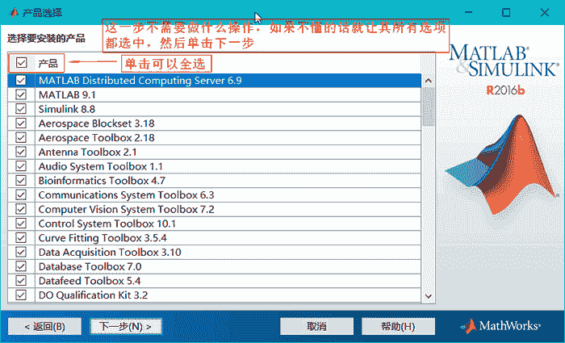
 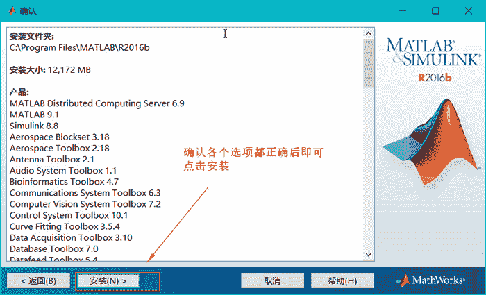
 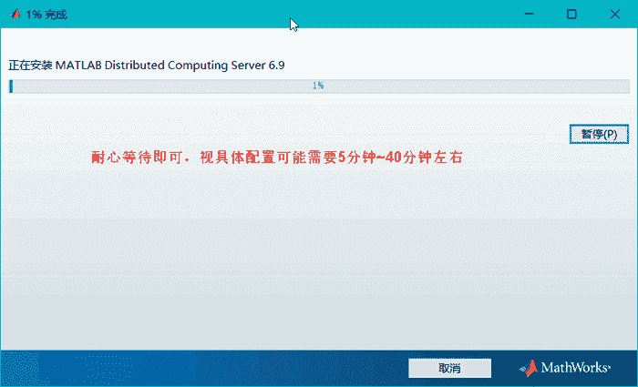

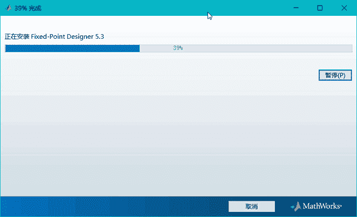

## MATLAB 破解

1) 到这一步就算是基本安装好了，剩下的就是破解了，这里的说明不需要理会，直接单击下一步就好。

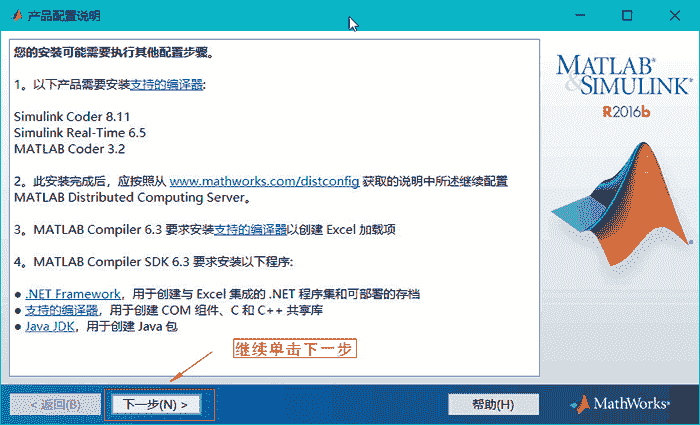
 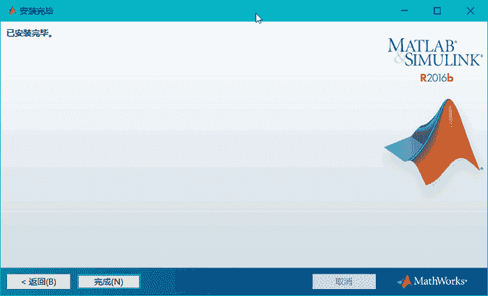
软件已经安装完成，但此时桌面上并没有快捷方式，所以我们需要把 MATLAB 的启动快捷方式发送到桌面上，首先找到你的安装目录，一般都是 C:\Program Files\MATLAB，然后在里面找这个文件夹：R2016b\bin。

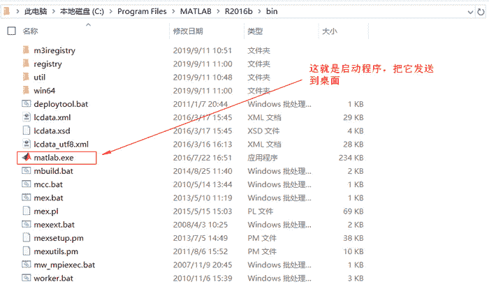
 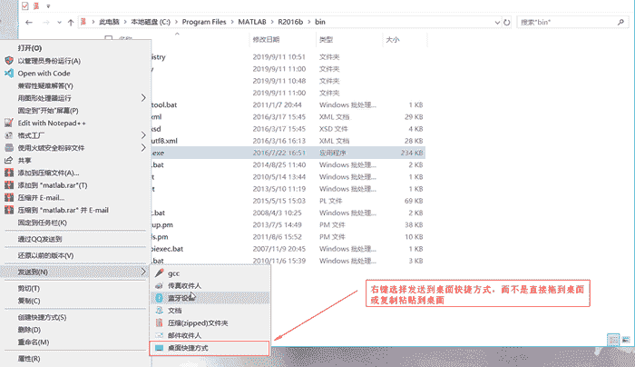
很多人都喜欢直接拖拽或者复制这个文件，这样拖拽出去很多时候都是用不了的，记得要按上图所示的用右键选择发送到桌面快捷方式

2) 桌面图标有了，但现在这软件还用不了，因为此时我们还没有进行破解，现在双击快捷方式打开会出现软件激活的窗口，我们的破解工作就在这个窗口里进行：

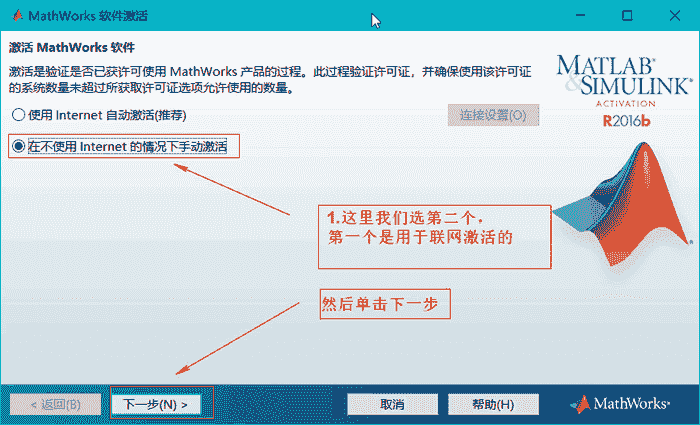
3) 现在，回到我们的破解文件夹。

下图中有两个`.lic`文件，我们后面要使用第二个文件。现在，请记住这个文件的路径。

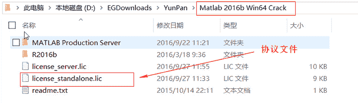
现在，回到 MATLAB 的离线激活窗口，先选择第一项：输入许可证文件的完整路径，之后右边的浏览按钮就变成可用状态了，单击浏览按钮找到我们上图中圈出来的那个 license_standalone.lic 文件，选择好许可证文件后下方的下一步按钮会变亮，我们直接单击它进行下一步就好。

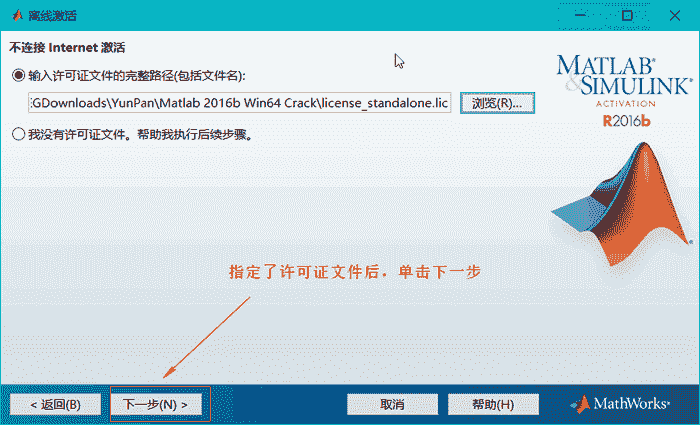
 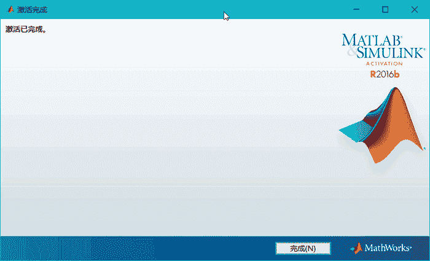
单击完成按钮后，激活工作完成，但现在依然不能使用 matlab，如果现在直接双击 matlab.exe 快捷方式打开是会报错的，就像这样：

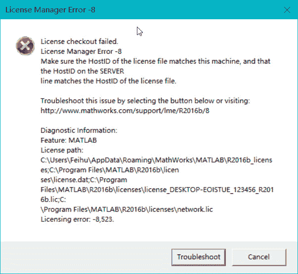
4) 接下来找到我们的破解文件夹，找到这个目录：Matlab 2016b Win64 Crack\MATLAB Production Server\R2016b\bin\win64，这个目录里有 4 个 dll 文件，我们把这 4 个动态链接库文件全部右键复制。

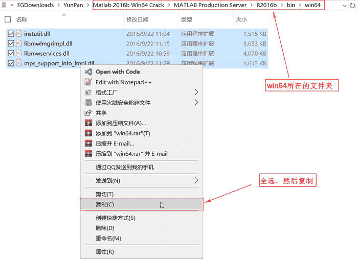
接下来，我们找到 MATLAB 的安装目录，现在它应该被安装在了这个目录：C:\Program Files\MATLAB，在这个目录里，我们继续找这样一个目录：R2016b\bin\win64，嫌麻烦的话可以在地址栏里直接粘贴  C:\Program Files\MATLAB\R2016b\bin\win64，然后回车，会直接进入 win64 目录。

注意：这个 win64 目录是你安装的 matlab 里的目录，可不是破解文件夹里的 win64 目录，不要搞错了。

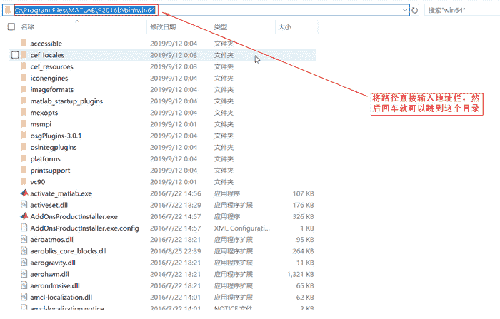
然后粘贴我们刚才复制的那 4 个 dll 文件。

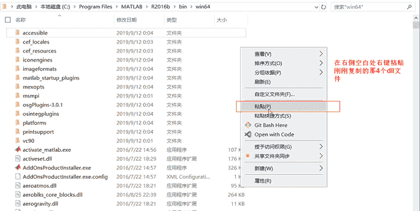
当粘贴过去之后，不出意外应该会弹出一个文件冲突的弹窗：如果没有出现这个弹窗，或提示冲突文件的数量不是如图所示的那样，那么很可能是你 matlab 安装的有问题，建议你好好检查一下前面几步有没有问题。

现在，直接单击替换目标中的文件，就完成了破解的最后一步。

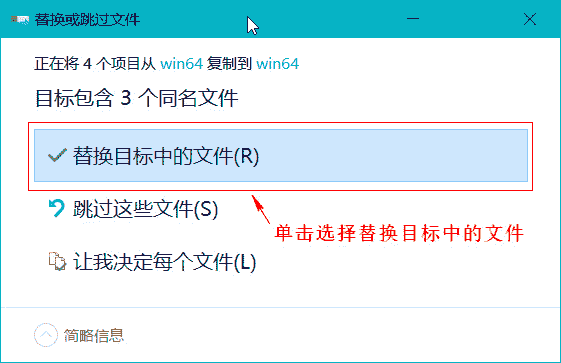
5) 至此，破解安装完毕，现在双击打开桌面上的 matlab.exe 快捷方式，就可以使用这款软件了。

 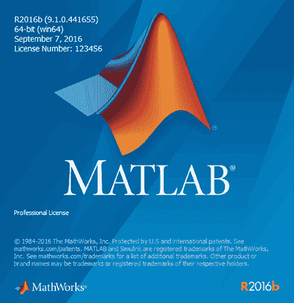
 