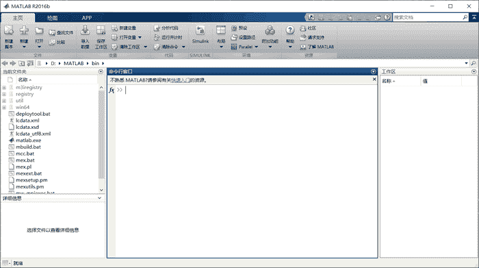

# MATLAB 的启动、退出和卸载

> 原文：[`c.biancheng.net/view/6613.html`](http://c.biancheng.net/view/6613.html)

本节将讲解 MATLAB 的启动、退出和卸载的详细过程。

## 启动

启动 MATLAB 软件需要执行的是安装路径“C:\Program Files\MATLAB\R2016b\bin\”下的 matlab.exe 文件。

为了方便运行，选中该文件，单击鼠标右键，可将该文件“固定到任务栏”，或单击鼠标右键 → 发送到 → 桌面快捷方式。上节下载和安装 MATLAB 中已经将软件快捷方式放到了桌面上。

MATLAB 启动后，将显示如下图所示的工作界面，用户可与 MATLAB 系统进行交互操作。

## 退出

想要退出 MATLAB 环境，可以使用以下任何一种方式：

1.  在 MATLAB 的命令行窗口输入`exit`命令。
2.  在 MATLAB 的命令行窗口输入`quit`命令。
3.  直接单击 MATLAB 直接面右上角的“关闭”按钮。

## 卸载

下载 MATLAB R2016b 时，需要执行安装路径“C:\Program Files\MATLAB\R2016b\uninstall\bin\win64”下的可执行文件“uninstall.exe”。

另一种方法就是使用本机自带的卸载操作：找到控制面板，然后单击卸载程序。