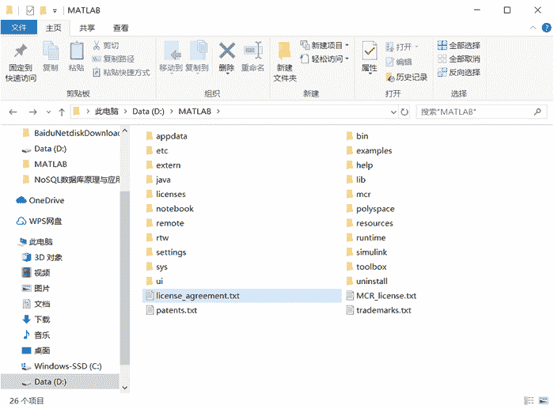

# MATLAB R2016b 的目录结构

> 原文：[`c.biancheng.net/view/6614.html`](http://c.biancheng.net/view/6614.html)

当用户在电脑上安装了 MATLAB R2016b 之后，在用户自定义的安装目录内便包含一系列的文件和文件夹。如下图所示。

主要文件和主要文件夹的用途如下说明：

| 文件夹 | 说明 |
| \bin\win64 | MATLAB R2016b 系统中可执行的相关文件。 |
| \extern | 创建 MATLAB R2016b 的外部程序接口工具。 |
| \help | 帮助系统。 |
| \java | MATLAB R2016b 的 Java 支持程序。 |
| \notebook | 用来实现 MATLAB 工作环境与 Word 软件之间的交互，从而可以在 Word 中方便地使用 MATLAB 的有关功能。 |
| \rtw | Real-timeWorkshop 软件包。 |
| \simulink | Simulink 软件包，用于动态系统的建模、仿真与分析。 |
| \sys | 存储 MATLAB R2016b 需要的工具和操作系统库文件。 |
| \toolbox | MATLAB R2016b 提供的各种应用程序。 |
| \uninstall | MATLAB R2016b 的卸载程序。 |
| \license_agreement.txt | 软件许可协议的内容。 |
| \patents.txt | 存储 MathWorks 公司产品在各个国家获得的专利号码。 |