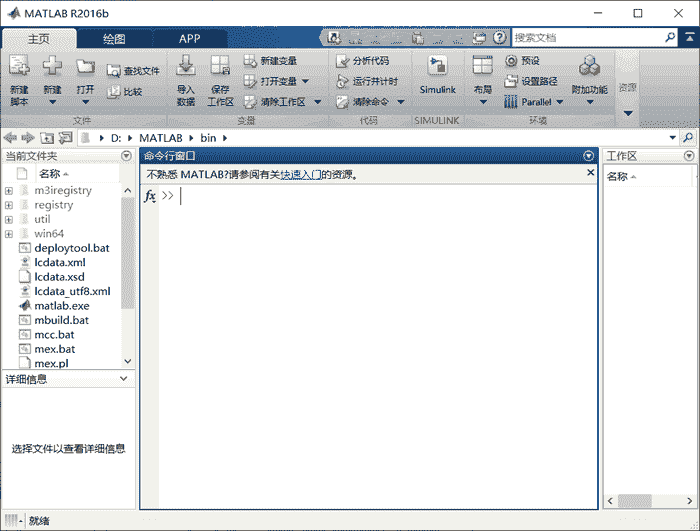
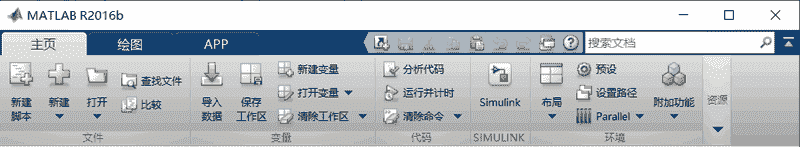
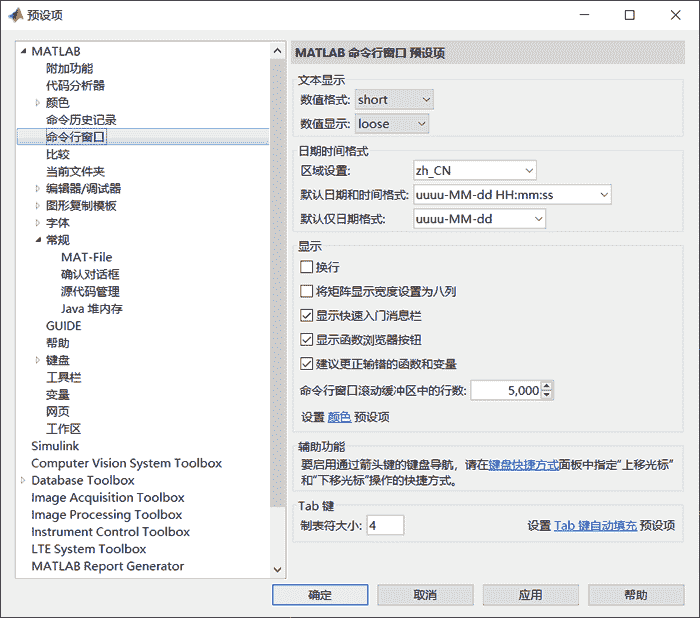
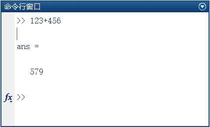
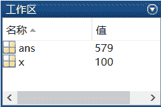
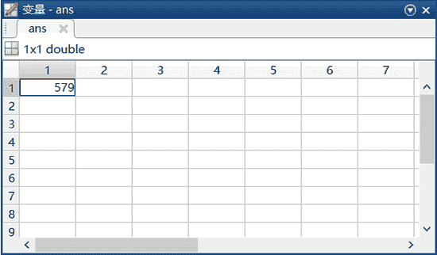
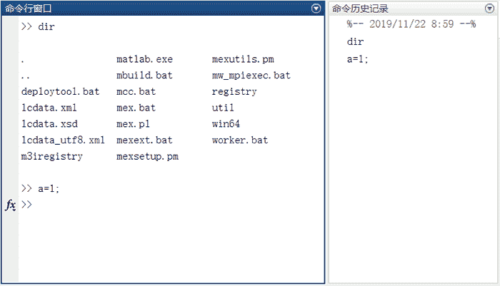

# MATLAB R2016b 工作界面详解

> 原文：[`c.biancheng.net/view/6616.html`](http://c.biancheng.net/view/6616.html)

MATLAB 启动后，将显示如下图所示的启动界面，它表示 MATLAB 系统已建立，用户可与 MATLAB 系统进行交互操作。

## 启动界面

MATLAB 的工作界面主要由菜单工具栏、当前工作目录窗口（Current Directory）、工作区窗口（Workspace）、命令历史记录窗口（Command History）和命令行窗口（Command Window）组成，如下图所示。

## 菜单工具栏

MATLAB 的菜单工具栏界面与 Windows 程序的界面类似，用户只要稍加实践就可以掌握其功能和使用方法。下图为 MATLAB 的菜单工具栏。

MATLAB 的菜单工具栏包含 3 个标签，分别是主页、绘图和 APP（应用程序）。

其中，绘图标签提供数据的绘图功能；APP 标签提供了 MATLAB 涵盖的各工具箱的应用程序入口；主页标签提供了下面主要功能。

*   新建脚本：用于建立新的 .m 文件。
*   新建：用于建立型的 .m 文件、图形、模型和图形用户界面。
*   打开：用于打开 MATLAB 的 .m 文件、.fig 文件、.mat 文件、.mdl 文件、.cdr 文件等，也可通过快捷键`Ctrl+O`来实现此操作。
*   导入数据：用于从其他文件导入数据，单击后弹出对话框，选择导入文件的路径和位置。
*   保存工作区：用于把工作区的数据存放到相应的路径文件之中。
*   设置路径：用于设置路径。
*   帮助：打开帮助文件或其他帮助方式。
*   预设：用于设置命令行窗口的属性，也可设置界面的字体、颜色、工具栏项目等内容。单击该按钮，会弹出如下图所示的属性界面。

## 命令行窗口

命令行窗口是 MATLAB 非常重要的窗口，用户可以在此输入各种指令、函数和表达式等，如下图所示。

>>为运算提示符，表示 MATLAB 处于准备状态。在该窗口中，用户可以运行函数，执行 MATLAB 的基本操作命令，以及对 MATLAB 系统的参数进行设置等。

MATLAB 具有良好的交互性，当在提示符后输入一段正确的运算式时，只需按“Enter”键，命令行窗口中就会直接显示运算结果。

在 MATLAB 命令行窗口中运行的所有命令都共享一个相同的工作区，所以它们共享所有的变量。对此特点，初学者应当予以重视。

当单击命令行窗口右上角的图标时，可以对命令行窗口进行清除、全选、查找、打印、页面设置、最大化、最小化以及取消停靠等操作，其中，取消停靠可以使命令行窗口脱离 MATLAB 界面成为一个对老的窗口。同理，单击独立的命令行窗口右上角的图标并选择“停靠”，可使命令行窗口再次合并到 MATLAB 主界面中。

## 工作区

工作区窗口是 MATLAB 的重要组成部分，工作区显示当前内存中所有的 MATLAB 变量的变量名、数据结构、字节数以及数据类型等信息。

例如，表达式 x=100 产生了一个名为 x 的变量，而且这个变量 x 被赋予值 100，这个值就被存储在计算机的内存中。

在 MATLAB 中不同的变量类型对应不同的变量名图标，如下图所示。在命令行窗口中运行的所有命令都共享一个相同的工作区，所以它们共享所有的变量。

在工作区窗口中，用鼠标双击所选变量则进入数组编辑器（Array Editor）如下图所示。

此时用户可以对变量的内容、维数等进行修改。在工作区选择某变量后，再单击鼠标右键可以完成对该变量的复制、重命名和删除等操作，甚至可以完成基于该变量的曲线或曲面绘制工作。

## 命令历史记录窗口

命令历史记录窗口用于记录已经在命令行窗口输入过的表达式和命令，当需要再次输入这些命令时，可以直接在命令历史记录窗口中找到并单击执行，方便用户操作。

用户也可以选择“布局→显示→命令历史记录”中的“停靠”或“关闭”命令调出或隐藏命令历史记录窗口，其窗口形式如下图右侧所示。

命令历史记录窗口显示用户在命令行窗口中输入的每条命令的历史记录，并标明使用时间，这样可以方便用户查询。

如果用户希望再次执行某条已经执行过的命令，只需在命令历史记录窗口中双击该命令；如果用户需要从命令历史记录窗口中删除一条或多条命令，只需选中这些命令，并单击右键，在弹出的快捷菜单中选择“删除”命令即可。