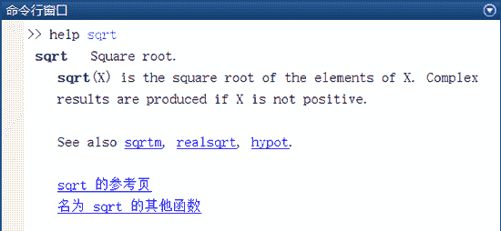

# MATLAB R2016b 的帮助系统

> 原文：[`c.biancheng.net/view/6625.html`](http://c.biancheng.net/view/6625.html)

MATLAB 为用户提供了非常完善的帮助系统，包括帮助命令、帮助窗口、HTML 格式帮助、PDF 格式帮助及帮助演示等。有效地使用帮助系统所提供的信息，是用户掌握好 MATLAB 应用的最佳途径之一。

随着 MATLAB 版本的不断更新，MATLAB 帮助文档也在逐步改进。用户能在命令行窗口使用 help 和 lookfor 命令查看帮助，还可通过 Internet 查找所需资源。

## 使用帮助浏览器窗口

MATLAB 的帮助浏览器窗口非常全面，几乎包括该软件的所有内容。打开帮助浏览器窗口的方法有以下几种：

1) 单击工具栏的图标，选择图标下的“帮助”按钮，打开下拉帮助菜单，如下图所示，然后选择其中的“文档”选项。

2) 单击 MATLAB 窗口的快速访问工具栏（见下图）中的按钮。

帮助浏览器窗口如下图所示。

需要说明的是，MATLAB 的帮助文档分为本地版和在线版两种，其中本地版在安装软件的时候已经安装到了用户的电脑硬盘上，在线版则需要从 MathWorks 公司网站在线获取。

默认情况下是选择在线版，这时用户需要有自己的 MathWorks 账号和提供自己的购买的 MATLAB 软件的序列号（或激活码）。

可以通过菜单工具栏上的“主页→预设→帮助”进行选择，如下图所示。

## 使用命令行窗口帮助

在 MATLAB 的图形用户接口（GUI）出现之前，只能使用 help 和 lookfor 函数在命令行窗口中查看帮助。这两个函数至今仍在使用。

例如，下面的代码用于查看 sqrt 函数的帮助文本。

如果不知道具体的函数名，但知道与该函数相关的某个关键字，则可以使用 lookfor 函数进行查找。

例如，如果想使用某个与关键字 inverse 有关的函数，可以使用下面的代码进行查找：

lookfor 函数在执行时将打开 MATLAB 搜索路径中的所有 M 函数文件，然后在文件中的第一行注释（即 H1 帮助行）中寻找给定的关键字，最后返回所有匹配的 H1 帮助行。

常见的帮助命令如下表所示。

常用的 MATLAB 帮助命令

| 帮助命令 | 功能 |
| demo | 运行 MATLAB R2016b/R2018b 演示程序 |
| lookfor | 按照指定的关键字查找所有相关的 M 文件 |
| help | 获取在线帮助 |
| which | 显示指定函数或文件的路径 |
| who | 列出当前工作空间中的变量 |
| whos | 列出当前工作空间中变量的更多信息 |
| helpwin | 运行帮助窗口 |
| helpdesk | 运行 HTML 格式帮助面板 helpdesk |
| exist | 检查指定变量或文件的存在性 |
| what | 列出当前文件夹或指定目录下的 M 文件、MAT 文件和 MEX 文件 |
| doc | 在网络浏览器中显示指定内容的 HTML 格式帮助文件，或启动 helpdesk |

help 命令可以获得 MATLAB 命令和 M 文件的帮助信息。如果不知道一个具体的命令怎么使用，通过 help 命令来查找是最快捷的。

除了 help 和 lookfor 命令外，MATLAB 还提供了相对分离的帮助浏览器或帮助窗口。要打开 MATLAB 帮助窗口，用户可以单击 MATLAB 界面中帮助菜单下的示例标签，或在 MATLAB 命令行窗口中直接输入 helpwin、helpdesk 或 doc。

帮助窗口不仅用于显示帮助文本，还提供了帮助导航功能。帮助导航提供了 4 个选项卡：contents、index、search 和 demo。

其中，contents 选项卡中提供了 MATLAB 和所有工具箱的在线文档的内容列表；index 选项卡提供了所有在线帮助条目的索引；search 选项卡允许用户在在线文档中进行搜索；demo 选项卡则提供了 MATLAB 演示函数命令的接口。

help 命令和 helpwin 命令在显示帮助内容上是等效的，只不过 helpwin 命令将帮助内容显示在一个帮助窗口中，而不是在命令行窗口中直接显示。

例如，下面的代码将打开一个帮助窗口用于显示 sqrt 命令的帮助文本。

>> helpwin sqrt

实际上，MATLAB 在执行上述代码时，首先打开 sqrt.m 文件，读取帮助文本，然后将文件转换成 HTML 格式，并在帮助窗口中显示该 HTML 文本。

在该过程中，大写字母的函数命令都将被转换成小写格式，列在“See also”后面的参考函数命令都被转换成能够链接到相应的 HTML 链接。

doc 命令会绕过 M 文件的帮助文本，直接连接到在线帮助文档。例如，下面的代码将显示 print 命令的在线文档。

>> doc print

在线帮助文档包含了比帮助文本更多、更详细的信息。

whatsnew 命令和 whatsnew toolbox 语句用于在帮助窗口中显示 MATLAB 或某个选定工具箱的发布信息和最后修改时间。

实际上，whatsnew toolbox 语句在后台打开了工具箱的 Readme.m 文件，并在帮助窗口中显示出来。

## Internet 资源

Mathworks Inc.（MATLAB 的制造商）的网站是互联网上排名在前 100 名的商业网站，其网址是 [`www.mathworks.com`](http://www.mathworks.com)。该网站提供了涵盖 MATLAB 各个方面的信息。

由于该网站内容繁多，并且会经常更新，不停地添加新内容、删除旧链接。因此，本节无法、也没有必要对网站上的具体内容进行讲解，有兴趣的读者可以到该网站上一饱眼福。

不过，Mathworks Inc. 的网站上有两个最有用的工具需要提示一下，一个是解决方案搜索引擎（Solution Search Engine），另一个是 MATLAB 中心（MATLAB Central）。

## 演示帮助

通过 demos 演示帮助，用户可以更加直观、快速的学习 MATLAB 中需要实用的知识。可以通过以下两种方式打开演示帮助。

*   选择并单击 MATLAB 主界面菜单栏上的“帮助”按钮，从下拉菜单中单击“示例”选项。
*   在命令行窗口中输入 demos。

无论采用上面哪种方式，执行命令后都会弹出帮助窗口，如下图所示。

与 MATLAB、Simulink 和各工具箱相关的各种示例都可以在此找到，用好了这个功能，将有助于用户对相关知识的学习和问题的解决。