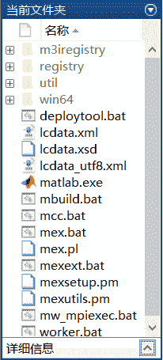
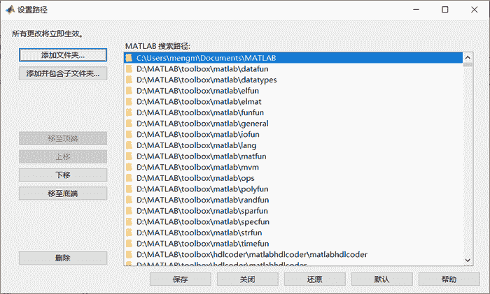
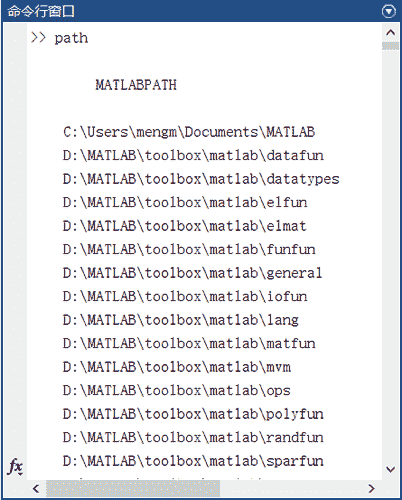

# MATLAB 的文件管理

> 原文：[`c.biancheng.net/view/6628.html`](http://c.biancheng.net/view/6628.html)

MATLAB 借鉴 Windows 资源管理器管理磁盘、文件夹和文件的思想，设计了当前目录窗口。

利用该窗口可组织、管理和使用所有 MATLAB 文件和非 MATLAB 文件，如创建、复制、删除和重命名文件夹和文件。甚至还可以用此窗口打开、编辑和运行 M 程序文件以及加载 MAT 数据文件等。

## 当前文件夹浏览器和路径管理器

MATLAB 加载任何文件、执行任何命令都是从当前路径下开始的，所以 MATLAB 提供了当前文件夹浏览器，MATLAB 的工作界面如图 1 所示。

图 1：MATLAB 的工作界面
图 2 是当前文件夹窗口，它显示当前文件夹下的子文件夹和文件，以及提供文件搜索功能。

图 2：当前文件夹窗口与命令行窗口类似，该窗口也可以成为一个独立的窗口（执行“停靠”命令）。在当前文件夹窗口中还可以查看必要的 M 文件和 MAT 文件信息，用户可以方便的组织管理当前路径下的 M 文件以及编辑相应的文件、加载 MAT 文件等。

## 搜索路径及其设置

MATLAB 提供了专门的路径搜索器来搜索存储在内存中的 M 文件和其他文件，MATLAB 自带的文件所存放路径都被默认包含在搜索路径中，在 MATLAB 安装目录的“toolbox”文件夹中包含了所有此类目录和文件。

#### 查看 MATLAB 搜索路径

单击 MATLAB 主界面菜单工具栏中的“设置路径”按钮，打开“设置路径”对话框，如图 3 所示。

图 3：设置路径对话框
该对话框分为左右两部分，左侧的几个按钮用来添加，目录到搜索路径，还可以从当前的搜索路径中移除选择的目录；右侧的列表框列出来已经被 MATLAB 添加到搜索路径的目录。

此外，在命令行窗口中插入命令 path，MATLAB 将把所有的搜索路径列出来，如图 4 所示。

图 4：显示 MATLAB 所有的搜索路径

#### 设置 MATLAB 的搜索路径

MATLAB 提供了 3 种方法来设置搜索路径。

1) 在命令行窗口中输入 Pathtool 或者通过 MATLAB 主界面菜单栏上的“设置路径”选项菜单，进入“设置路径”对话框，然后通过该对话框编辑搜索路径。如图 3 搜索。

2) 在命令行窗口中输入：

path (path, 'path')    % 'path' 是待添加目录的完整路径。

3) 在命令行窗口中输入：

addpath 'path' -begin    % 'path' 是待添加目录的路径，将新目录添加到搜索路径的开始

addpath 'path' -end    % 'path' 是待添加目录的路径，将新目录添加到搜索路径的末端

以上 3 种方法中推荐使用第一种方法，该方法不需要记忆琐碎的命令格式。

需要注意的是，不再搜索路径下的文件夹和文件，在应用 MATLAB 的搜索功能时是找不到的。