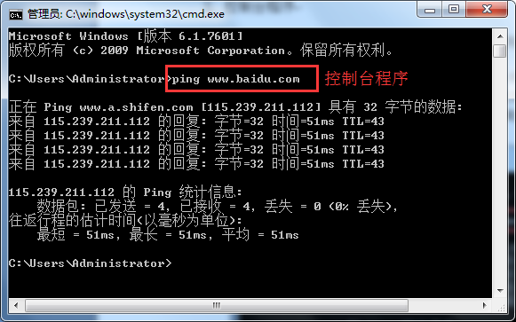

# MFC 简介

介绍 MFC 之前，需要先介绍几个 MFC 的概念。

## 1) API

Windows 操作系统提供了各种各样的函数，以方便我们开发 Windows 应用程序。这些程序是 Windows 操作系统提供给应用程序编程的接口（Application Programming Interface）,简称为 API 函数。我们在编写 Windows 程序时所说的 API 函数，就是指系统提供的函数，所有主要的 Windows 函数都在 Windows 头文件中进行了声明。

举个例子，Windows 中播放声音的 API 函数，函数原型如下：

```
BOOL PlaySound(LPCSTR pszSound, HMODULE hmod,DWORD fdwSound);
```

pszSound 就是你要播放的文件路径，fdwSound 就是你要选择的播放模式。具体的用法可以查阅相关的资料。

在使用 API 时，注意头文件和库文件对 API 的支持，否则程序编译或链接会提示错误。API PlaySound 需要头文件 mmsystem.h 和库文件 WINMM.LIB 的支持。

```
#include <mmsystem.h>
#pragma comment(lib, "WINMM.LIB")
```

## 2) SDK

SDK（Software Development Kit, 即软件开发工具包 ）一般是一些被软件工程师用于为特定的软件包、软件框架、硬件平台、操作系统等建立应用软件的开发工具的集合。举个例子，假如我们要开发无线信号发射器，在购买芯片或主板的同时，厂商同时会提供主板的 SDK 开发包，以方便我们对主板的编程操作。这个开发包通常会包含主板的 API 函数、帮助文档、使用手册、辅助工具等资源，也就是定义里面说的，SDK 实际上一个开发所需资源的一个集合。

## 3) 控制台程序

所谓的控制台应用程序，就是能够运行在 MS-DOS 环境中的程序。控制台应用程序通常没有可视化的界面，只是通过字符串来显示或者监控程序。控制台程序常常被应用在测试、监控等用途，用户往往只关心数据，不在乎界面。一个典型的应用就是 ping 网络，如图 1-1 所示：
图 1-1 控制台程序示例
DOS 的这种界面叫 CUI (Command line User Interface ) 命令行模式的人机接口。

## 4) GUI 程序

GUI 是 Graphical User Interface 的简称，即图形用户界面，如 Windows 是以图形界面方式操作的，因为你可以用鼠标来点击按钮来进行操作，很直观。而 DOS 就不具备 GUI，所以他只能输入命令。另外，GUI 还是一种结合计算机科学、美学、心理学、行为学，及各商业领域需求分析的人机系统工程，强调人—机—环境三者作为一个系统进行总体设计。这种面向客户的系统工程设计其目的是优化产品的性能，使操作更人性化，减轻使用者的认知负担，使其更适合用户的操作需求，直接提升产品的市场竞争力。

## 5) MFC 程序

MFC 是微软基础类库的简称，是微软公司实现的一个 c++类库，主要封装了大部分的 windows API 函数，所以在 MFC 中，你可以直接调用 windows API，同时需要引用对应的头文件或库文件；另外，MFC 除了是一个类库以外，还是一个框架，在 vc++里新建一个 MFC 的工程，开发环境会自动帮你产生许多文件，同时它使用了 mfcxx.dll。xx 是版本，它封装了 mfc 内核，所以你在你的代码看不到原本的 SDK 编程中的消息循环等等东西，因为 MFC 框架帮你封装好了，这样你就可以专心的考虑你程序的逻辑，而不是这些每次编程都要重复的东西。但是由于是通用框架，没有最好的针对性，当然也就丧失了一些灵活性和效率，但是 MFC 的封装很浅，所以在灵活性以及效率上损失不大，可以忽略不计。

MFC 程序就是基于 MFC 编译出来的可执行程序，是一种 GUI 程序。

## 6) 字符编码：Unicode 和多字节

字符编码是一个复杂的过程。简单地讲，就是将机器语言（0 和 1 组成的字符串）转换成我们能识别的信息的一个过程。我们不必在这里深究这个过程是怎么完成的，暂时没有必要。这里我们知道的是，MFC 有两种编码方式，Unicode 和多字节并且可以设置切换。切换方法是打开项目属性页，常规项对应的字符集中可切换编码方式。Visual C++6.0 用的是多字节编码；Virtual Studio 2010 默认使用的是 Unicode 编码，所以在代码移植的时候经常会提示很多编码方式相关的错误，解决方法是将 Unicode 编码改为多字节编码即可。这里提示一点，使用 _T 宏有条件地编写字符串的代码，使之可移植到 Unicode。这一招可以解决大多数编码方式不匹配引发的问题。