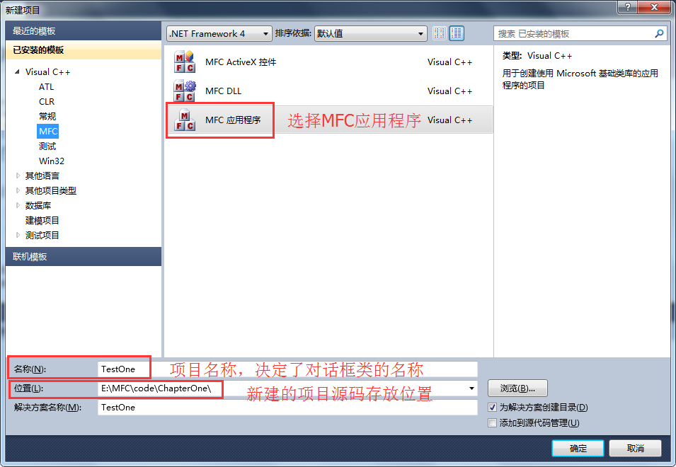
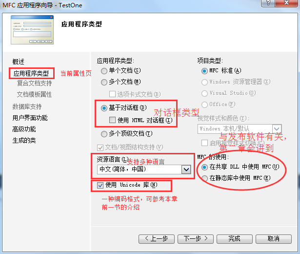
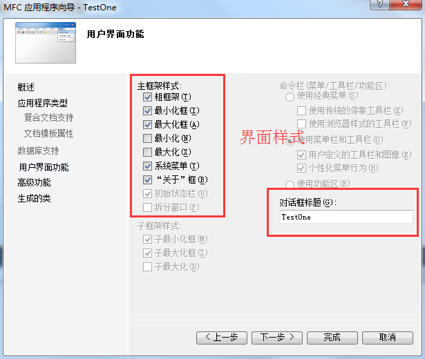
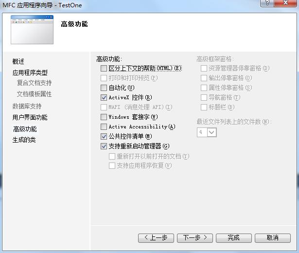
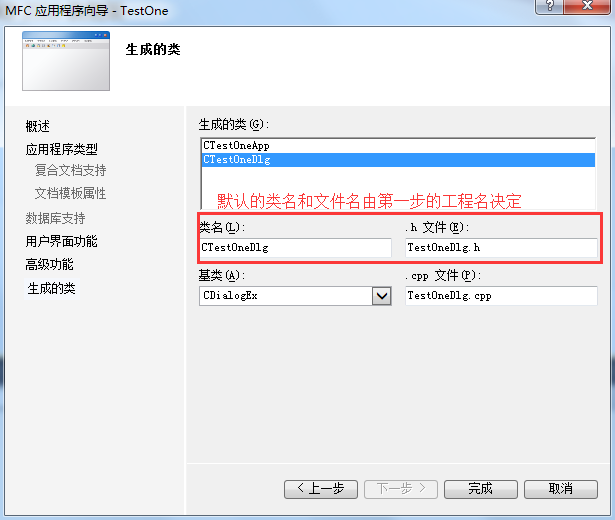
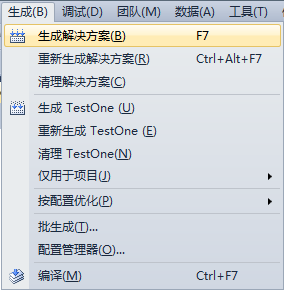
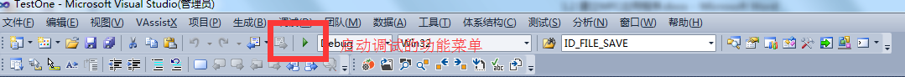
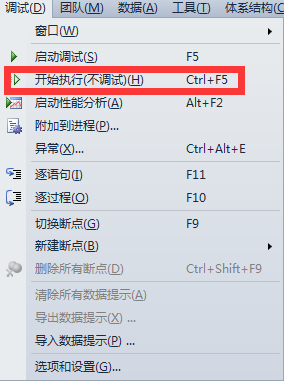
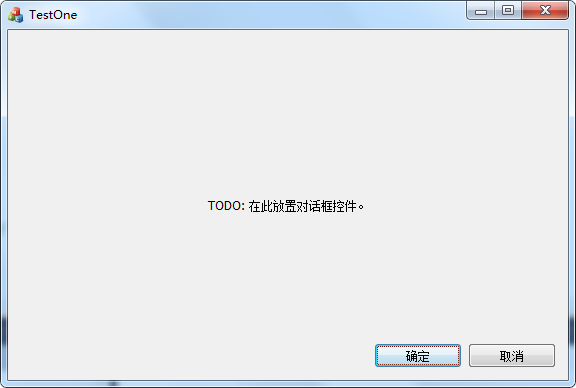

# 建立 MFC 应用程序

从程序设计转化为软件设计，这是激动人心的时刻。这里面对的不再是黑色的、单调的控制台界面，而是一个崭新的环境。各种功能强大，界面漂亮的软件，将从你的手上诞生。软件开发的第一步是熟悉开发环境，本节将会详细介绍如何通过 Virtual Studio 2010 编写一个 MFC 对话框程序。

## 建立 MFC 应用程序

本节将以 MFC 生成一个默认的对话框程序为例，如何建立一个 MFC 应用程序。在前面讲解 MFC 概念的时候我们提到过，MFC 还是一个框架，新建一个 MFC 的工程，开发环境会自动帮你产生许多文件，即使不添加一行代码，也可以编译运行，生成一个默认的有界面的软件。下面新建一个空的工程，先熟悉一下开发环境。

启动 Visual Studio 2010 后，首先需要新建项目，开发环境会针对选定的项目类型生成对应的框架代码。新建项目的方法这里总结了三种：
1) 在起始页中直接点击“新建项目…”；
2) 通过菜单命令“文件——新建——项目”；
3) 通过快捷键 Ctrl+Shift+N；

> 说明：实际编程的过程中，采用第一种方法就可以了，后面两种方法用得少，知道就行了。

打开新建项目对话框，如图 1-2 所示：
1-2 Virtual Studio 2010 的“新建项目”对话框
输入项目名称、选择项目存放位置，点击“确定”按钮。出现“MFC 应用程序向导”对话框，切换到“应用程序类型”页，如图 1-3 所示。
图 1-3 Visual Studio 2010 “MFC 应用程序向导”应用程序类型属性页对话框
选择“基于对话框”应用程序类型，点击“下一步”，进入“用户界面功能”：
图 1-4 Visual Studio 2010 “MFC 应用程序向导”用户界面功能属性页对话框
点击“下一步”，弹出下面的对话框：
图 1-5 Visual Studio 2010 “MFC 应用程序向导”高级功能属性页对话框
继续点击“下一步”：
图 1-6 Visual Studio 2010 “MFC 应用程序向导”生成的类属性页对话框
点击完成。这样根据 MFC 应用程序向导我们就完成了一个 MFC 项目的创建工作。

接下来就是直接编译建好的框架代码，编译有两种方式：
1) 快捷键 F7；
2) 菜单命令“生成——生成解决方案”，图 1-7 所示。
图 1-7 Visual Studio 2010 编译项目示例
编译完成之后，如果没有语法错误或链接错误，项目对应的可执行程序已经生成，可以直接运行了。运行有三种方式：
1) 快捷键 Ctrl+F5；
2) 启动调试的功能菜单，如图 1-8 所示；
3) 菜单命令“调试——开始执行（不调试）”如图 1-9 所示。
图 1-8Visual Studio 2010 启动调试的功能菜单
图 1-9 Visual Studio 2010 运行项目示例
执行后，弹出了一个对话框，如图 1-10 所示。
图 1-10 Visual Studio 2010 基于 MFC 的默认对话框软件示例