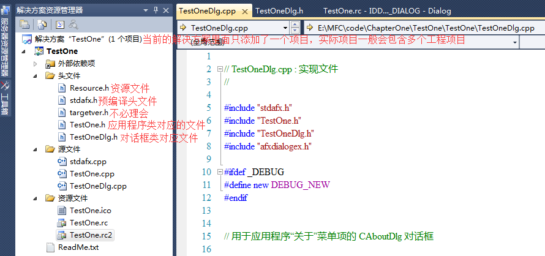
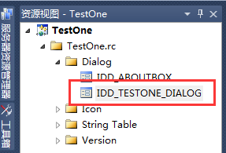
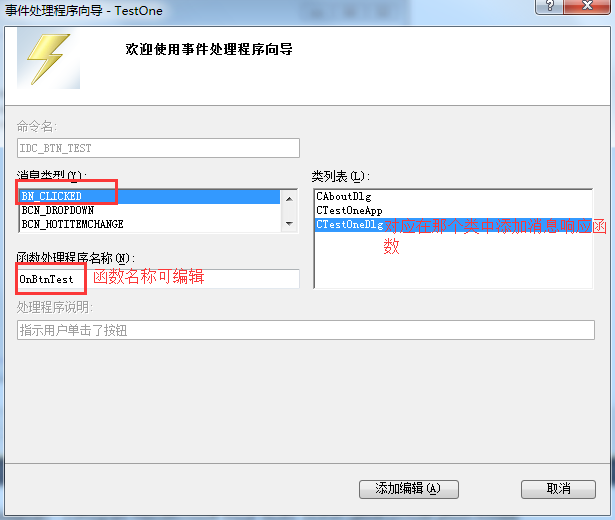
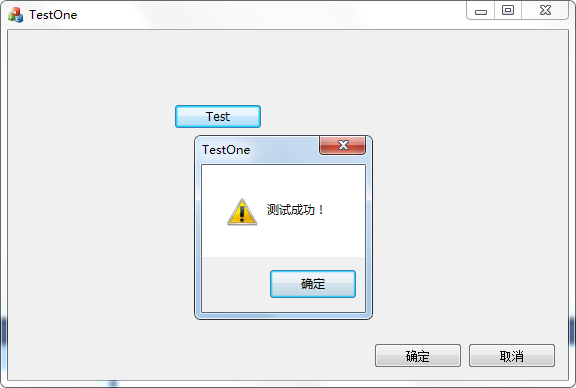

# MFC 框架结构的分析

上一节我们基于 MFC 的框架结构，创建了一个默认的基于对话框的应用程序。没有添加一行代码，但是运行程序却弹出了一个对话框界面。本节将要介绍上一节所生成的框架代码，来更多地了解 MFC 应用程序，能更好地在 MFC 框架上快速地开发软件。

## 框架代码文件的结构

基于 MFC 对话框程序的框架结构如图 1-3-1 所示：
图 1-3-1 基于 MFC 对话框程序的框架代码结构示意图
主要有 4 个部分组成：
1) 资源文件 Resource.h：主要是定义资源的 ID。
2) 预编译文件：可以用来解决头文件包含冲突的问题，定义一些需要全局性包含的文件。
3) 应用程序类对应文件：项目名称是 TestOne，对应类名为 CTestOneApp。
4) 对话框类：项目名称是 TestOne，对应类名为 CTestOneDlg。

## 应用程序类

MFC 定义了一个应用程序基类 CWinApp，所有基于 MFC 的应用程序都会继承这个类。TestOne 项目也不例外，此时的应用程序类是 CTestOneApp，定义如下：

```
class CTestOneApp : public CWinApp
{
public:
    CTestOneApp();
public:
    // 重载虚函数
    virtual BOOL InitInstance();
    // 实现
    DECLARE_MESSAGE_MAP()
};
```

这个类的定义很简单，重点来看一下 InitInstance 函数：

```
BOOL CTestOneApp::InitInstance()
{  
    //初始化应用程序环境包控件等操作，省略部分代码.
    CWinApp::InitInstance();..
    //省略部分代码...    
    //定义对话框对象
    CTestOneDlg dlg;
    //保存对话框到全局变量
    m_pMainWnd = &dlg; 
    //显示对话框
    INT_PTR nResponse = dlg.DoModal();
    if (nResponse == IDOK)
    {
        //“确定”来关闭对话框的代码
    }
    else if (nResponse == IDCANCEL)
    {
        //“取消”来关闭对话框的代码
    }
    // 由于对话框已关闭，所以将返回 FALSE 以便退出应用程序， 而不是启动应用程序的消息泵。
    return FALSE;
}
```

这个函数可以看作 MFC 程序的入口函数，main 函数隐藏在这个函数中。在实际的开发中，一般不需要对这个类进行操作，但如果需要在建立主对话框之前处理一些数据或者准备工作，那么就可以把代码添加到这个函数中，主对话框显示之前。

这里有两个比较个典型的应用。
1) 启动界面之前弹出登陆界面，需要正确输入用户名和密码才能弹出主界面；

2) 启动界面之前，弹出一个项目配置界面，例如操作员，设备编号，项目名称，批次等信息，同时这些信息需要传递到主界面中，主界面根据项目和批次决定某种操作方式。

上面两个应用在实际的项目开发中很常见，需求比较普遍。

第一个需求不涉及数据传递，可以在代码中将用户名和密码固定，如果输入的结果与设定的结果一致，那么就开放此软件的使用权限；稍微复杂一点的，可以比较输入的结果与数据库中存储的用户名和密码是否匹配，如果匹配，才开放此软件的使用权限；再稍微复杂一点的，还可以将界面输入结果与服务器中的信息比较，查看当前用户是否有此软件的使用权限，当然这个还涉及到服务端的处理，与网络通信有关。

第二个需求涉及不同对话框之间的数据传递，应用也比较广泛。

篇幅有限，这里不再展示这两个需求的源码，源码统一在本教程的源码获取链接中获取。

## 对话框类

MFC 主对话框类（主对话框是指与项目名称一致的那个类对应的对话框，下同）CTestOneDlg 继承 CDialogEx 类，CDialogEx 又继承 CDialog 类，这个可以通过类转到定义查看，对话框类负责与用户交互，处理用户消息，接受用户输入。类的定义如下：

```
// CTestOneDlg 对话框
class CTestOneDlg : public CDialogEx
{
public:
    // 标准构造函数
    CTestOneDlg(CWnd* pParent = NULL);
    // 对话框数据
    enum { IDD = IDD_TESTONE_DIALOG }; 
protected:
    // 动态数据交换，负责控件与变量之间的关联
    virtual void DoDataExchange(CDataExchange* pDX);   
protected:
    //应用程序句柄
    HICON m_hIcon;

    //重载初始化对话框
    virtual BOOL OnInitDialog();
    //定义消息 WM_SYSCOMMAND 处理函数
    afx_msg void OnSysCommand(UINT nID, LPARAM lParam);
    //定义消息 WM_PAINT 处理函数
    afx_msg void OnPaint();
    //定义消息 ON_WM_QUERYDRAGICON 处理函数
    afx_msg HCURSOR OnQueryDragIcon();
    //消息映射
    DECLARE_MESSAGE_MAP()
};
```

从这个类的定义可以看出以下几点：
1) 控件与数据关联，可以简单地交给框架来实现；
2) 在 MFC 框架上开发主要是针对消息处理机制。

## 添加消息响应

MFC 消息响应机制过程比较复杂，这里因为还只是基础部分，不做深入的探讨，只做一个简单的过程演示，给读者一个初步的印象，后面会在专门的章节中讨论这个问题。本节演示在界面中添加一个按钮的消息响应。

首先把工作区间切换到“资源视图”，如果工作区间没有显示资源视图，在菜单中的视图中查找“资源视图”并点击，这样工作区间就会显示出来。切换到资源视图后，找到 Dialog 文件夹找到 IDD_TESTONE_DIALOG，如图 1-3-2 所示。
图 1-3-2 MFC 对话框程序资源视图示例
双击图 1-3-2 中选中的对话框 ID 就会显示这个对话框窗口，从工具栏中选择“Button”按钮后，可以直接将按钮拖至显示的这个对话框窗口中。说明一下，工具栏只有当主工作区间显示对话框时才会显示，初学者可能会碰到找不到工具栏的情况。用鼠标右键点击按钮，选择“属性”切换到属性页，修改按钮的名称（对应 Caption）“Test”，同时修改按钮的 ID 为 IDC_BTN_TEST。有两种方式可以完成添加按钮的消息处理函数。
1) 直接双击按钮；
2) 右键选中按钮，点击“添加事件处理程序”；

两种方式区别在于，第一种方式添加的消息响应函数名称是默认的，第二种方式添加的消息响应函数名称是可以编辑的。
图 1-3-3 MFC 添加按钮消息响应事件处理向导
代码如下所示：

```
//添加按钮 IDC_BTN_TEST 的单击消息处理函数
void CTestOneDlg::OnBtnTest()
{
    AfxMessageBox(_T("测试成功！"));
}
```

添加一个 MessageBox 之后，编译并执行。在软件中添加我们添加的“Test”按钮之后，出现消息框，如图 1-3-4 所示。
图 1-3-4 显示处理按钮的消息