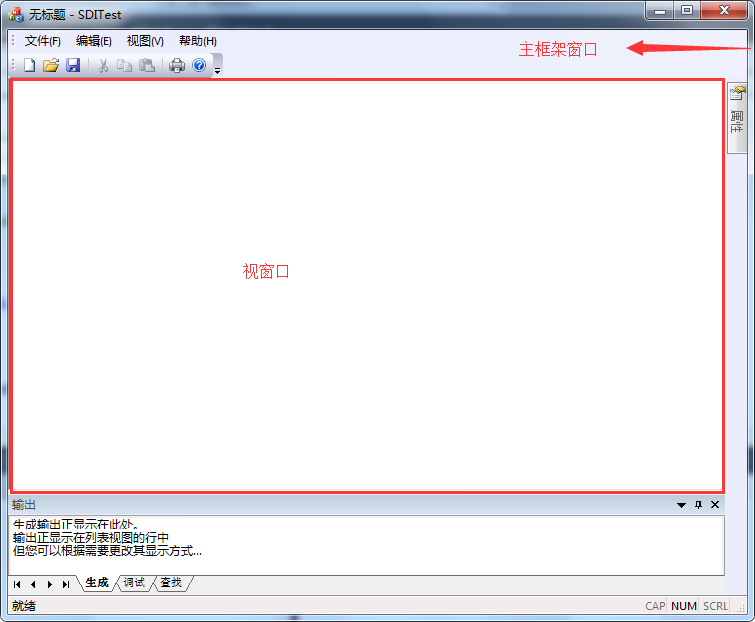
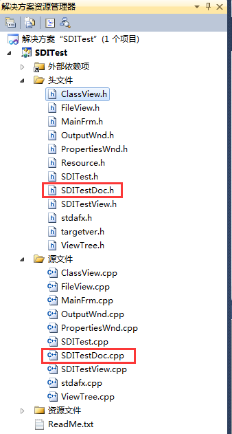

# MFC 视图和窗口的基本概念

## 视类窗口

视类窗口是指程序运行后，显示信息的那一部分。对应的类是 CXXXView（XXX 表示项目名称）类，CXXXView 类是派生于 CView 类，而 CView 类又派生于 CWnd 类。他们的继承关系可以通过查找类的定义来查看继承关系。视图类 CView，拥有窗口的客户区域，负责显示文档数据，接受用户的输入，提供文档与用户的通信。视类窗口只是主框架窗口中空白的部分。

## 主框架窗口

主框架窗口是指程序运行后，程序的整个界面。对应的类是 CMainFrame，CMainFrame 类派生于 CFrameWnd 类，而 CFrameWnd 类又又派生于 CWnd 类。主框架窗口就是整个应用程序外框所包括的部分，包括了图 3-1-1 的全部内容。

框架窗口是视类窗口的一个父窗口（这里暂时记住结论，各个窗口之间的关系会在后面的章节中单独讨论，目前还只针对初学者），他们之间的关系如图 3-1-1 所示：
图 3-1-1  主框架窗口和视窗口之间的关系

## 文档

文档类 CDcoument 负责维护应用程序所需要的数据，提供一系列可对这些数据进行操作的方法，并且能够为视图提供所需的数据。

新建一个 MFC 单文档应用程序，项目名称为 SDITest。项目结构示意图如图 3-1-2 所示：
图 3-1-2 MFC 单文档程序结构示意图
上图中可以看到 SDITest 程序中还有一个 CSDITestDoc 类，它派生于 CDocument 类，CDocument 类的基类是 CCmdTarget，而 CCmdTarget 又派生于 CObject 类，从而可知这个 CSDITestDoc 类不是一个窗口类，实际上是一个文档类。

MFC 提供的文档/视（Document/View）结构，其中文档是指 CDocument 类，视类是指 CView 类。Microsoft 在设计基础类库时，考虑到要把数据本身与它的显示分离开，于是就采用文档类和视类结构来实现这一想法。数据的存储和加载由文档类来完成，数据的显示和修改则由视类完成，从而把数据的管理和显示方法分离开来。文档/视类结构是 MFC 程序的一个重点，在后面的中级部分会详细地介绍这部分内容。这里希望大家能够有一个初步的印象。

下面再介绍一下 MFC 单文档程序是如何将文档类对象、框架对象、视类对象组织在一起的。还是以 SDITest 项目为例，在源文件 SDITest.cpp 中找到 CSDITestApp 类的 InitInstance 函数定义，有下面这一段代码：

```
// 注册应用程序的文档模板。文档模板将用作文档、框架窗口和视图之间的连接
CSingleDocTemplate* pDocTemplate;
pDocTemplate = new CSingleDocTemplate(
    IDR_MAINFRAME,
    RUNTIME_CLASS(CSDITestDoc),
    RUNTIME_CLASS(CMainFrame),       // 主 SDI 框架窗口
    RUNTIME_CLASS(CSDITestView)
);
if (!pDocTemplate)
    return FALSE;
AddDocTemplate(pDocTemplate);
```

从上面的代码段中可以看到其中定义了一个单文档模板对象指针 pDocTemplate，这个对象把文档对象、框架对象、视类对象有机地组织在一起，形成了一个有机的整体，程序接着利用 AddDocTemplate 函数把这个单文档模板添加到文档模板中，从而把这三个类组织为一个整体。