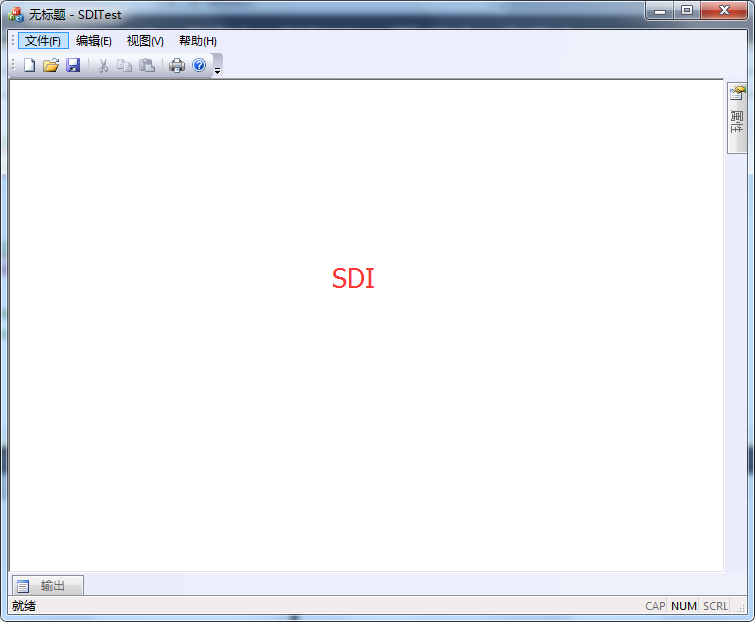
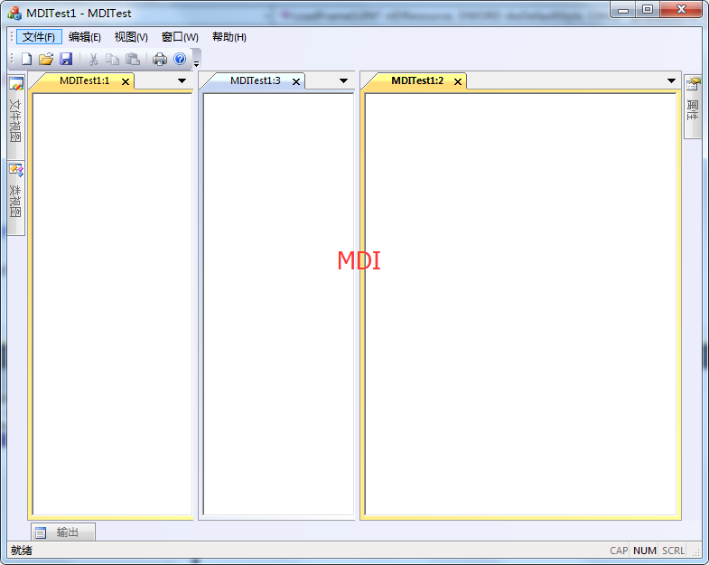

# MFC 单文档与多文档

使用 AppWizard 创建 SDI 和 MDI 的过程相似，主要区别是创建 SDI 时不生成 CChildFrame 类，CMainFrame 类的基类为 CMainWnd；而在创建 MDI 时会生成两个框架类，一个是 CMainFrame 类，由 CMDIFrameWnd 类派生而来，另一个是 CChildFrame 类，由 CMDIChildWnd 类派生而来。

在 SDI 的 CMainFrame 对象不但构成了应用程序框架，也包含了视图对象。在 MDI 中，CMainFrame 对象是在应用程序类的 InitInstance 中被创建，而视图则被包含在 CChildFrame 对象中。

单文档（SDI）应用程序在一个主框架上只有一个子框架窗口，如图 3-5-1 所示：
图 3-5-1 单文档应用程序示例
多文档（MDI）应用程序在一个主框架上可以有多个子框架窗口，如图 3-5-2 所示：
图 3-5-2  多文档应用程序示例