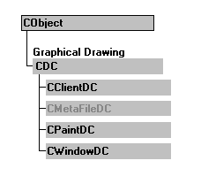

# MFC 图形设备接口

图形设备接口（Graphics Device Interface,GDI），把应用程序的函数调用传递给图形设备驱动程序，由设备驱动程序来执行与硬件相关的函数。GDI 向应用程序提供了一个设备无关的编程，同时以设备相关的格式和具体的硬件设备交互。

在 MFC 中使用 GDI 进行绘图操作一般会涉及两个对象，一是设备上下文对象，包括 CDC 及其派生类；二是 GDI 对象，包括 CFont、CBrush、CPen 等。

## 设备上下文

设备上下文（Device Context，DC），是一种 Windows 数据结构，包括与设备绘制属性相关的信息。利用设备上下文可以实现向屏幕、打印机的输出。

在应用程序中，通常在绘图之前调用 BeginPaint 函数，然后在设备上下文中进行一系列绘图操作，最后调用 EndPaint 函数结束绘制过程。

MFC 中的设备上下文包括：CDC、CClientDC、CPaintDC、CWindowsDC 等。他们之间的关系如图 4-1-1 所示：

图 4-1-1 MFC 中常见的设备上下文之间的关系

MFC 把不同的上下文对象用不同的类进行了封装，如下所示：
1) CDC：所有设备上下文类的基类。封装了所有图形输出函数，包括矢量、光栅和文本输出。

2) CClientDC：用于客户区域的图形输出，需要直接在客户区域进行绘制时使用。一般在响应非窗口重绘消息（如键盘输入时绘制文本、鼠标绘图）时使用，在其构造函数中自动调用 GetDC，在其析构函数中自动调用 ReleaseDC 函数。CClientDC 对象联系的 DC 是窗口的客户区。

3) CPaintDC：用于响应窗口重绘消息消息（WM_PAINT）时的绘制输出。CPaintDC 继承自 CDC，在其构造函数中自动调用 BeginPaint 函数。在其析构函数中自动调用 EndPaint 函数。EndPaint 除了释放设备上下文外，还负责从消息队列中清除 WM_PAINT 消息。因而在处理窗口重绘时，必须使用 CPaintDC，否则 WM_PAINT 消息无法从消息队列中清除，将引起不断的窗口重绘。CPaintDC 也只能用在 WM_PAINT 消息处理中。

4) CWindowsDC：用于窗口客户区和非客户区（包括窗口边框、标题栏、控制按钮等）的绘制。

获取整个屏幕区域，包括客户区和非客户区。一句话概括：

| CDC | 任何 dc | 相当于 CreateDC、DeleteDC |
| CClientDC | 客户区 dc | 相当于 GetDC、ReleaseDC |
| CPaintDC | 无效区 dc | 相当于 BeginPaint、EndPaint |
| CWindowDC | 整窗口 dc | 相当于 GetWindowDC、 ReleaseDC |

设备上下文相关函数整理如下：

*   GetSafeHdc： 返回输出设备上下文 m_hDC。
*   SaveDC：保存设备上下文当前状态。
*   RestoreDC：  恢复 SaveDC 保存的设备上下文以前状态。
*   ResetDC：更新 m_hAttribDC 设备上下文。
*   GetDeviceCaps： 获取有关给定显示设备功能的指定类型指定设备信息。
*   IsPrinting：确定正在使用的设备上下文是否用于打印。

## GDI 对象

绘图不仅需要场景，也需要工具。可以把设备上下文理解为 GDI 绘图的场景，那么 GDI 对象就是工具。MFC 主要提供了以下几种 GDI 对象：
CPen：用来绘制线条；
CBursh：用来填充绘制对象的内部；
CBitmap：用来操作位图对象；
CFont：用来绘制文本；
CPalette：用于应用程序和彩色输出设备（如显示器）之间的接口。

## GDI 绘图

使用 GDI 进行图形绘制的一般流程如下所示：

*   创建 GDI 对象；
*   创建或取得设备上下文对象；
*   使用 SelectObject 把 GDI 对象选入设备上下文；
*   使用图形输出函数在指定上下文中绘制图形。

GDI 绘图过程经常会遇到出现抖动的问题，主要原因是对屏幕设备 DC 操作太过频繁，解决办法是首先把所有绘图操作都在内存 DC 中操作，然后这些内存 DC 统一绘制到一个总的内存 DC 中，然后再把这个总的内存 DC 一次性绘制到屏幕 DC，这样就不会出现抖动。这就是通常所说的“双缓存技术”，将在第 4.4 节中以实例的形式介绍。