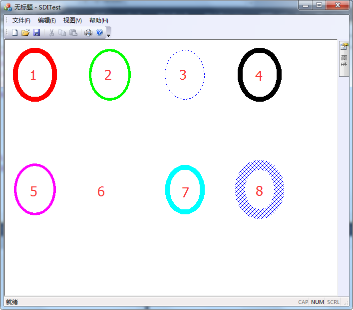

# MFC 画笔 CPen 类

MFC 的 CPen 类封装了画笔对象，其中的成员函数 CreatePen 实现创建画笔的功能，函数原型如下：

```
BOOL CreatePen(
    int      nPenStyle,  //画笔风格
    int      nWidth,     //画笔宽度
    COLORREF crColor     //画笔颜色
);
```

一旦不再需要画笔，记得用 DeleteObject 函数将其删除。

## 设置线型

创建画笔的函数中，nPenStyle 参数表示画笔风格，可以设置下列值之一。nPenStyle ------ Long，指定画笔样式，可以是下述常数之一：

*   PS_SOLID ： 画笔画出的是实线。
*   PS_DASH： 画笔画出的是虚线(nWidth 必须不大于 1)。
*   PS_DOT： 画笔画出的是点线(nWidth 必须不大于 1)。
*   PS_DASHDOT：画笔画出的是点划线(nWidth 必须不大于 1)。
*   PS_DASHDOTDOT：  画笔画出的是点-点-划线(nWidth 必须不大于 1)。
*   PS_NULL： 空画笔，画笔不能画图。
*   PS_INSIDEFRAME：内侧实线画笔  由椭圆、矩形、圆角矩形、饼图以及弦等生成的封闭对象框时，画线宽度向内扩展。如指定的准确 RGB 颜色不存在，就进行抖动处理。

## 设置线宽

创建画笔的函数中，nWidth 表示画笔线宽，是一个逻辑值，这个值越小，画出的图形线越细；这个值越大，绘制的图形线条越粗。

## 设置画笔颜色

画笔颜色通过 RGB 宏控制，例如需要画红色的图形，RGB（255,0,0）。MFC 中有许多引用颜色宏 RGB，这里总结了一些常见的颜色的宏，供大家参考。

基本颜色三种：红绿蓝，其他的颜色都是由这三种基本的颜色组成。例如，红 RGB（255,0,0）、绿 RGB（0, 255,0）、蓝 RGB（0,0, 255）、浅粉红 #FFB6C1 255,182,193、紫色 #800080 128,0,128 等。

## 示例：使用 GDI 对象 CPen 绘图示例

编写一个程序，练习一下画笔的创建。上面有八种不同风格的画笔，现在用这八种不同风格的画笔分别话一个圆，同时修改画笔的线宽和颜色。

代码写在前面新建的工程 SDITest 中，读者可以从网站提供的链接中获取。阅读程序是请参考注释。

1) 定义数据结构：

```
struct my_Eclipse{
    CRect rect;  //图形显示区域
    CPen pen;  //画笔
};
```

2) 定义成员变量

```
//定义 8 个结构，用于绘制 8 个图形
my_Eclipse  m_myEclipse[8];
```

3) 在 View 类中初始化绘图区域：

```
void CSDITestView::InitRect()
{
    //界面上要显示 8 个图形，准备好 8 个区域，分两行显示，每一行显示四个
    //图形左右间隔 10 个像素，上下间隔 20 个像素
    //左上 右下
    CRect rect(0,0,100,100);
    for (int i=0;i<8;i++)
    {
        if (i<4)
        {
            //第一行图形
            CRect rect;
            rect.left=20+i*150;
            rect.top=20;
            rect.right=100+i*150;
            rect.bottom=120;

            m_myEclipse[i].rect.CopyRect(rect);
        }
        else
        {
            //第二行图形
            CRect rect;
            rect.left=20+(i-4)*150;
            rect.top=250;
            rect.right=100+(i-4)*150;
            rect.bottom=350;

            m_myEclipse[i].rect.CopyRect(rect);
        }

    }
}
```

4) 在 View 类中初始化画笔：

```
void CSDITestView::InitPen()
{
    //创建普通画笔
    m_myEclipse[0].pen.CreatePen(PS_SOLID,10,RGB(255,0,0));
    m_myEclipse[1].pen.CreatePen(PS_DASH,5,RGB(0,255,0));
    m_myEclipse[2].pen.CreatePen(PS_DOT,1,RGB(0,0,255));
    m_myEclipse[3].pen.CreatePen(PS_DASHDOT,10,RGB(0,0,0));
    m_myEclipse[4].pen.CreatePen(PS_DASHDOTDOT,5,RGB(255,0,255));
    m_myEclipse[5].pen.CreatePen(PS_NULL,1,RGB(0,255,255));
    m_myEclipse[6].pen.CreatePen(PS_INSIDEFRAME,10,RGB(0,255,255));

    //创建集合画笔
    LOGBRUSH LogBrush;
    LogBrush.lbStyle=BS_HATCHED;
    LogBrush.lbColor=RGB(0,0,255);
    LogBrush.lbHatch=HS_DIAGCROSS;
    m_myEclipse[7].pen.CreatePen(PS_GEOMETRIC,20,&LogBrush);
}
```

5) 在 View 类中的 OnDraw 函数中添加画图代码，代码如下：

```
//采用 GDI 绘图
CClientDC cdc(this);
CPen* pOldPen = NULL;
for (int i=0;i<8;i++)
{
    //把当前的画笔选入 DC
    pOldPen = cdc.SelectObject(&m_myEclipse[i].pen);
    cdc.Ellipse(m_myEclipse[i].rect);
    cdc.SelectObject(pOldPen);
}
```

6) 编译并运行程序，生成结果如图 4-2-1 所示：
图 4-2-1 用不同风格不同颜色的画笔画图效果图
示例中演示了 8 种画笔效果

*   1 号：PS_SOLID 风格，实现画笔；
*   2 号：PS_DASH 风格，实现画笔；
*   3 号：PS_DOT  风格，实现画笔；
*   4 号：PS_DASHDOT 风格，实现画笔；
*   5 号：PS_DASHDOTDOT 风格，实现画笔；
*   6 号：PS_NULL 风格，实现画笔；
*   7 号：PS_INSIDEFRAME 风格，实现画笔；
*   8 号：PS_GEOMETRIC 风格，实现画笔。