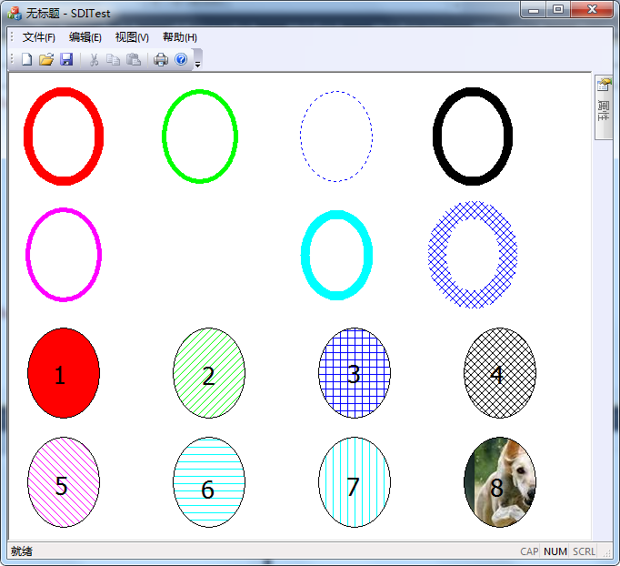

# MFC 画刷 CBrush 类

画刷其实是一个像素大小为 8*8 的位图，用多个相同的位图对封闭图形的内部进行填充。

MFC 的 CBrush 类封装了画刷对象，创建画刷时，首先定义一个画刷对象，然后调用 CreateSolidBrush、CreateHatchBrush 或 CreatePatternBrush 函数。可以采用下面三种方式创建画刷。

1) 创建单色画刷

```
BOOL CreateSolidBrush(
    COLORREF crColor  //画刷颜色
);
```

2) 创建阴影画刷

```
BOOL CreateHatchBrush(
    int nIndex,  //阴影画刷类型
    COLORREF crColor  //画刷颜色
);
```

参数 nIndex 指定画刷的样式。可以设置的样式如下所示：

*   HS_BDIAGONAL：表示 45 度向上，从左至右的阴影(/////)；
*   HS_CROSS：水平和垂直交叉阴影(+++++)；
*   HS_DIAGCROSS：45 度交叉阴影(XXXXX)；
*   HS_FDIAGONAL：45 度向下，自左至右阴影(\\\\\\)；
*   HS_HORIZONTAL：水平阴影(-----)；
*   HS_VERTICAL：垂直阴影(|||||)。
*   crColor：指定用于阴影的刷子的前景色。

3) 创建按图画刷

```
BOOL CreatePatternBrush(
    CBitmap* pBitmap  //画刷位图，只使用左上角的 8*8 大小
);
```

## 示例：使用 GDI 对象 CBrush 绘图示例

编写一个程序，练习一下画刷的创建。上面有八种不同风格的画刷。

代码写在前面新建的工程 SDITest 中，读者可以从网站提供的链接中获取。阅读程序是请参考注释。

1) 定义数据结构

```
//定义数据结构
struct my_EclipseBrush{
    //图形显示区域
    CRect rect;
    //画笔
    CBrush brush;
};
```

2) 定义成员变量

```
my_EclipseBrush m_myEclipseBrush[8];
```

3) 在 View 类中初始化绘图区域

```
//初始化绘图区域
void CSDITestView::InitRectBrush()
{
    //界面上要显示 8 个图形，准备好 8 个区域，分两行显示，每一行显示四个
    //图形左右间隔 10 个像素，上下间隔 20 个像素
    //左上 右下
    CRect rect(0,0,100,100);
    for (int i=0;i<8;i++)
    {
        if (i<4)
        {
            //第一行图形
            CRect rect;
            rect.left=20+i*160;
            rect.top=280;
            rect.right=100+i*160;
            rect.bottom=380;

            m_myEclipseBrush[i].rect.CopyRect(rect);
        }
        else
        {
            //第二行图形
            CRect rect;
            rect.left=20+(i-4)*160;
            rect.top=400;
            rect.right=100+(i-4)*160;
            rect.bottom=500;

            m_myEclipseBrush[i].rect.CopyRect(rect);
        }

    }
}
```

4) 在 View 类中初始化画刷

```
//初始化画刷
void CSDITestView::InitBrush()
{
    //创建单色画刷
    m_myEclipseBrush[0].brush.CreateSolidBrush(RGB(255,0,0));
    //创建阴影画刷
    m_myEclipseBrush[1].brush.CreateHatchBrush(HS_BDIAGONAL,RGB(0,255,0));
    m_myEclipseBrush[2].brush.CreateHatchBrush(HS_CROSS,RGB(0,0,255));
    m_myEclipseBrush[3].brush.CreateHatchBrush(HS_DIAGCROSS,RGB(0,0,0));
    m_myEclipseBrush[4].brush.CreateHatchBrush(HS_FDIAGONAL,RGB(255,0,255));
    m_myEclipseBrush[5].brush.CreateHatchBrush(HS_HORIZONTAL,RGB(0,255,255));
    m_myEclipseBrush[6].brush.CreateHatchBrush(HS_VERTICAL,RGB(0,255,255));

    //创建几何画笔
    CBitmap bmp;
    //注意，这里要先加载一个位图图片，方法前面已经做个介绍
    bmp.LoadBitmapW(IDB_BRUSH);
    m_myEclipseBrush[7].brush.CreatePatternBrush(&bmp);
}
```

5) 在 View 类中的 OnDraw 函数中添加画图代码，代码如下：

```
CBrush* pOldBrush = NULL;
for (int i=0;i<8;++i)
{
    //把当前的画笔选入 DC
    pOldBrush = cdc.SelectObject(&m_myEclipseBrush[i].brush);
    //在指定的区域绘制椭圆，区域为正方形，因而实际为圆
    cdc.Ellipse(m_myEclipseBrush[i].rect);
    //还原 DC
    cdc.SelectObject(pOldBrush);
}
```

6) 编译并运行程序，生成结果如图 4-3-1 所示：
图 4-3-1 用不同风格不同颜色的画刷画图效果图
示例中演示了 8 种画笔效果

*   1 号：单色画刷，用 CreateSolidBrush 函数创建；
*   2 号：HS_BDIAGONAL 风格，CreateHatchBrush 函数创建；
*   3 号：HS_CROSS 风格，CreateHatchBrush 函数创建；
*   4 号：HS_DIAGCROSS 风格，CreateHatchBrush 函数创建；
*   5 号：HS_FDIAGONAL 风格，CreateHatchBrush 函数创建；
*   6 号：HS_HORIZONTAL 风格，CreateHatchBrush 函数创建；
*   7 号：HS_VERTICAL 风格，CreateHatchBrush 函数创建；
*   8 号：几何画刷，自定义位图。