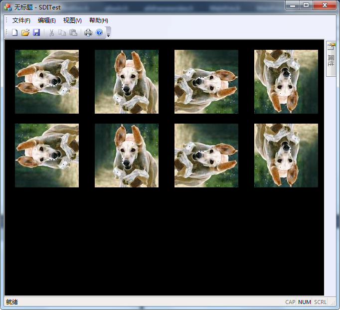

# MFC 使用 GDI 对象 CBitmap 示例

位图是描述图像的最简单直观的一种方式，把图像横向分为等间距的 W 列，纵向分为等间距的 H 列，于是这个图像大小被定义为分辨率 W*H。位图分为单色图和彩色图，区分方法是图片的一个像素点可以用多少种颜色表示。现在这里介绍的位图是作为 GDI 对象来介绍的，后面会在位图专题中介绍位图。

在 MFC 中 CBitmap 类封装了位图对象及其基本操作，可以使用多种方式来创建位图对象。

1) 在内存中创建位图对象

```
BOOL CreateBitmap(
    int nWidth,         //位图宽度
    int nHeight,        //位图高度
    UINT nPlanes,       //指定目标设备的位面数
    UINT nBitcount,     //颜色位图
    const void* lpBits  //位图数据
);
```

当前内存中已存在位图数据，需要构造 CBitmap 对象便于管理位图，此时就可以简单地调用 CreateBitmap 即可。

2) 根据 BITMAP 结构在内存中创建位图对象

```
BOOL CreateBitmapIndirect(
    LPBITMAP lpBitmap  //指向 BITMAP 结构
);
```

CreateBitmapIndirect 与 CreateBitmap 类似，都是在内存中直接创建位图对象。而 CreateBitmapIndirect 通过 BITMAP 结构指定待创建位图对象的参数信息。BITMAP 结构定义如下：

```
typedef struct tagBITMAP
{
    LONG    bmType;        //位图类型。对于逻辑位图，必须为 0
    LONG    bmWidth;       //位图宽度，必须大于 0
    LONG    bmHeight;      //位图高度，必须大于 0
    LONG    bmWidthBytes;  //位图数据中一行有几个字节
    WORD    bmPlanes;      //指定目标设备的位面数
    WORD    bmBitsPixel;   //指定每个像素的位数
    LPVOID  bmBits;        //位图数据
} BITMAP;
```

3) 创建与指定设备上下文兼容的位图对象

```
BOOL CreateCompatibleBitmap(
    CDC* pDC,    //目标 DC
    int nWidth,  //位图宽度
    int nHeight  //位图高度
);
```

4) 从应用程序资源中加载位图对象，有两种形式，可以根据资源名或资源 ID 加载。

```
BOOL LoadBitmap(
    LPCTSTR lpszResourceName  //位图资源名，绝对路径
);

BOOL LoadBitmap(
    UINT nIDResource  //位图资源 ID
);
```

## 示例：使用 GDI 对象 CBitmap 显示位图

1) 导入位图资源。通过加载位图资源的方式，加载 8 个位图资源，资源 ID 为默认 ID。

2) 定义绘图结构和变量

```
struct my_Bitmap{
    CRect rect;  //图形显示区域
    CBitmap bmp;  //位图
};
```

成员变量：my_Bitmap m_my_Bitmap[8];

3) 初始化绘图区域

```
void CSDITestView::InitRectBitmap()
{
    //加载的图片大小是 128*128
    CRect rect(0,0,128,128);
    for (int i=0;i<8;i++)
    {
        if (i<4)
        {
            //第一行图形
            CRect rect;
            rect.left=20+i*160;
            rect.top=20;
            rect.right=100+i*160;
            rect.bottom=148;

            m_my_Bitmap[i].rect.CopyRect(rect);
        }
        else
        {
            //第二行图形
            CRect rect;
            rect.left=20+(i-4)*160;
            rect.top=168;
            rect.right=100+(i-4)*160;
            rect.bottom=296;

            m_my_Bitmap[i].rect.CopyRect(rect);
        }
    }
}
```

4) 初始化绘图信息

```
void CSDITestView::InitBitmap()
{
    m_my_Bitmap[0].bmp.LoadBitmapW(IDB_BITMAP1);
    m_my_Bitmap[1].bmp.LoadBitmapW(IDB_BITMAP2);
    m_my_Bitmap[2].bmp.LoadBitmapW(IDB_BITMAP3);
    m_my_Bitmap[3].bmp.LoadBitmapW(IDB_BITMAP4);
    m_my_Bitmap[4].bmp.LoadBitmapW(IDB_BITMAP5);
    m_my_Bitmap[5].bmp.LoadBitmapW(IDB_BITMAP6);
    m_my_Bitmap[6].bmp.LoadBitmapW(IDB_BITMAP7);
    m_my_Bitmap[7].bmp.LoadBitmapW(IDB_BITMAP8);
}
```

5) 具体绘图过程。在 OnDraw 函数中添加下面的代码：

```
//采用 GDI CBitmap 绘图 S
CRect WndRect;
GetWindowRect(&WndRect);
ScreenToClient(&WndRect);

CClientDC cdc(this);
CDC mdc,TempDc;
BITMAP BmpInfo;
CBitmap ClientBmp,*pOldBmp;
//创建与设备 DC 兼容的内存 DC
mdc.CreateCompatibleDC(&cdc);
TempDc.CreateCompatibleDC(&cdc);
//创建与设备 DC 兼容的位图对象
ClientBmp.CreateCompatibleBitmap(&cdc,WndRect.right,WndRect.bottom);
mdc.SelectObject(&ClientBmp);

//依次把位图贴到内存 DC
for (int i=0;i<8;i++)
{
    TempDc.SelectObject(&m_my_Bitmap[i].bmp);
    m_my_Bitmap[i].bmp.GetBitmap(&BmpInfo);

    mdc.TransparentBlt(m_my_Bitmap[i].rect.left,m_my_Bitmap[i].rect.top,BmpInfo.bmWidth,BmpInfo.bmHeight,&TempDc,0,0,BmpInfo.bmWidth,BmpInfo.bmHeight,RGB(255,255,255));

}
//把内存 DC 贴到设备 DC 上
cdc.BitBlt(0,0,WndRect.right,WndRect.bottom,&mdc,0,0,SRCCOPY);
//环境清理
ClientBmp.DeleteObject();
mdc.DeleteDC();
//采用 GDI CBitmap 绘图 E
```

6) 运行结果如图 4-4-1 所示：
图 4-4-1 使用 GDI 对象 CBitmap 显示图片
其实，不仅仅对于位图操作需要先写到内存 DC 后写到设备 DC，几乎所有绘图过程都应该遵循这个原理。不止是为了防止抖动，也为了提升效率。当然，如果有特殊的需求的话，那就另当别论了。