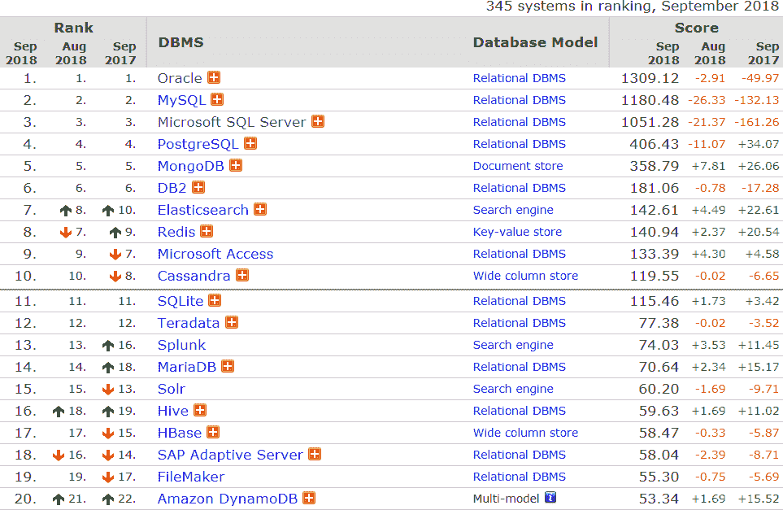

# MongoDB 是什么？

> 原文：[`c.biancheng.net/view/6542.html`](http://c.biancheng.net/view/6542.html)

MongoDB 是一个开源文档数据库，提供高性能、高可用性和自动扩展的功能。MongoDB 是用 C++ 语言编写的非关系型数据库。

与 HBase 相比，MongoDB 可以存储具有更加复杂的数据结构的数据，具有很强的数据描述能力。MongoDB 提供了丰富的操作功能，但是它没有类似于 SQL 的操作语言，语法规则相对比较复杂。

MongoDB（来自英文单词“Humongous”，中文含义为“庞大”）是可以应用于各种规模的企业、各个行业以及各类应用程序的开源数据库。

## MongoDB 使用广泛

MongoDB 是目前 NoSQL 数据库中使用最广泛的数据库之一，根据 [DB-Engines](https://db-engines.com/en/ranking) 2018 年 9 月份发布的全球数据库排名（见图 1），前六名依次是 Oracle、MySQL、Microsoft SQL Server、PostgreSQL、MongoDB 和 DB2，此排名顺序已经持续很长时间，MongoDB 排名第五，在排名前六的数据库中，9 月份只有 MongoDB 的分数依然保持增长，而且还是整个排行榜中增长幅度最大的一个。

同时纵向分析可知，自 2017 年 10 月 开始到 2018 年 9 月，MongoDB 的分数连续增长 11 个月，这说明广大的 IT 公司和程序员对 MongoDB 的认可度越来越高。

图 1：2018 年 9 月全球数据库排名

## MongoDB 性能高

MongoDB 是一个开源文档数据库，是用 C++ 语言编写的非关系型数据库。其特点是高性能、高可用、可伸缩、易部署、易使用，存储数据十分方便，主要特性有：面向集合存储，易于存储对象类型的数据，模式自由，支持动态查询，支持完全索引，支持复制和故障恢复，使用高效的二进制数据存储，文件存储格式为 BSON （ 一种 JSON 的扩展）等。

MongoDB 提供高性能数据读写功能，并且性能还在不断地提升。根据官方提供的 MongoDB 3.0 性能测试报告，在 YCSB 测试中，MongoDB 3.0 在多线程、批量插入场景下的处理速度比 MongoDB 2.6 快 7 倍。

关于读写与响应时间的具体测试结果参见图 2。

图 2：MongoDB 2.6 与 3.0 读写性能与响应时间性能测试

## MongoDB 支持分布式

在生产过程中，因机器故障导致系统宕机的问题不可避免；集中式系统在计算能力和存储能力方面的瓶颈，也无法满足当前的数据量爆发式增长的需求。这两个问题就是系统对高可用和可伸缩架构的需求，MongoDB 在原生上就可满足这两方面的需求。

MongoDB 的高可用性体现在对副本集 Replication 的支持上，可伸缩性体现在分片集群的部署方式上。

MongoDB 的 Replication 集提供自动故障转移和数据冗余服务，Replication 结构可以保证数据库中的全部数据都会有多份备份，这与 HDFS 分布式文件系统的备份机制比较类似。采用副本集的集群中具有主（Master）、从（Slaver）、仲裁（Arbiter）三种角色。

主从关系（Master-Slaver） 负责数据的同步和读写分离；Arbiter 服务负责心跳（Heartbeat）监控，Master 宕机时可将 Slaver 切换到 Mas 血状态，继续提供数据的服务，完成了数据的高可用需求。

当需要存储大量的数据时，主从服务器都需要存储全部数据，可能会出现写性能问题。同时， Replication 主要解决的是读数据高可用方面的问题，在对数据库查询时也只限制在一台服务器上， 并不能支持一次查询多台数据库服务器，并没有满足数据库读写操作的分布式需求。

MongoDB 提供水平可伸缩性功能的是分片（Shard）。分片与在 HDFS 分布式文件系统中上传文件会将文件切成 128MB（Hadoop2.x 默认配置）相似，通过将数据切成数片（Sharding）写入不同的分片节点，完成分布式写的操作。同时，MongoDB 在读取时提供了分布式读的操作，这个功能与 HDFS 的分布式读写十分类似。

## MongoDB 安装和部署容易

MongoDB 的安装十分友好，部署容易，支持多种安装方式，对第三方组件的依赖很低，用户可以使用它较容易地搭建起一个完整的生产集群。MongoDB 的单机部署十分简单，针对分片副本集安装也有第三方工具提供辅助。

## MongoDB 便于开发

MongoDB 对开发者十分友好，便于使用。支持丰富的查询语言、数据聚合、文本搜索和地理空间查询，用户可以创建丰富的索引来提升查询速度，MongoDB 被称为最像关系数据库的非关系数据库。读者可以通过对比 MongoDB 与关系数据库的操作，掌握 MongoDB 的操作特点。

MongoDB 允许用户在服务端执行脚本，可以用 Javascript 编写某个函数，直接在服务端执行，也可以把函数的定义存储在服务端，使用时直接调用即可。MongoDB 支持各种编程语言，包括 Ruby、Python、Java、C++、PHP、C# 等。