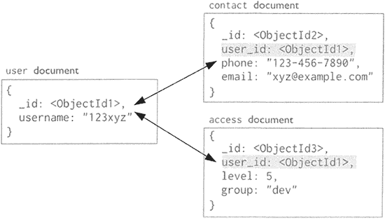

# MongoDB 的文档数据模型

> 原文：[`c.biancheng.net/view/6543.html`](http://c.biancheng.net/view/6543.html)

传统的文档数据库（Document Storage）概念的提岀要追溯到 1989 年，Lotus 提出的 Notes 产品被称为文档数据库，这种文档数据库常用于管理文档，如 Word、建立工作流任务等。

文档数据库区别于传统的其他数据库，它可用来管理文档，尤其擅长处理各种非结构化的文档数据。在传统的数据库中，信息被分割成离散的数据段，而在文档数据库中，文档是处理信息的基本单位。

传统的文档数据库与 20 世纪 50 ~ 60 年代管理数据的文件系统不同，文档数据库仍属于数据库范畴。

首先，文件系统中的文件基本上对应于某个应用程序。当不同的应用程序所需要的数据部分相同时，也必须建立各自的文件，而不能共享数据，而文档数据库可以共享相同的数据。因此，文件系统比文档数据库数据冗余度更大，更浪费存储空间，且更难于管理维护。

其次，文件系统中的文件是为某一特定应用服务的，因此，要想对现有的数据再增加一些新的应用是很困难的，系统难以扩展，数据和程序缺乏独立性。而文档数据库具有数据的物理独立性和逻辑独立性，数据和程序分离。

## NoSQL 中的文档数据库

NoSQL 中的文档数据库（以下文档数据库均指 NoSQL 中的文档数据库）与传统的文档数据库不是同一种产品，NoSQL 中的文档数据库（MongoDB）有自己特定的数据存储结构及操作要求。

在传统数据库的发展过程中，基本都是出现一种数据模型，再依据数据模型，开发出相关的数据库，例如，层次数据库是建立在层次数据模型的基础上，关系数据库是建立在关系数据模型的基础上的。NoSQL 中文档数据库的出现也是建立在文档数据模型的基础上的。

NoSQL 中的文档数据库与传统的关系数据库均建立在对磁盘读写的基础上，实现对数据的各种操作。文档数据库的设计思路是尽可能地提升数据的读写性能，为此选择性地保留了部分关系型数据库的约束，通过减少读写过程的规则约束，提升了读写性能。

## MongoDB 文档数据模型

传统的关系型数据库需要对表结构进行预先定义和严格的要求，而这样的严格要求，导致了处理数据的过程更加烦琐，甚至降低了执行效率。

在数据量达到一定规模的情况下，传统关系型数据库反应迟钝，想解决这个问题就需要反其道而行之，尽可能去掉传统关系型数据库的各种规范约束，甚至事先无须定义数据存储结构。

文档存储支持对结构化数据的访问，与关系模型不同的是，文档存储没有强制的架构。文档存储以封包键值对的方式进行存储，文档存储模型支持嵌套结构。例如，文档存储模型支持 XML  和 JSON 文档，字段的“值”可以嵌套存储其他文档，也可存储数组等复杂数据类型。

MongoDB 存储的数据类型为 BSON，BSON 与 JSON 比较相似，文档存储模型也支持数组和键值对。

MongoDB 的文档数据模型如图下所示，MongoDB 的存储逻辑结构为文档，文档中采用键值对结构，文档中的 _id 为主键，默认创建主键索引。从 MongoDB 的逻辑结构可以看出，MongoDB 的相关操作大多通过指定键完成对值的操作。

文档数据库无须事先定义数据存储结构，这与键值数据库和列族数据库类似，只需在存储时采用指定的文档结构即可。从上图可以看出，一个`{}`中包含了若干个键值对，大括号中的内容就被称为一条文档。