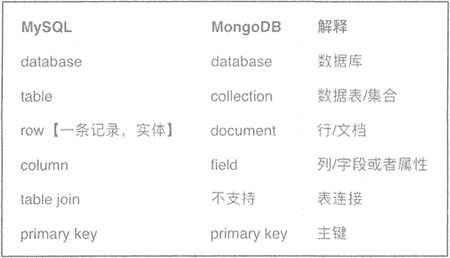
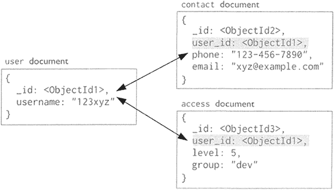
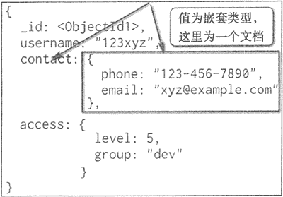
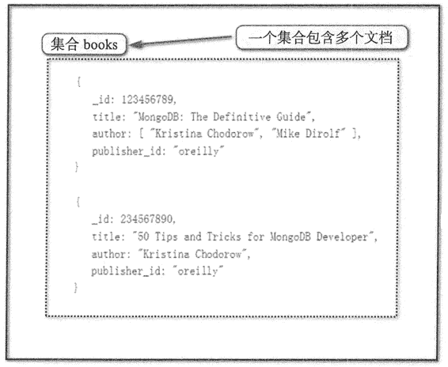
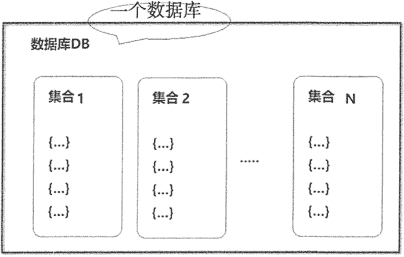

# MongoDB 的文档存储结构

> 原文：[`c.biancheng.net/view/6545.html`](http://c.biancheng.net/view/6545.html)

MongoDB 文档数据库的存储结构分为四个层次，从小到大依次是：键值对、文档（document）、集合（collection）、数据库（database）。

图 1 描述了 MongoDB 的存储与 MySQL 存储的对应关系，可以看出，MongoDB 中的文档、集合、数据库对应于关系数据库中的行数据、表、数据库。


图 1：MongoDB 存储与 Mysql 存储的对比

## 键值对

文档数据库存储结构的基本单位是键值对，具体包含数据和类型。键值对的数据包含键和值，键的格式一般为字符串，值的格式可以包含字符串、数值、数组、文档等类型。

按照键值对的复杂程度，可以将键值对分为基本键值对和嵌套键值对。

*   图 2 中的键值对中的键为字符串，值为基本类型，这种键值对就称为基本键值。
*   嵌套键值对类型如图 3 所示，从图中可以看岀， contact 的键对应的值为一个文档，文档中又包含了相关的键值对，这种类型的键值对称为嵌套键值对。


图 2：MongoDB 文档数据模型
 
图 3：嵌套键值对
键（Key）起唯一索引的作用，确保一个键值结构里数据记录的唯一性，同时也具有信息记录的作用。例如，country:"China"，用`:`实现了对一条地址的分割记录，“country”起到了 “China”的唯一地址作用，另外，“country”作为键的内容说明了所对应内容的一些信息。

值（Value）是键所对应的数据，其内容通过键来获取，可存储任何类型的数据，甚至可以为空。

键和值的组成就构成了键值对（Key-Value Pair）。它们之间的关系是一一对应的，如定义了 “country:China”键值对，"country”就只能对应“China”，而不能对应“USA”。

文档中键的命名规则如下。

*   UTF-8 格式字符串。
*   不用有`\0`的字符串，习惯上不用`.`和`$`。
*   以开头的多为保留键，自定义时一般不以开头。
*   文档键值对是有序的，MongoDB 中严格区分大小写。

## 文档

文档是 MongoDB 的核心概念，是数据的基本单元，与关系数据库中的行十分类似，但是比行要复杂。文档是一组有序的键值对集合。文档的数据结构与 JSON 基本相同，所有存储在集合中的数据都是 BSON 格式。

BSON 是一种类 JSON 的二进制存储格式，是 Binary JSON 的简称。 一个简单的文档例子如下：

{"country" : "China", "city": "BeiJing"}

MongoDB 中的数据具有灵活的架构，集合不强制要求文档结构。但数据建模的不同可能会影响程序性能和数据库容量。文档之间的关系是数据建模需要考虑的重要因素。文档与文档之间 的关系包括嵌入和引用两种。

下面举一个关于顾客 patron 和地址 address 之间的例子，来说明在某些情况下，嵌入优于引用。

```

{
    _id: "joe",
    name: "Joe Bookreader"
}

{
    patron_id: "joe",
    street: "123 Fake Street",
    city: "Faketon",
    state: "MA",
    zip: "2345"
}
```

关系数据库的数据模型在设计时，将 patron 和 address 分到两个表中，在查询时进行关联， 这就是引用的使用方式。如果在实际查询中，需要频繁地通过 _id 获得 address 信息，那么就需要频繁地通过关联引用来返回查询结果。在这种情况下，一个更合适的数据模型就是嵌入。

将 address 信息嵌入 patron 信息中，这样通过一次查询就可获得完整的 patron 和 address 信息，如下所示：

```

{
    _id: "joe",
    name: "Joe Bookreader",
    address: {
        street: "123 Fake Street",
        city: "Faketon”，
        state: nMAnz
        zip: T2345”
    }
}
```

如果具有多个 address，可以将其嵌入 patron 中，通过一次查询就可获得完整的 patron 和多个 address 信息，如下所示：

```

{
    _id: "joe",
    name: "Joe Bookreader",
    addresses:[
        {
            street: "123 Fake Streetn,
            city: "Faketon",
            state: "MA",
            zip: "12345"
        },
        {
            street: "l Some Other Street",
            city: "Boston",
            state: "MA",
            zip: "12345"
        }
    ]
}
```

但在某种情况下，引用用比嵌入更有优势。下面举一个图书出版商与图书信息的例子，代码如下:

```

{
    title: "MongoDB: The Definitive Guide",
    author: [ "Kristina Chodorow", "Mike Dirolfn"],
    published_date: ISODate("2010-09-24"),
    pages: 216,
    language: "English",
    publisher: {
        name: "O'Reilly Media",
        founded: 1980,
        location: "CA"
    }
}
{
    title: "50 Tips and Tricks for MongoDB Developer",
    author: "Kristina Chodorow",
    published_date: ISODate("2011-05-06"),
    pages: 68,
    language: "English",
    publisher: {
        name: "O'Reilly Media",
        founded: 1980,
        location: "CA"
    }
}
```

从上边例子可以看出，嵌入式的关系导致出版商的信息重复发布，这时可采用引用的方式描述集合之间的关系。使用引用时，关系的增长速度决定了引用的存储位置。如果每个出版商的图书数量很少且增长有限，那么将图书信息存储在出版商文档中是可行的。

通过 books 存储每本图书的 id 信息，就可以查询到指定图书出版商的指定图书信息，但如果图书出版商的图书数量很多, 则此数据模型将导致可变的、不断增长的数组 books，如下所示：

```

{
    name: "O'Reilly Media",
    founded: 1980,
    location: "CA",
    books: [123456789, 234567890, …]
}
{
    _id: 123456789,
    title: "MongoDE: The Definitive Guide",
    author: ["Kristina Chodorow", "Mike Dirolf"],
    published_date: ISODate("2010-09-24"),
    pages: 216,
    language: "English"
}
{
    _id: 234567890,
    title: "50 Tips and Tricks for MongoDB Developer",
    author: "Kristina Chodorow",
    published_date: ISODate("2011-05-06"),
    pages: 68,
    language: "English"
} 
```

为了避免可变的、不断增长的数组，可以将出版商引用存放到图书文档中，如下所示：

```

{
    _id: "oreilly",
    name: "O'Reilly Media",
    founded: 1980,
    location: "CA"
}
{
    _id: 123456789,
    title: "MongoDB: The Definitive Guiden,
    author: [ "Kristina Chodorow", "Mike Dirolf"],
    published_date: ISODate("2010-09-24"),
    pages: 216,
    language: "English",
    publisher_id: "oreilly"
}
{
    _id: 234567890,
    title: "50 Tips and Tricks for MongoDB Developer",
    author: "Kristina Chodorow",
    published date: ISODate("2011-05-06")，
    pages: 68,
    language: "English",
    publisher_id: "oreilly"
}
```

## 集合

MongoDB 将文档存储在集合中，一个集合是一些文档构成的对象。如果说 MongoDB 中的文档类似于关系型数据库中的“行”，那么集合就如同“表”。

集合存在于数据库中，没有固定的结构，这意味着用户对集合可以插入不同格式和类型的数据。但通常情况下插入集合的数据都会有一定的关联性，即一个集合中的文档应该具有相关性。

集合的结构如图 4 所示。


图 4：文档数据库中的一个集合

## 数据库

在 MongoDB 中，数据库由集合组成。一个 MongoDB 实例可承载多个数据库，互相之间彼此独立，在开发过程中，通常将一个应用的所有数据存储到同一个数据库中，MongoDB 将不同数据库存放在不同文件中。

数据库结构示例如图 5 所示。


图 5：一个名为 DB 的数据库的结构