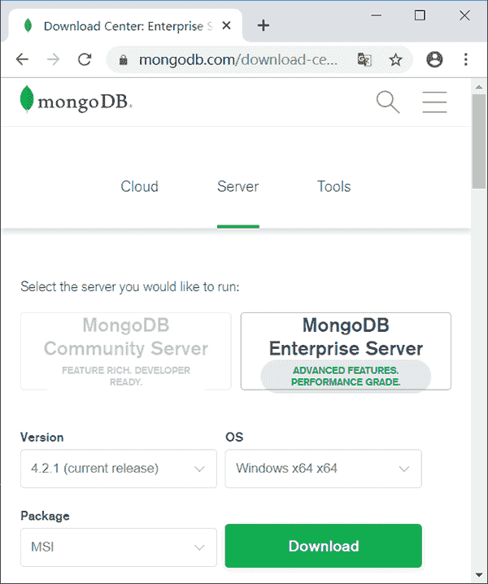
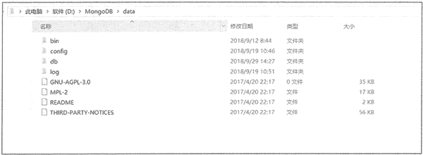
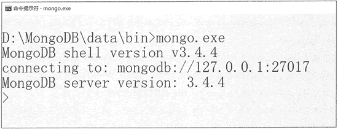

# MongoDB 的安装与测试

> 原文：[`c.biancheng.net/view/6548.html`](http://c.biancheng.net/view/6548.html)

MongoDB 提供了可用于 64 位系统的预编译二进制包，用户可以从 MongoDB 官网下载安装，MongoDB 支持 Windows、Linux、OSX 等操作系统。 如下图所示。

本节以 Windows 为例，具体安装步骤可参考官网手册。

MongoDB for Windows 64-bit 适合 64 位的 Windows Server 2008 R2A Windows 7 及最新版本的 Windows 10 系统。

需要说明的是，MongoDB 采用内存映射存储引擎（Memory Mapped Storage Engine，MMAP），可以把磁盘文件的一部分或全部内容直接映射到内存，这样文件中的信息位置就会在内存中有对应的地址空间，所以新版本的 MongoDB 已经不再支持 32 位的操作系统。

1) 本节采用的 MongoDB 版本为 3.4，安装环境为 Windows 64 位系统。安装步骤如下。

① 下载 64 位的 .msi 文件，下载后双击该文件，按操作提示安装即可。

② 在安装过程中，通过单击“Custom（自定义）”按钮来设置安装目录，这里将 MongoDB 安装在 D:\MongoDB\data 目录。

③ 创建数据目录。安装完毕后先不要启动，在 MongoDB 安装目录（D:\MongoDB\data）下创建 db 目录用于存储数据，创建 log 目录用于存储日志文件，创建完毕后的界面如图所示。

2) 与传统数据库一样，MongoDB 需要先开启服务端，再开启客户端，启动步骤如下。

① 配置 MongoDB 服务器。
在命令窗口切换到 D:\MongoDB\data\bin 目录，运行 mongod.exe 命令，同时指定数据库和 log 日志的路径：

mongod -dbpath "D:\mongodb\data\db" -logpath
"D:\mongodb\data\log\mon.log"

查看 db 和 log 目录，会发现 MongoDB 自动创建了运行所需的文件，这种方式启动 MongoDB 为前台启动，命令行窗口不能关闭。

②启动 MongoDB 客户端。
在 D:\mongodb\data\bin 下另开一个命令窗口来开启命令行窗口，执行 mongo 命令进入 MongoDB 的 Shell 交互界面，如图所示。

3) 用户可将 MongoDB 服务设置为开机自启，方法如下。

① 配置 MongoDB 服务开机自启。
使用管理员身份进入命令窗口，切换到 D:\MongoDB\data\bin 目录，执行以下命令将 MongoDB 服务添加到系统服务中：

mongod -dbpath "D:\mongodb\data\db" -logpath
"D:\mongodb\data\log\mon.log" --install --serviceName "MongoDB"

② 开启 MongoDB 服务。
使用 net start 命令即可完成服务开机自启动设置，需要注意的是，一定要使用管理员身份打开 CMD 窗口。

net start MongoDB

③ 移除 MongoDB 服务开机自启。
使用管理员身份进入命令窗口，切换到 D:\MongoDB\data\bin 目录，执行以下命令：

net stop MongoDB
mongod -dbpath "D:\mongodb\data\db" —logpath "D:\mongodb\data\1og\mon.log"  --remove --serviceName "MongoDB"