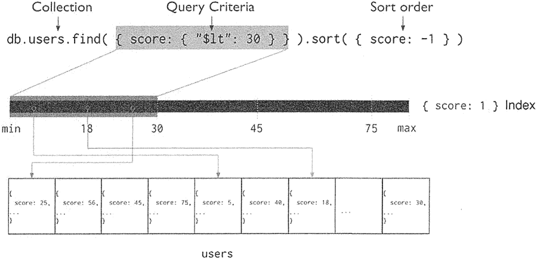
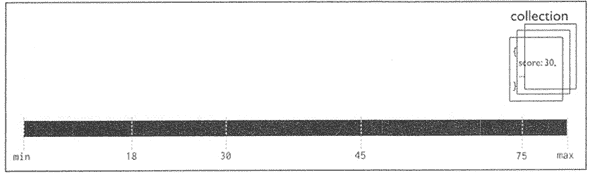
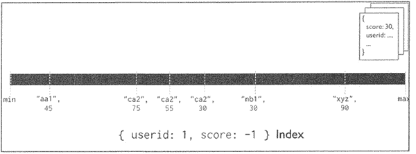
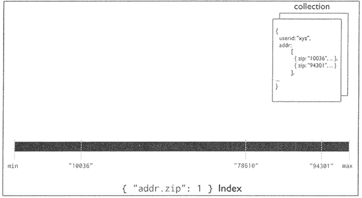

# MongoDB 索引完全攻略

> 原文：[`c.biancheng.net/view/6558.html`](http://c.biancheng.net/view/6558.html)

索引的作用是为了提升查询效率，在查询操作中，如果没有索引，MongoDB 会扫描集合中的每个文档，以选择与查询语句匹配的文档。如果查询条件带有索引，MongoDB 将扫描索引， 通过索引确定要查询的部分文档，而非直接对全部文档进行扫描。

## 索引简介

索引可以提升文档的查询速度，但建立索引的过程需要使用计算与存储资源，在已经建立索引的前提下，插入新的文档会引起索引顺序的重排。

MongoDB 的索引是基于 B-tree 数据结构及对应算法形成的。树索引存储特定字段或字段集的值，按字段值排序。索引条目的排序支持有效的等式匹配和基于范围的查询操作。

下图所示的过程说明了使用索引选择和排序匹配文档的查询过程。


从根本上说，MongoDB 中的索引与其他数据库系统中的索引类似。MongoDB 在集合级别定义索引，并支持 MongoDB 集合中文档的任何字段或子字段的索引。

MongoDB 在创建集合时，会默认在 _id 字段上创建唯一索引。该索引可防止客户端插入具有相同字段的两个文档，_id 字段上的索引不能被删除。

在分片集群中，如果不将该 _id 字段用作分片键，则应用需要自定义逻辑来确保 _id 字段中值的唯一性，通常通过使用标准的自生成的 Objectld 作为 _id。

## 索引类型+创建索引

MongoDB 中索引的类型大致包含单键索引、复合索引、多键值索引、地理索引、全文索引、 散列索引等，下面简单介绍各类索引的用法。

#### 单键索引

MongoDB 支持文档集合中任何字段的索引，在默认情况下，所有集合在 _id 字段上都有一个索引，应用程序和用户可以添加额外的索引来支持重要的查询操作，单键索引可参考下图。


对于单字段索引和排序操作，索引键的排序顺序（即升序或降序）无关紧要，因为 MongoDB 可以在任意方向上遍历索引。

创建单键索引的语法结构如下：

>db.collection.createlndex ( { key: 1 } )  //1 为升序，-1 为降序

以下示例为插入一个文档，并在 score 键上创建索引，具体步骤如下：

```

>db.records.insert(
    {
        "score" : 1034,
        "location" : { state: "NY", city: "New York"}
    }
)
db.records.createTndex( { score: 1 } )
```

使用 score 字段进行查询，再使用 explain() 函数，可以查看查询过程：

```

db.records.find({score:1034}).explain()
```

具体返回结果这里不再显示，读者可自行查阅。

#### 复合索引

MongoDB 支持复合索引，其中复合索引结构包含多个字段，下图说明了两个字段的复合索引示例。


复合索引可以支持在多个字段上进行的匹配查询，语法结构如下：

db.collection.createIndex ({ <key1> : <type>, <key2> : <type2>, ...})

需要注意的是，在建立复合索引的时候一定要注意顺序的问题，顺序不同将导致查询的结果也不相同。

如下语句创建复合索引：

```

>db.records.createIndex ({ "score": 1, "location.state": 1 })
```

查看复合索引的查询计划的语法如下：

```

>db.records.find({score:1034, "location.state" : "NY"}).explain()
```

#### 多键值索引

若要为包含数组的字段建立索引，MongoDB 会为数组中的每个元素创建索引键。这些多键值索引支持对数组字段的高效查询，如图所示。

创建多键值索引的语法如下：

>db.collecttion.createlndex( { <key>: < 1 or -1 > })

需要注意的是，如果集合中包含多个待索引字段是数组，则无法创建复合多键索引。

以下示例代码展示插入文档，并创建多键值索引：

```

>db.survey.insert ({item : "ABC", ratings: [ 2, 5, 9 ]})
>db.survey.createIndex({ratings:1})
>db.survey.find({ratings:2}).explain()
```

#### 地理索引

地理索引包含两种地理类型，如果需要计算的地理数据表示为类似于地球的球形表面上的坐标，则可以使用 2dsphere 索引。

通常可以按照坐标轴、经度、纬度的方式把位置数据存储为 GeoJSON 对象。GeoJSON 的坐标参考系使用的是 wgs84 数据。如果需要计算距离（在一个欧几里得平面上），通常可以按照正常坐标对的形式存储位置数据，可使用 2d 索引。

使用 2dsphere 索引的语法结构如下：

db.collection.createlndex( { <location field> : "2dsphere"})

使用 2d 索引的语法结构如下：

```

db.<collection>.createIndex(
{
    <location field> : "2d",
    <additional field> : <value>
},
{
    <index-specification options>
}
)
```

这里以 2dsphere 为示例，创建地理索引：

```

>db.places.insert(
{ 
    loc : { type: "Point", coordinates: [ -73.97, 40.77 ] },
    name: "Central Park",
    category : "Parks"
}
)
>db.places.insert(
{
    loc : { type: "Point", coordinates:[ -73.88, 40.78 ] },
    name: "La Guardia Airport",
    category : "Airport"
}
)
>db.places.createIndex ({loc : "2dsphere"})
>db.places.find({loc : "2dsphere"}).explain()
```

MongoDB 在地理空间查询方面还有很多的应用，读者可以进行适当的拓展。

#### 全文索引

MongoDB 的全文检索提供三个版本，用户在使用时可以指定相应的版本，如果不指定则默认选择当前版本对应的全文索引。

MongoDB 提供的文本索引支持对字符串内容的文本搜索查询，但是这种索引因为需要检索的文件比较多，因此在使用的时候检索时间较长。

全文索引的语法结构如下：

db.collection.createIndex ({ key: "text" })

#### 散列索引

散列（Hashed）索引是指按照某个字段的散列值来建立索引，目前主要用于 MongoDB Sharded Cluster 的散列分片，散列索引只能用于字段完全匹配的查询，不能用于范围查询等。

散列其语法如下：

db.collection.createlndex( { _id : "hashed" })

MongoDB 支持散列任何单个字段的索引，但是不支持多键（即数组）索引。

需要说明的是，MongoDB 在进行散列索引之前，需要将浮点数截断为 64 位整数。例如，散列将对 2.3、2.2 和 2.9 这些值产生同样的返回值。

上面列出的都是索引的类别，在每个索引的类别上还可以加上一些参数，使索引更加具有针对性，常见的参数包括稀疏索引、唯一索引、过期索引等。

稀疏索引只检索包含具有索引字段的文档，即使索引字段包含空值，检索时也会跳过所有缺少索引字段的文档。因为索引不包含集合的所有文档，所以说索引是稀疏的。相反，非稀疏索引包含集合中的所有文档，存储不包含索引字段的文档的空值。

设置稀疏索引的语法如下：

db.collection.createlndex ({ "key" : 1 }, { sparse : true })

如果设置了唯一索引，新插入文档时，要求 key 的值是唯一的，不能有重复的出现，设置唯一索引的语法如下：

db.collection.createlndex ({ "key" : 1 }, { unique: true })

过期索引是一种特殊的单字段索引，MongoDB 可以用来在一定时间或特定时间后从集合中自动删除文档。

过期索引对于处理某些类型的信息非常有用，例如，机器生成的事务数据、日志和会话信息，这些信息只需要在数据库中存在有限的时间，不需要长期保存。

创建过期索引的语法如下:

db.collection.createlndex( {"key" : 1 }, { expireAfterSeconds: 3600 })

需要注意的是，MongoDB 是每 60s 执行一次删除操作，因此短时间内执行会出现延迟现象。

## 查看现有索引

若要返回集合上所有索引的列表，则需使用驱动程序的 db.collection.getlndexes() 方法或类似方法。

例如，可使用如下方法查看 records 集合上的所有索引：

db.records.getIndexes()

## 列出数据库的所有索引

若要列出数据库中所有集合的所有索引，则需在 MongoDB 的 Shell 客户端中进行以下操作：

```

db.getCollectionNames().forEach(function(collection){
    indexes = db[collection].getIndexes();
    print("Indexes for " + collection + ":" );
    printjson(indexes);
});
```

## 删除索引

MongoDB 提供的两种从集合中删除索引的方法如下：

db.collection.dropIndex()

db.collection.dropIndexes()

若要删除特定索引，则可使用该 db.collection.droplndex() 方法。

例如，以下操作将删除集合中 score 字段的升序索引：

```

db.records.dropIndex ({ "score" : 1 })  //升序降序不能错，如果为-1，则提示无索引
```

还可以使用 db.collection.droplndexes() 删除除 _id 索引之外的所有索引。

例如，以下命令将从 records 集合中删除所有索引：

```

db.records.dropIndexes()
```

## 修改索引

若要修改现有索引，则需要删除现有索引并重新创建索引。