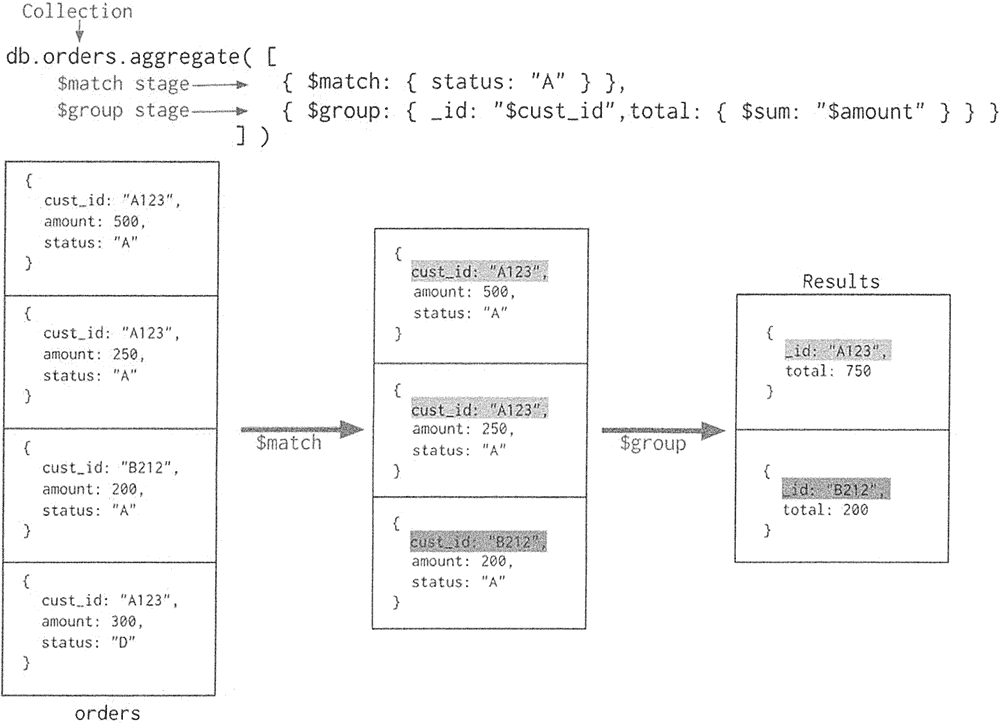

# MongoDB 聚合查询详解

> 原文：[`c.biancheng.net/view/6563.html`](http://c.biancheng.net/view/6563.html)

聚合操作主要用于处理数据并返回计算结果。聚合操作将来自多个文档的值组合在一起，按条件分组后，再进行一系列操作（如求和、平均值、最大值、最小值）以返回单个结果。

MongoDB 提供了三种执行聚合的方法：聚合管道、map-reduce 和单一目标聚合方法，本节只介绍前两种方法。

## 聚合管道方法

MongoDB 的聚合框架就是将文档输入处理管道，在管道内完成对文档的操作，最终将文档转换为聚合结果。

最基本的管道阶段提供过滤器，其操作类似查询和文档转换，可以修改输出文档的形式。其他管道操作提供了按特定字段对文档进行分组和排序的工具，以及用于聚合数组内容（包括文档数组）的工具。

此外，在管道阶段还可以使用运算符来执行诸如计算平均值或连接字符串之类的任务。聚合管道可以在分片集合上运行。

聚合管道方法的流程参见下图。


上图的聚合操作相当于 MySQL 中的以下语句：

```

select cust_id as _id, sum(amount) as total from orders where status like "%A%" group by cust_id;
```

MongoDB 中的聚合操作语法如下：

```

db.collection.aggregate([
{
    $match : {< query >},
}
{
    $group: {< fieldl >: < field2 >}
}
])
```

Query 设置统计查询条件，类似于 SQL 的 where，field1 为分类字段，要求使用 _id 名表示分类字段，field2 为包含各种统计操作符的数字型字段，如 $sum、$avg、$min 等。

这个语法看起来比较难以理解，下面给出一个示例进行对照：

```

db.mycol.aggregate([
{
    $group : {_id : "$by_user", num_tutorial : {$sum : 1}}
}
])
```

相当于 MySQL 中的：

```

select by_user as _id, count(*) as num_tutorial from mycol group by by_user;
```

再举一个复杂的例子，按照指定条件对文档进行过滤，然后对满足条件的文档进行统计，并将统计结果输出到临时文件中。

首先插入多条文档，代码如下：

```

db.articles.insert([    
    { "_id" : 10, "author" : "dave", "score" : 80, "views" :100 },
    { "_id" : 11, "author" : "dave", "score" : 85, "views" : 521 },
    { "_id" : 12, "author" : "ahn", "score" : 60, "views" : 1000 },
    { "_id" : 13, "author" : "li", "score" : 55, "views" : 5000 },
    { "_id" : 14, "author" : "annT", "score" : 60, "views" : 50 },
    { "_id" : 15, "author" : "1i", "score": 94, "views": 999 },
    { "_id" : 16, "author" : "ty", "score" : 95, "views": 1000 }
]);
```

再进行聚合分类统计，代码如下:

```

db.articles.aggregate([
{
    $match: { $or: [{ score: { $gt: 70, $1t: 90 }}, { views: { $gte: 1000 }}]}}, { $group: { _id: null, count: { $sum: 1 }}
}
]);
```

最终统计结果为：

{ "_id" : null, "count" : 5 }

管道阶段的 RAM 限制为 100MB。若要允许处理大型数据集，则可使用 allowDiskUse 选项启用聚合管道阶段，将数据写入临时文件。

## map-reduce 方法

MongoDB 还提供了 map-reduce 方法来执行聚合。通常 map-reduce 方法有两个阶段：首先 map 阶段将大批量的工作数据分解执行，然后 reduce 阶段再将结果合并成最终结果。

与其他聚合操作相同，map-reduce 可以指定查询条件以选择输入文档以及排序和限制结果。

map-reduce 使用自定义 JavaScript 函数来执行映射和减少操作，虽然自定义 JavaScript 与聚合管道相比提供了更大的灵活性，但通常 map-reduce 比聚合管道效率更低、更复杂。

map-reduce 可以在分片集合上运行，也可以输出到分片集合。map-reduce 的语法如下：

>db.collection.mapReduce(
    function() { emit(key,value); },
    function(key, values) { return reduceFunction }
    { query: document, out: collection }
)

参数说明：

*   function() { emit(key,value); } 为 map 映射函数，负责生成键值对序列，并作为 reduce 函数输入参数。
*   function(key, values) { return reduceFunction } 为 reduce 统计函数，reduce 函数的任务就是将 key-values 变成 key-value，也就是把 values 数组转换成一个单一的值 value。
*   query 设置筛选条件，只有满足条件的文档才会调用 map 函数。
*   out 为统计结果的存放集合，如果不指定则使用临时集合，但会在客户端断开后自动删除。

举例说明使用 map-Teduce 方法进行 MongoDB 文档数据的聚合。首先插入数据，数据为每位顾客 cust_id 的消费情况，代码如下：

```

db.order.insert([
    { "cust_id" : "l", "status" : "A", "price" : 25, "items" : [{"sku" : "mmm", "qty" : 5, "price" : 2.5 }, 
    { "sku" : "nnn", "qty" : 5, "price" : 2.5 }]},
    { "cust_id" : "l", "status" : "A", "price" : 25, "items" : [{"sku" : "mmm", "qty" : 5, "price" : 2.5 },
   { "sku" : "nnn", "qty" : 5, "price" : 2.5 }]},
   { "cust_id" : "2", "status" : "A", "price" : 25, "items" : [{"sku" : "mmm", "qty" : 5, "price" : 2.5 },
   { "sku" : "nnn", "qty" : 5, "price" : 2.5 }]},
    { "cust_id" : "3", "status" : "A", "price" : 25, "items" : [{"sku" : "mmm", "qty" : 5, "price" : 2.5 },
    { "sku" : "nnn", "qty" : 5, "price" : 2.5 }]},
    { "cust_id" : "3", "status" : "A", "price" : 25, "items" : [{"sku" : "mmm", "qty" : 6, "price" : 2.5 },
    { "sku" : "nnn", "qty" : 6, "price" : 2.5 }]},
])
```

编写 map 函数，cust_id 作为 map 的输出 key，price 作为 map 的输出 value，代码如下：

```

var mapFunc = function(){
    emit(this.cust_id, this.price);
};
```

编写 reduce 函数，将相同的 map 的输出 key(cust_id) 聚合起来，这里对输出的 value 进行 sum 操作，代码如下：

```

var reduceFunc = function(key,values){
    return Array.sum(values);
};
```

执行 map-reduce 任务，将 reduce 的输出结果保存在集合 map_result_result 中，代码如下：

```

db.order.mapReduce(mapFunc, reduceFunc, { out: { replace: 'map_result_result' }})
```

查看当前数据库下的所有集合，会发现新建了一个 map_result_result，此集合里保存了 map-reduce 聚合后的结果：

```

>show collections
    map_result_result
    myColl
    order
>db.map_result_result.find() 
    { "_id" : "l", "value" : 50.0 } 
    { "_id" : "2", "value" : 25.0 } 
    { "_id" : "3", "value" : 55.0 }
```