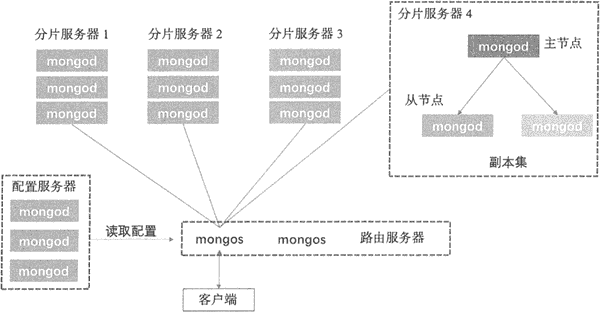
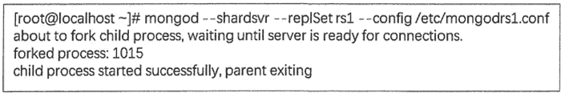
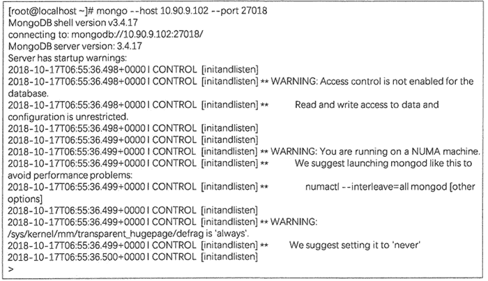
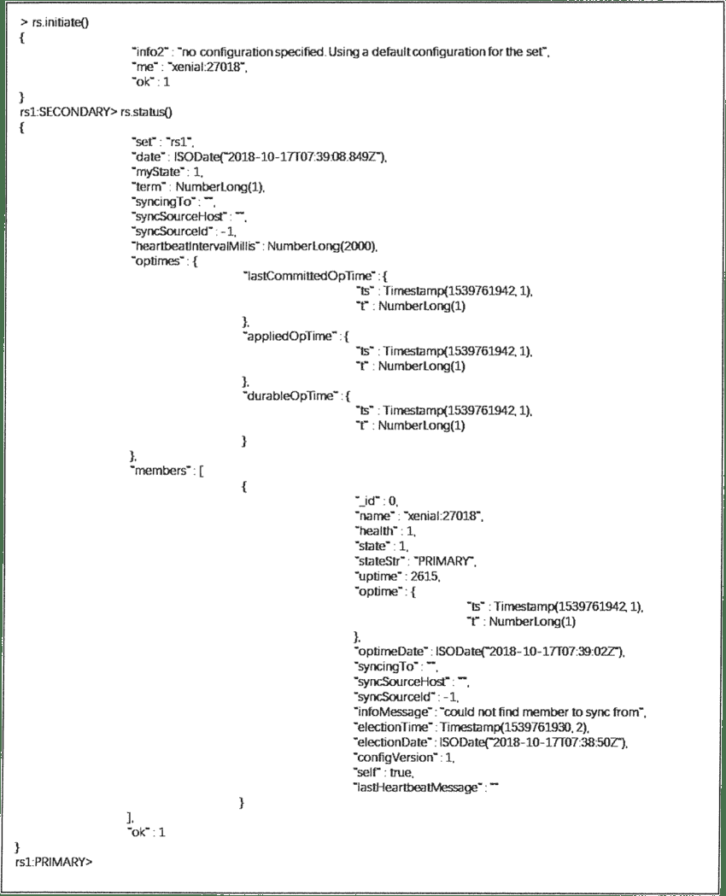
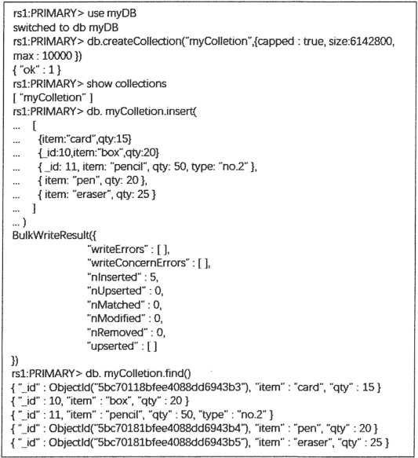
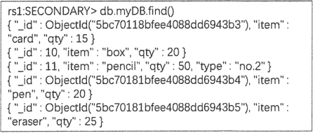
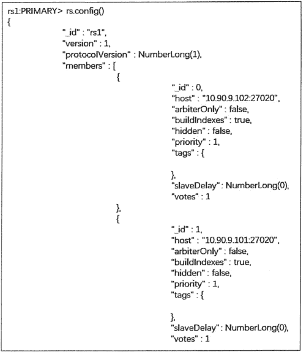
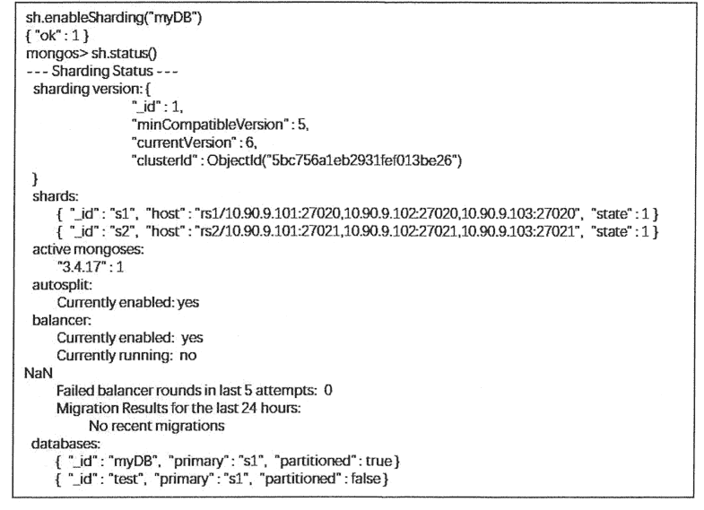

# 将 MongoDB 部署到分布式集群（实操）

> 原文：[`c.biancheng.net/view/6568.html`](http://c.biancheng.net/view/6568.html)

学习了《MongoDB 分布式集群架构（3 种模式）》，我们就来实操一下，看看究竟如何将 MongoDB 部署到生产环境中。

## 分布式集群的整体架构

在实际生产环境中，MongoDB 的集群架构是分布式的，如下图所示，集群会结合副本集和分片机制保证生产过程的高可靠性和高可扩展性。


从上图的集群中可以看到，整个生产集群与分片集群的架构类似，由三个重要组件组成，包括 Shard Server、Config Server 和 Route Server。不同之处在于每个组件可以使用多个实例来保证集群的可靠性。

例如，每一个 Shard Server 由一个包含三个 mongod 实例的副本集组成，避免了单一的 mongod 实例出现故障造成数据的丢失。Config Server 也可由多个 mongod 实例集群组成，保证集群中配置信息的可用性。而路由服务器也可以使用多个 mongos 实例，来保证客户端的请求能得到及时的响应。

接下来通过分布式集群的部署了解 MongoDB 的副本集和分片机制。假设目前有三台机器， 操作系统为 Ubuntu 16.04，均安装了 MongoDB 3.4，信息如下表所示。在这三台机器上部署副本集和部署分片集群。

表 1：集群机器信息

| 主机名 | IP | 端口信息 |
| Node1 | 10.90.9.101 | momgod shard1 : 27018（rs1） momgod shard2 : 27018（rs2）
mongod config1 : 27030
mongos router1 : 27017 |
| Node2 | 10.90.9.102 | momgod shard1 : 27018（rs1） momgod shard2 : 27018（rs2）
mongod config1 : 27030
mongos router1 : 27017 |
| Node3 | 10.90.9.103 | momgod shard1 : 27018（rs1） momgod shard2 : 27018（rs2）
mongod config1 : 27030
mongos router1 : 27017 |

副本集和分片联合部署的基本思路是先建立副本集，然后将每个副本集作为整体建立分片，如在上表中，集群有两个副本集 rs1 和 rs2，每个副本集由三个成员组成，分别部署在三台机器 Node1、Node2 和 Node3 上。

每个副本集作为一个整体建立一个分片，因此，此集群由两个 Shard Server 组成，每个 Shard Server 由一个三成员的副本集来保证数据的容错和冗余。

另外，在每台机器上启动一个 mongod 和 mongos 实例分别用于实现 Config Server 和 Route Server 的功能，使用三台机器备份的方式保证集群的可靠性。

## 部署副本集

标准副本集一般会部署三个成员，即一个 Primary 和两个 Secondary，实现数据的冗余和容错。 以下步骤为配置表 1 集群中的副本集 rs1、rs2 的部署。

#### 启动副本集

1) 修改配置文件
在表 1 所示的集群中，副本 rs1 在三个节点上均启动了一个 mongod 实例来完成数据的存储，启动 mongod 实例前先修改配置文件 /etc/mongodrs1.conf，主要是对 path、dbpath、port 这几项的修改，如下所示：

```

systemLog:
    path: /root/mongodb/data/mongodrsl.log    #副本集 rs1 的日志文件位置
storage:
    dbPath: /root/mongodb/data/rsl    #副本集 rs1 的数据库存储位置
net:
    port: 27018    #副本集 rs1 mongod 进程使用的端口号。
    bindIp: 10.90.9.101    #即本机地址，允许 mongo 客户端连接。
```

在 /root/mongodb 文件夹下创建 /data/rs1 目录,用来保存副本集 rsl 的数据库和日志文件。

2) 启动 mongod 副本集
在 Nodel 机器上启动 mongod 进程为副本集模式，在 Shell 终端执行：

```

mongod --shardsvr --replSet rs1 --config /etc/mongodrs1.conf
```

参数说明：

*   --shardsvr 表示本集群中的数据库是可分片的。
*   --replSet 用于指定副本集名称。
*   --config 用于指定配置文件位置。

在 Nodel 机器上启动副本集为 rs1 的 MongoDB 实例，如下图所示。


同样地，在 Node2 和 Node3 节点上以同样的方式启动 mongod 服务，在此阶段，三台机器上的副本集成员都是 Secondary 节点，只有经过初始化才会称为 Primary 节点。

3) 初始化副本集
启动 MongoDB 的副本集服务后，可在任意一台机器上连接 MongoDB 的服务，例如，在 Nodel 节点上执行以下命令连接 Node2 节点上的 mongod 服务。

```

mongo --host 10.90.9.102 --port 27018
```

参数说明：

*   --host 表示需连接的节点 IP。
*   --port 是启动 mongod 服务的端口，端口号在 /etc/mongod.conf 配置文件中配置。

此命令运行后进入 mongo shell 的交互界面，如图下所示。


然后在此界面使用 rs.initiate() 对副本集进行初始化，经过初始化后，执行 rs.status。

查看副本集状态，如下图所示，初始化后的 Node2 已经作为副本集 rs1 的 Primary 节点。


4) 添加成员
目前 rs1 副本集还只有 Node2 这个 Primary 节点，需要将 Node1、Node3 节点添加到副本集中，执行以下命令添加副本集成员：

```

rs.add( "10.90.9.101 : 27018" )
rs.add( "10.90.9.103 : 27018" )
```

至此副本集的启动配置已完成，通过 rs.stutas() 命令可以看到 rs1 副本集中已经有一个 Primary 节点（10.90.9.102）和两个 Secondary 节点（10.90.9.101 和 10.90.9.103）。副本集 rs2 以同样的步骤部署即可。

#### 测试副本集复制功能

1) 在 Primary 节点上添加数据
在 Primary 节点上创建 myDB 数据库，在此数据库中创建集合 myCollection，并插入 5 个文档，如图下所示。


2) 在 Secondary 节点上查看副本数据
使用 mongo 命令连接 Secondary 节点，Secondary 节点上的数据默认是不允许读写的，可以通过以下命令设置副本节点允许查询。

```

db.getMongo().setSlaveOk()
```

然后查询 Secondary 节点上的数据，查询结果如下图所示。


3) 管理副本集
通过 rs.conflg() 命令可以查看副本集中每个成员的属性，如下图所示。

修改副本集属性可通过如下命令实现：

```

con=rs.conf()
con.members[1].priority=2
rs.reconfig(con)
```

首先定义对象 con，将副本集的配置信息赋给 con，之后将 con 成员列表中的第 2 个（编号从 0 开始）成员的优先级设为 2，最后以 con 为参数，使用 rs.reconfig() 函数对副本集属性进行重设。

在 MongoDB 中只能通过主节点将 Mongo 服务添加到副本集中，可以使用命令 db.isMaster() 判断当前运行的 Mongo 服务是否为主节点，其他副本集的操作可查看 rs.help 来了解。

## 部署分片集群

分片集群由配置服务器、路由服务器、分片服务器和客户端组成。客户端可以是 Shell 终端，也可以是具体的应用程序。

配置服务器（Config Server）是普通的 mongod 服务器，保存着集群的配置信息：集群中有哪些分片、分片的是哪些集合，以及数据块的分布。分片服务器（Shard Server）存储具体的分片数据。启动集群后，路由服务器（Route Server）加载 Config Server 中的分片信息， 客户端通过连接 Route Server 来获取集群中的数据信息。

#### 启动分片机制

在表 1 的分布式集群中，有两个分片，分别由副本集 rs1、rs2 组成。集群中的 Shard Server 已经在前面配置好，接下来需要建立 Config Server 和 Route Server。

1) 配置 Config Server
Config Server 相当于集群的大脑，保存着集群和分片的元数据，即各分片包含哪些数据的信息。鉴于它所包含数据的极端重要性，必须启用其日志功能，并确保其数据保存在非易失性驱动器上。

因此，在集群中，Config Server 也通常配置成副本集模式来保证数据的可靠性。由于 mongos 需从配置服务器获取配置信息，因此配置服务器应先于任何 mongos 进程启动。

配置服务器是独立的 mongod 进程，所以可以像启动“普通的”mongod 进程一样启动配置服务器：

```

mongod --replSet config --configsvr --dbpath /home/ubuntu/mongodb/data/config --port 27030 -logpath /home/ubuntu/mongodb/data/config.log --logappend --fork
```

分别在三台机器上执行以上命令来启动配置服务器，使用 replSet config 选项，表示该实例归属于名为 config 的副本集。

参数说明：

*   --configsvr：选项表明启动的为 config server，端口为 27030。
*   --dbpath：表示数据存储路径
*   --logpath：表示日志文件路径。

配置 config 副本集的过程请参考本节前面的内容。

使用副本集选项实现了配置信息的冗余存储。配置服务器并不需要太多的空间和资源。配置服务器的 1KB 空间约等于 200MB 真实数据，它保存的只是数据的分布表。

由于配置服务器并不需要太多的资源，因此可将其部署在运行着其他程序的机器上，如应用服务器、分片的 mongod 服务器或 mongos 进程的服务器上。

2) 配置 Route Server
三个配置服务器均处于运行状态后，启动一个 mongos 进程供应用程序连接。因为 mongos 进程需要知道配置服务器的地址，所以必须使用 --configdb 选项启动 mongos：

```

mongos --configdb config/10.90.9.101:27030,10.90.9.102:27030,10.90.9.103:27030 -logpath /home/ubuntu/mongodb/data/mongos.log --logappend --fork
```

在默认情况下，mongos 运行在 27017 端口。注意，并不需要指定数据目录（mongos 自身并不保存数据，它会在启动时从配置服务器加载集群数据）。确保正确设置了 logpath，以便将 mongos 日志保存到安全的地方。

可启动任意数量的 mongos 进程，通常的设置是每个应用程序服务器使用一个 mongos 进程（与应用服务器运行在同一台机器上）。每个 mongos 进程必须按照列表顺序，使用相同的配置服务器列表，如 --configdb 后面输入的是一个带有三个服务器列表的 config 的副本集的名称。

至此，分布式集群中的分片服务已经启动完毕，接下来进行分片服务器的设置和数据的分片存储。

#### 测试分片机制

1) 添加分片
为了将副本集转换为分片，需告知 mongos 副本集名称和副本集成员列表。例如，在 Node1、 Node2 和 Node3 上有一个名为 rs1 和 rs2 的副本集，将每个副本集作为一个分片。

首先执行以下命令连接 mongos：

```

mongo --host 10.90.9.101 --port 27017
```

然后进入 mongos 的 Shell 界面，执行下面两条命令，将两个副本集 rs1 和 rs2 加入分片集中：

```

db.runCommand ({ addshard : "rs1/10.90.9.102:27020,10.90.9.101:27020,10.90.9.103 : 27020", name : "s1", maxsize : 10240 });
db.runCommand ({ addshard : "rs2/10.90.9.102:27021,10.90.9.101:27021,10.90.9.103 : 27021", name : "s2", maxsize : 1024 });
```

可在参数中指定副本集的所有成员，但并非一定要这样做。mongos 能够自动检测到没有包含在副本集成员表中的成员。name 选项表示此分片的名称，maxsize 选项指定此分片的最大存储容量。

如果之后需要移除这个分片或是向这个分片迁移数据，可使用分片名称标识这个分片。这比使用特定的服务器名称要好，因为副本集成员和状态是不断改变的。

将副本集作为分片添加到集群后，就可以将应用程序设置从连接到副本集改为连接到 mongos。添加分片后，mongos 会将副本集内的所有数据库注册为分片的数据库，因此，所有查询都会被发送到新的分片上。与客户端库相同，mongos 会自动处理应用故障，将错误返回客户端。

用户也可以创建单 mongod 服务器的分片（而不是副本集分片），但不建议在生产中使用。直接在 addShard() 中指定单个 mongod 的主机名和端口，就可以将其添加为分片了 :

```

sh.addShard("some-server:port")
```

单一服务器分片默认会被命名为 shard0000、shard0001 …… 以此类推。

如打算以后切换为副本集，应先创建一个单成员副本集再添加为分片，而不是直接将单一服务器添加为分片。如需将单一服务器分片转换为副本集，则需停机进行操作。

2) 数据分片
除非明确指定规则，否则 MongoDB 不会自动对数据进行拆分。如有必要，必须明确告知数据库和集合。

假设希望对 myDB 数据库中的 Mytest 集合按照 _id 键进行分片。首先对 myDB 数据库执行以下命令启用分片:

```

sh.enableSharding("myDB")
```

命令执行成功后，用 sh.status() 查询分片状态，如下图所示，数据库 myDB 的 patitioned 属性值为 true。


对数据库分片是对集合分片的先决条件。数据库启用分片后,就可以使用如下 shardCollection() 命令对集合进行分片了：

```

sh.shardCollection("myDB.myColletion", {"_id" : 1})
```

现在，集合会按照 _id 键进行分片。如果是对已存在的集合进行分片，则 _id 键上必须包含索引，否则 shardCollection() 会返回错误。如果出现了错误，则先创建索引，然后重试 shardCollection() 命令；如要进行分片的集合不存在，则 mongos 会自动在片键上创建索引。

shardCollection() 命令会将集合拆分为多个数据块，这是 MongoDB 迁移数据的基本单元。

成功执行分片操作后，MongoDB 会均衡地将集合数据分散到集群的分片上。这个过程不是瞬间完成的，对于比较大的集合，可能需要花费几个小时才能完成。