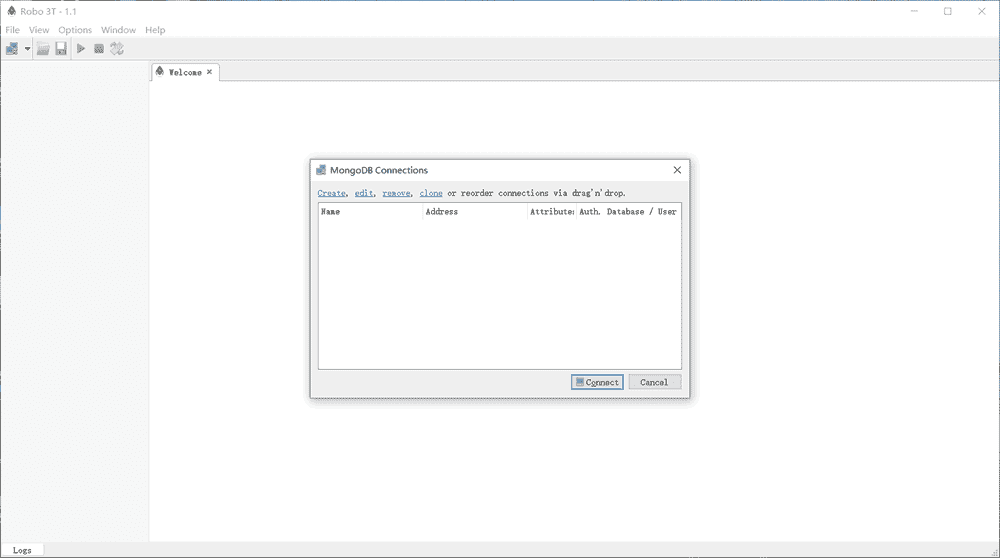
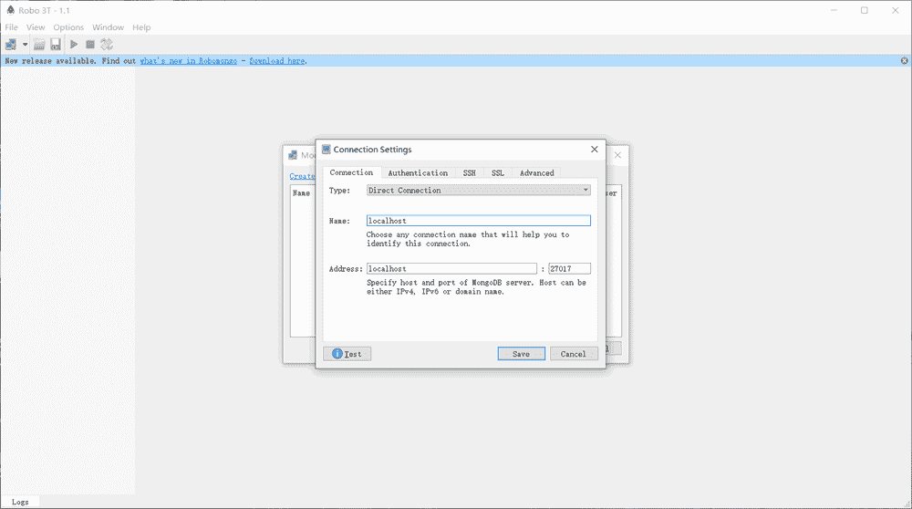
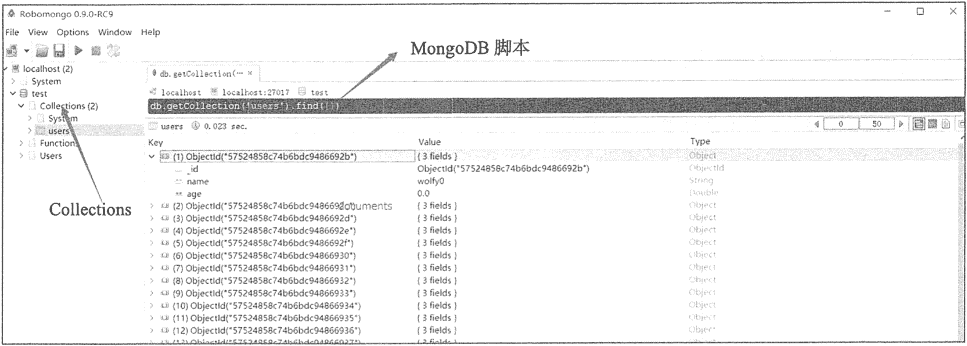

# Robomongo（MongoDB 可视化工具）简介

> 原文：[`c.biancheng.net/view/6573.html`](http://c.biancheng.net/view/6573.html)

Robomongo 是一个界面友好且免费的 MongoDB 可视化工具，读者可在 Robomongo 官网下载此软件，其安装过程十分简单，安装好的界面如下图所示。

在 MongoDB Connections 窗口单击鼠标右键添加 MongoDB 数据库，设置如下图所示。

连接成功后，MongoDB 中所有数据库以及集合均显示在左侧导航栏，如图下所示。

从上图中可以看到 Robomango 提供可视化的界面将数据库中的文档显示出来，在集合上单击鼠标右键可以显示提供的集合操作。

使用 Robomango，初学者能更容易理解 MongoDB 数据库的概念。