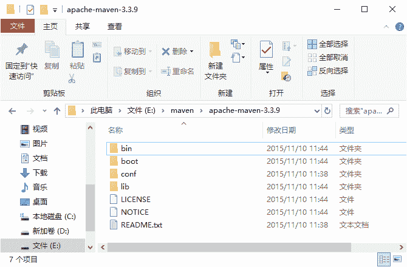
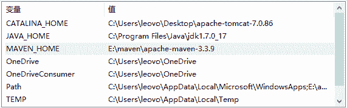
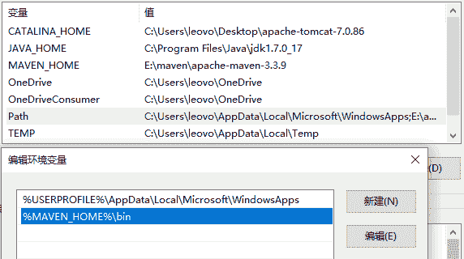
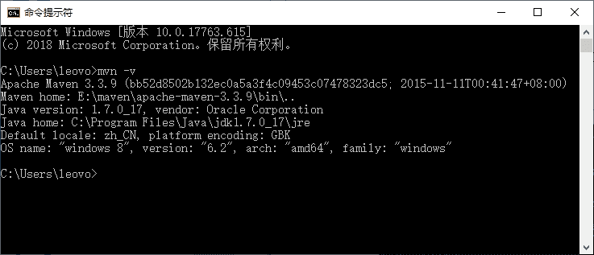

# Maven 安装配置和目录结构详解

> 原文：[`c.biancheng.net/view/4720.html`](http://c.biancheng.net/view/4720.html)

因为 Maven 本身就是基于 Java 写的，所以在安装配置 Maven 之前，有必要将 Java 的运行环境安装配置好。有关 JDK 的安装，大家可参阅《Java JDK 下载与安装教程》和《Java JDK 环境变量配置》教程。这里要注意本教程使用 Maven 3.3.9 版本，版本要求的 JDK 一定是 JDK 1.7 或以后的版本。

JDK 环境安装好之后，接下来正式安装配置 Maven。先要下载 Maven（[`maven.apache.org/download.cgi`](http://maven.apache.org/download.cgi) 或直接点开 [`archive.apache.org/dist/maven/maven-3/3.3.9/binaries/`](https://archive.apache.org/dist/maven/maven-3/3.3.9/binaries/)下载）。

它是以压缩包形式提供的，下载 Binary 形式的压缩包就行。

下载完成后，直接用解压工具解压到自己的一个空目录下。这里是解压到 E:\maven\apache-maven-3.3.9，最后的目录结构如图 1 所示。

图 1  Maven 安装目录
现在来仔细分析一下 Maven 的目录结构和内容。

#### 1）bin

该目录包含了 mvn 运行的脚本，这些脚本用来配置 Java 命令，准备好 classpath 和相关的 Java 系统属性，然后执行 Java 命令。

其中 mvn 是基于 UNIX 平台的 shell 脚本，mvn.bat 是基于 Windows 平台的 bat 脚本。在命令行输入任何一条 mvn 命令时，实际上就是在调用这些脚本。

该目录还包含了 mvnDebug 和 mvnDebug.bat 两个文件，同样，前者是 UNIX 平台的 shell 脚本，后者是 Windows 平台的 bat 脚本。那么 mvn 和 mvnDebug 有什么区别和关系呢？

打开文件我们就可以看到，两者基本是一样的，只是 mvnDebug 多了一条 MAVEN_DEBUG_OPTS 配置，其作用就是在运行 Maven 时开启 debug，以便调试 Maven 本身。

此外，该目录还包含 m2.conf 文件，这是 classworlds 的配置文件，后面会介绍 classworlds。

#### 2）boot

该目录只包含一个文件，以 maven 3.3.9 为例，该文件为 plexus-classworlds-2.5.2.jar。

plexus-classworlds 是一个类加载器框架，相对于默认的 java 类加载器，它提供了更丰富的语法以方便配置，Maven 使用该框架加载自己的类库。

更多关于 classworlds 的信息请参考 [`classworlds.codehaus.org/`](http://classworlds.codehaus.org/)。对于一般的 Maven 用户来说，不必关心该文件。

#### 3）conf

该目录包含了一个非常重要的文件 settings.xml。直接修改该文件，就能在机器上全局地定制 Maven 的行为。

一般情况下，我们更偏向于复制该文件至 ～/.m2/ 目录下（～表示用户目录），然后修改该文件，在用户范围定制 Maven 的行为。后面将会多次提到 settings.xml，并逐步分析其中的各个元素。

#### 4）lib

该目录包含了所有 Maven 运行时需要的 Java 类库，Maven 本身是分模块开发的，因此用户能看到诸如 maven-core-3.0.jar、maven-model-3.0.jar 之类的文件。

此外，这里还包含一些 Maven 用到的第三方依赖，如 common-cli-1.2.jar、commons-lang-2.6.jar 等。

对于 Maven 2 来说，该目录只包含一个如 maven-2.2.1-uber.jar 的文件，原本各为独立 JAR 文件的 Maven 模块和第三方类库都被拆解后重新合并到了这个 JAR 文件中。可以说，lib 目录就是真正的 Maven。

关于该文件，还有一点值得一提的是，用户可以在这个目录中找到 Maven 内置的超级 POM，这一点教程后面会详细解释。

#### 5）LICENSE.txt

记录了 Maven 使用的软件许可证 Apache License Version 2.0。

#### 6）NOTICE.txt

记录了 Maven 包含的第三方软件。

#### 7）README.txt

包含了 Maven 的简要介绍，包括安装需求及如何安装的简要指令等。

安装好后，接下来对 Maven 进行配置。配置内容同 JDK 的配置内容一样，也是两部分：一部分是在系统环境变量或者用户环境变量中配置一个 MAVEN_HOME；另一部分也是将 Maven 里面的 bin 目录添加到 Path 环境变量。

**1）配置 MAVEN_HOME**。同配置 JAVA_HOME 一样，在系统环境变量中添加 MAVEN_HOME，参考 JDK 的 JAVA_HOME 配置，这里就不再赘述了，效果如图 2 所示。

图 2  设置 MAVEN_HOME 环境变量
**2）追加 Path**。类似前面 JDK Path 环境变量的配置，请参考 JDK 配置，效果如图 3 所示。

图 3  Maven Path 环境变量
其中，`%MAVEN_HOME%/bin`是作为 Maven 的 Path 添加的。

**3）测试安装是否成功**。打开一个 CMD 窗口（一定要重新打开一个，不能使用配置环境变量之前的旧 CMD 窗口），输入“mvn-v”命令运行，出现如图 4 所示内容表示安装成功。

图 4  Maven 安装检测