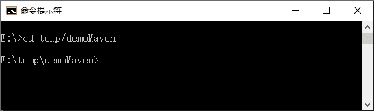
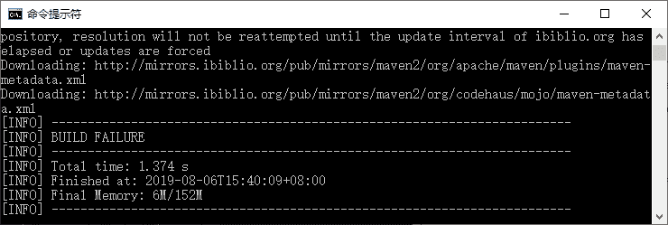

# 创建 Maven 项目（cmd 命令）

> 原文：[`c.biancheng.net/view/4756.html`](http://c.biancheng.net/view/4756.html)

Maven 项目同 MyEclipse 或其他工具产生的项目一样，有自己的目录结构和特殊的意义。

比如一般有如下目录。

*   src\main\java，用来存放项目的 Java 源代码。
*   src\main\resources，用来存放项目相关的资源文件（比如配置文件）。
*   src\test\java，用来存放项目的测试 Java 源代码。
*   src\test\resource，用来存放运行测试代码时所依赖的资源文件。

当然，还有一个 pom.xml 文件，该文件配置 Maven 管理的所有内容。

这里可以按 Maven 的要求，自动创建目录结构，按 Maven 的要求添加项目相关的配置文件，这样确实可以实现，但是很烦琐。已经有人用代码将这些要做的事情全都封装实现了，如同在 MyEclipse 中创建工程的那种图形化导向页面一样（这种效果到使用 MyEclipse+Maven 的时候体现），只要按它的步骤输入信息和命令，完成后自动产生项目架构。

这里简单介绍一下有关的命令和信息。

1）命令。命令很简单，就是创建项目的命令 create。

人们把要调用哪个软件的 create 命令创建项目叫插件（plugin）。创建项目的插件叫 Archetype 插件（archetype-plugin）。

2）信息。和项目相关的信息包括 groupId（组 Id）、artifactId（构件 Id）、packageName（包名）、version（版本）。

其实 packageName 和 version 好理解。程序员写的类，肯定要放在一个标准包下或标准包的子包下，packageName 指标准包；version 是当前代码的版本号。

这里的 groupId 和 artifactId 同部门名称和组名称一样，用来唯一确定一个项目（软件、功能）。有些地方会把这两个描述的信息合起来叫“坐标”。

用命令产生项目的方式有两种。

## 使用命令向导一步步创建项目

1）在硬盘上创建一个空的目录，用来存放 Maven 项目，如 E:\temp\demoMaven。

2）打开 CMD 窗口，用 cd 命令，切换到 demoMaven 目录，如图 1 所示。


图 1  Maven 项目目录（1）
3）在 CMD 窗口中输入“mvn archetype:generate”，按 Enter 键。

联网初始化一段时间后（一般不少于 5 分钟），会一步步提示输入 groupId、artifactId、version、packageName 等信息。最后创建成功，而且可以在 E:\temp\demoMaven 空目录下发现一个同 artifactId 一样的目录，这就是创建的项目目录。

## 在命令中输入所有必要信息直接创建项目

1）在硬盘上创建一个空的目录，用来存放 Maven 项目，如 E:\temp\demoMaven。

2）打开 CMD 窗口，用 cd 命令，切换到 demoMaven 目录，如图 1 所示。

3）在 CMD 窗口中输入如下命令并按 Enter 键。

mvn org.apache.maven.plugins:maven-archetype-plugin:2.2:creat
-DgroupId＝com.mengma.demo
-DartifactId＝HelloWorld
-DpackageName＝com.mengma.demo

注：

*   org.apache.maven.plugins:maven-archetype-plugin:2.2，指使用 groupId 为 org.apache.maven.plugins,artifactId 为 maven-archetype-plugin，版本为 2.2 的 Archetype 插件。
*   -DgroupId＝cn.com.mvnbook.demo，指定要创建的工程的 groupId。
*   -DartifactId＝MVNBookTP01，指定工程的 artifactId。
*   -DpackageName＝cn.com.mvnbook.demo.tp01，指定工程代码的标准包。

Maven 执行命令的时候，会在本地寻找是否有指定版本的 Archetype 插件，如果没有，就需要联网下载。最后显示的正常状态如图 2 所示。


图 2  Maven 创建项目提示
同时，它会在 demoMaven 目录下创建一个新的 HelloWorld 目录。到这里，就可以使用 Archetype 插件创建第一个工程的架构了。

## 添加样例代码

为了完成体验，需要写两个代码：一个是 HelloWorld.java，放在 src\main\java 目录下；另一个是 TestHelloWorld.java，用来体现测试，放在 src\test\java 目录下。下面介绍它们的内容。

HelloWorld.java 代码如下所示：

```

package com.mengma.demo.mvn;

/**
* 这是为了研究 Maven,写的第一个 Java 代码 功能很简单，输出一个 HelloWorld 的问候
*
* @ author Noble
* @ version 1.0
*/
public class HelloWorld {
    /**
     * 输出问候
     * @ param name String，说话人名称
     * @ return String 格式是：xxx say HelloWorld
     **/
    public String say(String name) {
        return name + " say HelloWorld";
    }
}
```

TestHelloWorld.java 代码如下所示：

```

package com.mengma.demo.mvn;

import junit.framework.Assert;
import org.junit.After;
import org.junit.Before;
import org.junit.Test;

public class TestHelloWorld {
    private HelloWorld hello;

    @Before
    public void init() {
        hello = new HelloWorld();
    }

    @Test
    public void testSay() {
        String name = "张三";
        String exp = "张三" + "say HelloWorld";
        String act = hello.say(name);
        Assert.assertEquals(exp, act);
    }

    @After
    public void destory() {
        hello = null;
    }
}
```

## 编写 Maven 骨架文件

代码写好了，接下来要通过配置文件让 Maven 管理。这时要用到 pom.xml，即骨架文件。该文件在创建工程时会在工程目录下自动生成 pom.xml。

```

<project xmlns="http://maven.apache.org/POM/4.0.0"
    xmlns:xsi="http://www.w3.org/2001/XMLSchema-instance"
    xsi:schemaLocation="http://maven.apache.org/POM/4.0.0 http://maven.apache.org/xsd/maven-4.0.0.xsd">
    <modelVersion>4.0.0</modelVersion>

    <groupId>com.mengma.demo</groupId>
    <artifactId>HelloWorld</artifactId>
    <version>0.0.1-SNAPSHOT</version>
    <packaging>jar</packaging>

    <name>HelloWorld</name>
    <url>http://maven.apache.org</url>

    <properties>
        <project.build.sourceEncoding>UTF-8</project.build.sourceEncoding>
    </properties>

    <dependencies>
        <dependency>
            <groupId>junit</groupId>
            <artifactId>junit</artifactId>
            <version>4.7</version>
            <scope>test</scope>
        </dependency>
    </dependencies>
</project>
```

注：

*   创建工程时指定的 groupId。
*   创建工程时指定的 artifactId。
*   当前工程的版本。
*   工程编译好后，打成 jar 包安装发布。
*   测试时需要依赖的 JUnit 的 groupId。
*   测试时需要依赖的 JUnit 的 artifactId。
*   测试时需要依赖的 JUnit 的版本。
*   指定测试依赖的作用范围是测试。

## 编译和测试

打开 CMD 窗口，操作步骤如下所示：

1.  将目录切换到工程目录下（HelloWorld）。
2.  输入“mvn clean”，按 Enter 键清空以前编译安装过的历史结果。
3.  输入“mvn compile”，按 Enter 键编译源代码。
4.  输入“mvn test”，按 Enter 键运行测试案例进行测试。
5.  输入“mvn install”，按 Enter 键，将当前代码打成 jar 包，安装到 Maven 的本地管理目录下，其他 Maven 工程只要指定坐标就可以使用。

到现在为止，编码的操作就完成了，包括工程的创建、源代码的编写、单元测试代码的编写、代码的编译、测试案例的运行以及最后的打包。