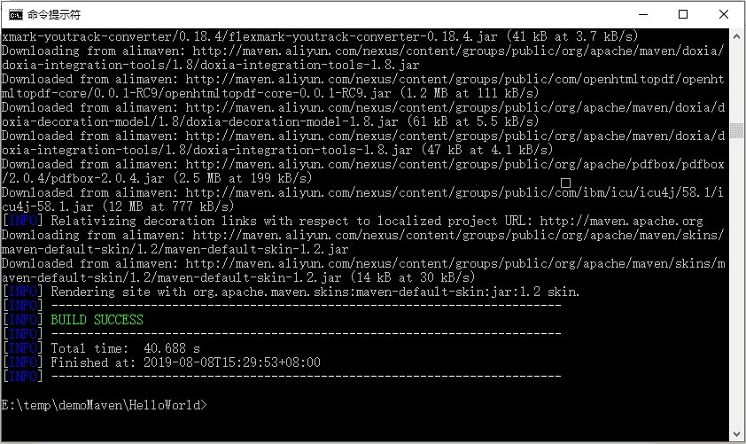
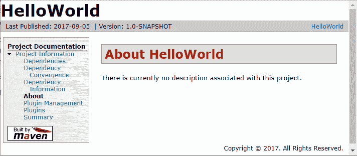
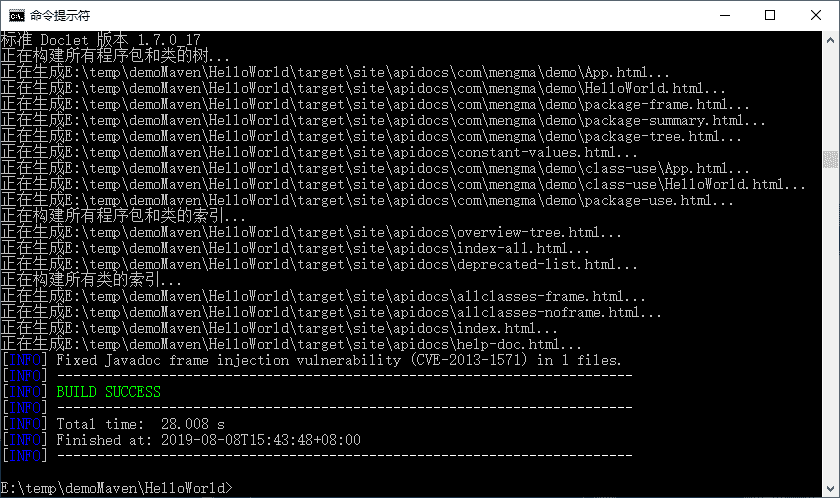
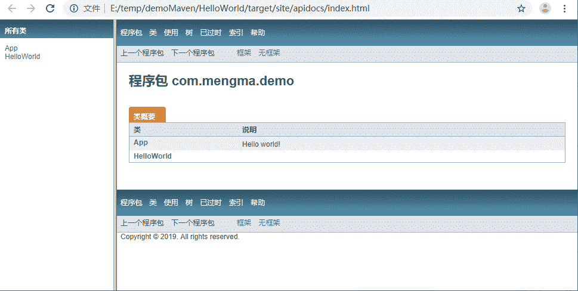

# Maven 生成站点和报告文档（cmd 命令）

> 原文：[`c.biancheng.net/view/4800.html`](http://c.biancheng.net/view/4800.html)

前面已经完成了一个项目的基本管理过程，接下来介绍生成相关文档。

## 生成站点信息

在《用命令提示符创建 Maven 项目》教程中用到的 CMD 窗口输入“mvn site”命令，就会自动生成站点信息，如图 1 所示。

图 1  mvn site 执行提示
执行完成后，查看一下工程目录下的 target 目录，里面自动添加了一个 site 目录，都是站点信息页面。打开其中的 index.html，就可以看到如图 2 所示类似的页面，里面描述的就是项目相关的信息。

图 2  Maven 生成的站点页面

## 生成 API Doc 文档

打开 CMD 窗口，切换到工程目录，输入“mvn javadoc:javadoc”，按 Enter 键，自动生成 API Doc 文档，如图 3 所示。

图 3  mvn javadoc:javadoc 执行提示
在工程中自动产生 target\site\apidocs 目录，里面就是当前工程中代码的 API Doc 文档。打开 index.html，页面如图 4 所示。

图 4  Maven 生成的 API Doc 页面